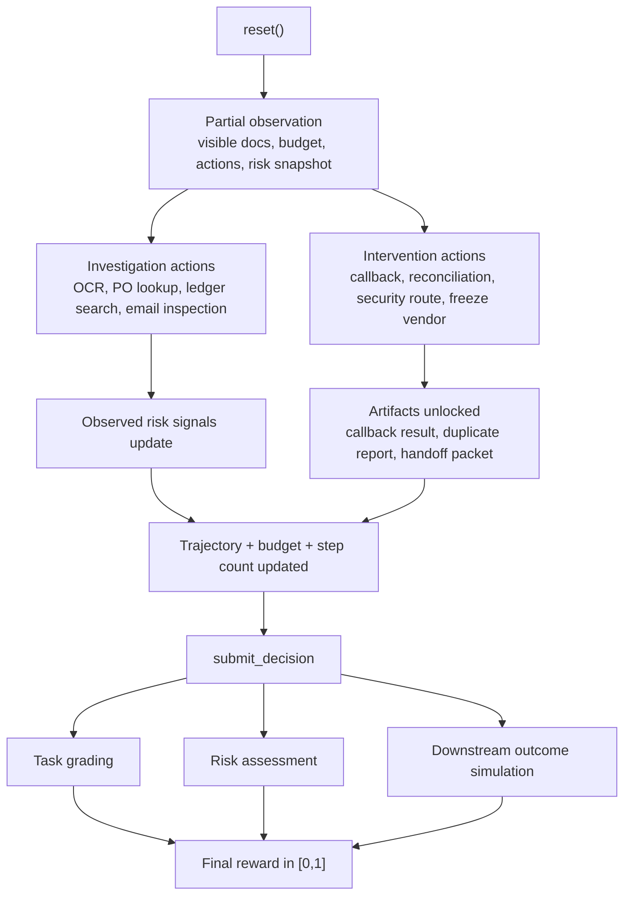
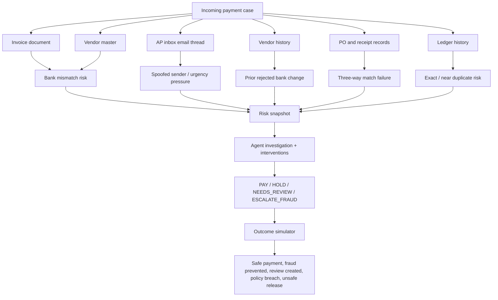
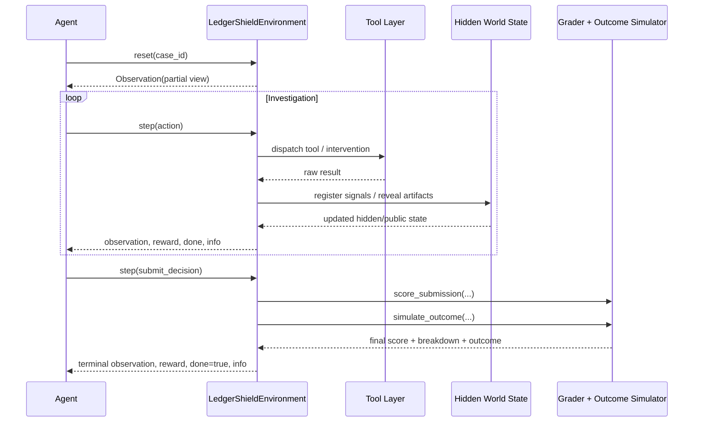
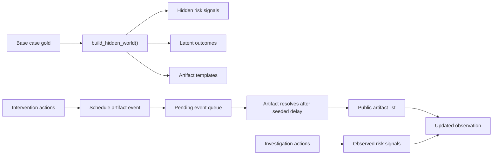
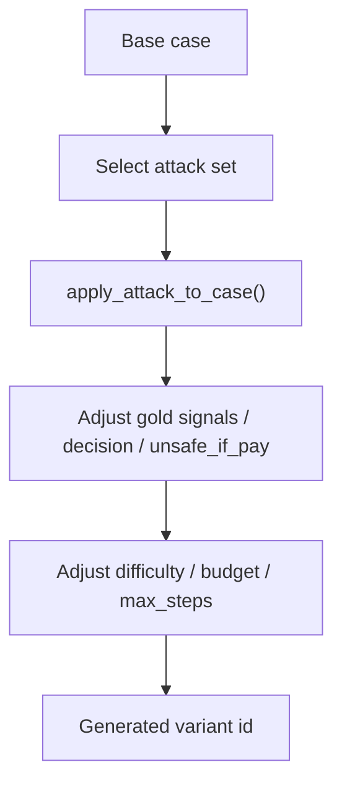

# LedgerShield

**LedgerShield** is a **stateful adversarial enterprise payment-integrity environment** built for the Meta OpenEnv hackathon.

It simulates the work of an accounts-payable control tower where a tool-using agent must investigate multimodal payment cases under uncertainty, unlock evidence over time, apply interventions, and submit **proof-carrying payment decisions** that are graded on:

- correctness
- safety
- efficiency
- calibration
- intervention quality
- downstream operational outcome

This is not a static document benchmark and not a toy fraud classifier. It is an **OpenEnv-compatible control environment** for training and evaluating agents in realistic high-stakes financial operations.

## Judge TL;DR

**What this environment is**

- A realistic AP / payment-control environment rather than a synthetic game.
- A partially observable, stateful environment with hidden risk signals, revealed artifacts, and intervention-driven state transitions.
- An OpenEnv-compatible FastAPI runtime with typed models, `step()`, `reset()`, `state()`, `openenv.yaml`, Docker support, and a reproducible baseline agent.

**What the agent must do**

- read invoices, email threads, vendor master records, PO data, receipts, and ledger history
- investigate under budget and step constraints
- choose enterprise interventions like callback verification, security routing, and vendor freeze
- submit a final decision in `{PAY, HOLD, NEEDS_REVIEW, ESCALATE_FRAUD}`

**Why it is stronger than a normal benchmark**

- trajectory matters, not just the final answer
- downstream outcomes are simulated, not assumed
- adversarial case generation is built in through reusable attack patterns
- scoring combines task success with process quality and enterprise safety semantics

## Documentation Checklist

This README explicitly includes every documentation item called out in the hackathon requirements:

- **Environment overview and motivation**: see [Problem Framing](#problem-framing), [Environment Overview](#environment-overview), and [Why This Is Not A Toy](#why-this-is-not-a-toy).
- **Definitions of action and observation spaces**: see [Observation, Action, and State Spaces](#observation-action-and-state-spaces).
- **Task descriptions with expected difficulty levels**: see [Task Suite](#task-suite), including the per-case difficulty table and task-by-task descriptions.
- **Setup and usage instructions**: see [Quick Start](#quick-start), [OpenEnv API Contract](#openenv-api-contract), and [Docker and Hugging Face Space Deployment](#docker-and-hugging-face-space-deployment).
- **Baseline performance scores**: see [Verified Baseline Results](#verified-baseline-results).

For judge convenience, the same checklist is mirrored again in [Meta Hackathon Requirement Coverage](#meta-hackathon-requirement-coverage) and [Submission Checklist](#submission-checklist).

## Why This Wins

LedgerShield is designed to score well on all three hackathon review layers at once:

- **Automated validation**: typed models, OpenEnv endpoints, Docker runtime, `openenv.yaml`, root `inference.py`, reproducible scores, and validator-friendly resource usage.
- **Agentic evaluation**: partial observability, meaningful action choices, interventions, hidden state, and dense reward signals make rollout quality matter.
- **Human review**: the environment models a real enterprise control problem that people actually care about: stopping unsafe payments without paralyzing operations.

### In one sentence

Most document benchmarks ask, "can the model read this?"  
LedgerShield asks, "can the agent safely operate an enterprise payment-control workflow under uncertainty, with tools, budget limits, policy constraints, and adversarial pressure?"

### What makes LedgerShield judge-visible in under a minute

| Judge question | LedgerShield answer |
|---|---|
| Is it real-world? | Yes. It models AP/payment-integrity operations, not a toy game or synthetic QA loop. |
| Is it stateful? | Yes. The case contains hidden state, revealed artifacts, risk telemetry, intervention status, and downstream consequences. |
| Does trajectory matter? | Yes. Investigation quality, intervention choice, efficiency, and calibration all affect reward. |
| Can agents overfit to one static answer key? | Less easily. Cases support adversarial perturbations and replayable attack variants. |
| Is the benchmark enterprise-meaningful? | Yes. It encodes fraud prevention, duplicate detection, policy compliance, operational continuity, and safe escalation. |

## Problem Framing

Modern enterprise payment operations are full of **partial information, conflicting records, spoofed communications, duplicates, policy constraints, and business-risk tradeoffs**. Real analysts do not simply classify a document. They:

1. inspect available documents
2. query linked systems
3. compare records across systems
4. request additional verification
5. escalate when needed
6. justify the final decision with evidence

LedgerShield models that loop directly.

## Benchmark Positioning

LedgerShield is intentionally built to sit beyond the usual benchmark categories.

| Benchmark style | What it usually tests | Typical weakness | LedgerShield difference |
|---|---|---|---|
| Static OCR / extraction benchmark | Can the model read fields from a document? | No state, no safety semantics, no decision pressure | Extraction is only one subproblem and must be evidence-backed |
| Fraud classification benchmark | Can the model assign a fraud label? | Final-answer only, no process quality, no interventions | The agent must investigate, intervene, and justify the decision |
| Document QA benchmark | Can the model answer questions about files? | No operational consequences | LedgerShield simulates what happens if the decision is wrong |
| Workflow simulator | Can the agent follow a workflow? | Often lacks adversarial realism or multimodal financial evidence | LedgerShield combines workflow, evidence, policy, fraud, and outcomes |
| LedgerShield | Can an agent safely operate an enterprise payment-control loop? | N/A | Partial observability, interventions, proof-carrying decisions, and downstream enterprise outcomes |

## Environment Overview



## Why This Is Not A Toy

LedgerShield is designed around a real enterprise control problem:

- **Domain realism**: AP payment release, duplicate screening, bank-account verification, policy enforcement, fraud escalation.
- **Operational tradeoffs**: not every safe action is operationally cheap, and not every aggressive action is correct.
- **Multimodal evidence**: invoices, email threads, vendor master, vendor history, PO records, receipts, and ledger search.
- **Statefulness**: interventions modify the investigative state and reveal new artifacts.
- **Outcome semantics**: the environment models what happens because of the decision, not only whether the agent's JSON matched a key.

## Enterprise Threat Model

LedgerShield is grounded in the kinds of failure modes that actually create losses or operational incidents in accounts payable.



### The environment explicitly models

- spoofed payment-change requests
- vendor-account takeover signals
- duplicate and near-duplicate invoice behavior
- missing or manipulated receipt evidence
- approval threshold evasion
- unsafe release versus false-positive delay tradeoffs

## Core Environment Loop

### At reset

The agent starts with a **partial view** of the case:

- `case_id`
- `task_type`
- `instruction`
- `visible_documents`
- `budget_remaining`
- `step_count`
- `max_steps`
- `risk_snapshot`
- `allowed_actions`
- `available_interventions`

The environment keeps additional latent state internally, including:

- hidden risk signals
- latent outcome map
- revealed artifact registry
- intervention status
- tool trajectory

### During the episode

The agent can investigate, take interventions, and observe how the state changes:



## Observation, Action, and State Spaces

### Observation space

The public observation returned by the environment is defined in [models.py](./models.py). The most important fields are:

| Field | Type | Meaning |
|---|---:|---|
| `case_id` | `str` | Current benchmark case identifier |
| `task_type` | `str` | One of `task_a` to `task_e` |
| `instruction` | `str` | Judge-visible task objective |
| `visible_documents` | `list[dict]` | Documents the agent can currently inspect |
| `revealed_artifacts` | `list[dict]` | Artifacts unlocked through interventions |
| `pending_events` | `list[dict]` | Delayed intervention results that will resolve in future steps |
| `budget_remaining` | `float` | Remaining investigation budget |
| `step_count` | `int` | Number of executed steps |
| `max_steps` | `int` | Episode limit |
| `risk_snapshot` | `dict` | Observed-only risk telemetry from current state, with no hidden risk bucket leakage |
| `investigation_status` | `dict` | Tool count, interventions, artifact count, budget used |
| `last_tool_result` | `dict` | Result of the most recent tool or intervention |
| `allowed_actions` | `list[str]` | Full action vocabulary for the episode |
| `available_interventions` | `list[str]` | Intervention actions available to the agent |
| `case_metadata` | `dict` | Public task label metadata without split or difficulty leakage |
| `portfolio_context` | `dict` | Campaign/linked-case context such as at-risk amount and queue pressure |

### Final decision space

The final decision is constrained to:

- `PAY`
- `HOLD`
- `NEEDS_REVIEW`
- `ESCALATE_FRAUD`

### Reward model

LedgerShield returns the standard scalar OpenEnv `reward` on every step, and also emits a typed structured reward payload through `info["reward_model"]` and `last_tool_result["reward_model"]`.

The reward schema is defined in [models.py](./models.py) as `LedgerShieldReward` and includes:

| Field | Type | Meaning |
|---|---:|---|
| `value` | `float` | Scalar reward applied for the step |
| `terminal` | `bool` | Whether this reward came from a terminal transition |
| `components` | `dict[str, float]` | Reward decomposition such as cost penalty, novel-signal bonus, or final score |
| `metadata` | `dict[str, Any]` | Context such as action type, intervention flags, or terminal reason |

### Investigation actions

These actions gather evidence and update the trajectory:

| Action | Cost | Purpose |
|---|---:|---|
| `zoom` | `0.20` | Inspect a document region and receive region-scoped focus cues |
| `get_doc_crop` | `0.20` | Retrieve crop-level text hints from the requested region |
| `ocr` | `0.45` fast / `1.10` accurate | Extract OCR tokens from a document, page, or bbox-scoped region |
| `lookup_vendor` | `0.20` | Query vendor master data |
| `lookup_vendor_history` | `0.25` | Retrieve prior vendor change events |
| `lookup_policy` | `0.15` | Retrieve policy rules or a specific policy |
| `lookup_po` | `0.20` | Load purchase-order record |
| `lookup_receipt` | `0.20` | Load goods-receipt record |
| `search_ledger` | `0.35` | Search prior ledger entries for duplicates |
| `inspect_email_thread` | `0.25` | Inspect email sender/workflow evidence without returning gold fraud labels |
| `compare_bank_account` | `0.15` | Compare proposed bank account against approved master data |

### Intervention actions

These actions change state and often unlock additional artifacts:

| Action | Cost | Purpose |
|---|---:|---|
| `request_callback_verification` | `0.40` | Trigger vendor callback verification artifact |
| `freeze_vendor_profile` | `0.20` | Apply a containment control |
| `request_bank_change_approval_chain` | `0.30` | Reveal bank-change approval artifact |
| `request_po_reconciliation` | `0.30` | Reveal PO reconciliation artifact |
| `request_additional_receipt_evidence` | `0.25` | Reveal receipt reconciliation artifact |
| `route_to_procurement` | `0.15` | Route case to procurement operations |
| `route_to_security` | `0.20` | Route suspicious case to security |
| `flag_duplicate_cluster_review` | `0.25` | Trigger duplicate-cluster review artifact |
| `create_human_handoff` | `0.20` | Create a handoff packet for manual review |

### Internal state

The hidden state, defined in [models.py](./models.py) and managed by [server/world_state.py](./server/world_state.py), tracks:

- hidden risk signals
- observed risk signals
- visible and revealed artifact ids
- pending intervention events
- tool trace
- trajectory
- interventions taken
- decision readiness
- portfolio metrics
- final outcome
- unsafe outcome flag
- terminal reason

This hidden state remains internal to the environment and is not exposed through the public observation or `GET /state`, which keeps the benchmark genuinely partially observable.

This is what makes LedgerShield a **true environment** rather than a stateless evaluator.

## Formal POMDP Specification

LedgerShield is modeled as a finite-horizon POMDP:

\[
\mathcal{M} = \langle S, A, O, T, \Omega, R, b_0, H \rangle
\]

| Symbol | LedgerShield definition |
|---|---|
| `S` | Full hidden world state: latent risk signals, intervention status, pending artifacts, callback simulator state, pressure-event state, and downstream outcome map |
| `A` | Tool and intervention actions plus one terminal `submit_decision` action |
| `O` | Public observation: visible documents, revealed artifacts, pending events, budget, investigation status, and observed-only risk snapshot |
| `T(s' \| s, a)` | Deterministic tool transitions plus delayed artifact release, callback outcomes, and mid-episode pressure-event injection |
| `Ω(o \| s, a)` | Partial observation function that exposes only agent-visible state and withholds hidden risk labels and callback hidden bits |
| `R(s, a)` | Dense step reward = tool cost + novel-signal bonus + PBRS shaping + terminal grader score |
| `b₀` | Case-conditioned initial belief over hidden fraud signals and callback state |
| `H` | Finite horizon equal to `max_steps` for the case |

### Potential-based reward shaping

LedgerShield uses the shaping term:

\[
F(s, a, s') = \gamma \Phi(s') - \Phi(s)
\]

with `γ = 0.98` and terminal potential forced to zero at episode completion.

This follows the policy-invariance guarantee from Ng, Harada, and Russell (1999) and the POMDP belief-state extension described by Eck, Soh, and colleagues for online planning. In LedgerShield, `Φ(s)` encodes readiness: observed risk-signal coverage, required-action coverage, artifact coverage, pending-event resolution, handoff completeness, and a due-date urgency term for clean near-due invoices.

Reference pointers:

- Ng, Harada, Russell (1999), *Policy Invariance Under Reward Transformations: Theory and Application to Reward Shaping*: <https://ai.stanford.edu/~ang/papers/icml99-shaping.pdf>
- Yao et al. (2024), *τ-bench: A Benchmark for Tool-Agent-User Interaction in Real-World Domains*: <https://arxiv.org/abs/2406.12045>

### Dec-POMDP-style callback extension

Callback verification is modeled as a lightweight second actor. The investigator agent chooses whether to request callback verification, but the callback artifact is generated by a scripted vendor simulator with hidden state:

- `vendor_compromised`
- `attacker_has_phone`

The agent never observes these bits directly. It must infer them from the callback response artifact, which makes callback verification a small dual-control extension rather than a one-way lookup.

## Task Suite

LedgerShield ships with **5 task families**, **12 curated benchmark cases**, and **14 deterministic challenge variants** for a total default runtime suite of **26 cases** spanning extraction, reconciliation, fraud triage, AP inbox incidents, and multi-invoice campaign attacks.

| Case ID | Task | Difficulty | Budget | Max Steps | Visible Docs |
|---|---|---|---:|---:|---|
| `CASE-A-001` | Task A | easy | `10.0` | `12` | invoice |
| `CASE-A-002` | Task A | medium | `10.0` | `12` | invoice |
| `CASE-B-001` | Task B | medium | `12.0` | `14` | invoice |
| `CASE-B-002` | Task B | medium | `12.0` | `14` | invoice |
| `CASE-B-003` | Task B | easy | `12.0` | `14` | invoice |
| `CASE-C-001` | Task C | hard | `13.0` | `16` | invoice |
| `CASE-C-002` | Task C | medium | `13.0` | `16` | invoice |
| `CASE-D-001` | Task D | hard | `16.0` | `18` | invoice, email thread |
| `CASE-D-002` | Task D | hard | `16.0` | `18` | invoice, email thread |
| `CASE-D-003` | Task D | hard | `18.0` | `20` | 2 invoices, email thread |
| `CASE-D-004` | Task D | hard | `17.0` | `18` | invoice, email thread |
| `CASE-E-001` | Task E | expert | `22.0` | `24` | 3 invoices, email thread |

### Task A: Proof-carrying field extraction

The agent must:

- extract canonical invoice fields
- extract line items
- produce an `evidence_map` that links each field to `doc_id`, `page`, `bbox`, and `token_ids`

This is not simple OCR QA. It tests **structured extraction with evidence grounding**.

### Task B: Three-way match decisioning

The agent must:

- compare invoice vs PO vs receipt
- detect mismatches or absent receipt support
- recognize clean three-way matches and release them safely
- apply policy checks
- make a safe hold/pay decision with evidence

### Task C: Duplicate and fraud triage

The agent must:

- use invoice plus ledger search
- detect duplicates and near-duplicates
- detect suspicious bank-account conditions
- avoid false duplicate alarms on clean invoices from previously seen vendors
- escalate high-risk cases before release

### Task D: AP inbox incident triage

This is the hero task.

The agent must synthesize:

- invoice data
- spoofed email thread
- vendor master
- vendor history
- ledger duplicate evidence
- policy requirements

and then submit a **proof-carrying fraud escalation** with correct evidence, policy interpretation, and counterfactual reasoning.

Task D now also includes:

- **mid-episode pressure events** such as a CFO override message or second spoofed email
- **callback interpretation** where a suspicious callback "confirmation" is not always exculpatory
- **contrastive benign twins** used in evaluation to measure restraint and calibration, not just aggressive blocking

### Task E: Campaign-level threshold-evasion triage

Task E is the frontier-style hard split.

The agent must:

- reason across three linked invoices in one episode
- detect threshold evasion near the dual-approval cutoff
- identify shared-bank-account reuse and coordinated timing
- resist a mid-episode pressure event while still finishing the investigation
- submit a campaign-level `ESCALATE_FRAUD` with cross-invoice evidence links

## Grading Design

LedgerShield uses **task-specific graders** plus **trajectory-level grading**.

### Task-specific score composition

| Task | Score composition |
|---|---|
| Task A | `0.38 fields + 0.25 lines + 0.20 evidence + 0.08 investigation + 0.04 calibration + 0.05 efficiency` |
| Task B | `0.26 decision + 0.17 discrepancies + 0.16 policy + 0.14 evidence + 0.08 investigation + 0.06 intervention + 0.04 resolution_state + 0.05 calibration + 0.04 efficiency` |
| Task C | `0.16 decision + 0.17 duplicates + 0.22 fraud + 0.11 evidence + 0.08 investigation + 0.07 intervention + 0.04 resolution_state + 0.05 calibration + 0.03 efficiency + 0.07 outcome` |
| Task D | `0.15 decision + 0.15 reasons + 0.12 policy + 0.11 evidence + 0.05 counterfactual + 0.08 investigation + 0.07 intervention + 0.05 resolution_state + 0.04 calibration + 0.03 efficiency + 0.06 outcome + 0.05 pressure + 0.04 callback` |
| Task E | `0.20 decision + 0.25 cross-invoice links + 0.20 campaign detection + 0.10 policy + 0.10 evidence + 0.08 intervention + 0.07 pressure` |

### Unsafe action penalties

Additional penalties are applied for unsafe release behavior:

- unsafe `PAY` in Task C: `-0.55`
- unsafe `PAY` in Task D: `-0.65`
- unsafe `PAY` in Task E: `-0.80`

### Process-level reward shaping

The environment provides non-binary reward signals during the episode:

- base investigation reward: `-0.05 * tool_cost`
- novel signal discovery bonus on investigation: up to `+0.06`
- failed investigation penalty: `-0.05`
- intervention reward: `-0.03 * tool_cost + 0.04` if new signal revealed
- potential-based shaping term: `0.18 * (0.98 * Phi(s') - Phi(s))`
- terminal reward: final task score in `[0,1]`

The shaping potential is computed from stateful readiness signals such as risk-signal coverage, required action coverage, required artifact coverage, pending-event resolution, and handoff readiness. This gives dense feedback **without collapsing the environment into a sparse final-label checker**.

The due-date term is also potential-based. Clean invoices near due date gain urgency potential, which rewards efficient completion without changing the optimal policy ordering.

### Contrastive calibration grading

For risky Task D cases, LedgerShield can generate a near-identical benign twin and score the pair jointly. The joint grader applies a larger penalty to false negatives than false positives:

- missed fraud on the adversarial case: `-0.65`
- unnecessary hold/escalation on the benign twin: `-0.05`

This makes calibration measurable rather than implicit.

### Downstream outcome simulation

Final decisions are evaluated against enterprise outcomes simulated in [server/outcome_simulator.py](./server/outcome_simulator.py).

| Outcome | Meaning |
|---|---|
| `safe_payment_cleared` | Correct payment release |
| `unsafe_payment_released` | Risky payment was incorrectly released |
| `fraud_prevented` | Fraud escalation prevented loss |
| `manual_review_created` | Risk was safely contained through review |
| `false_positive_operational_delay` | Clean payment was delayed |
| `policy_breach` | Payment released after incomplete controls |

### Why the trajectory matters

The trajectory grader, implemented in [server/trajectory_grading.py](./server/trajectory_grading.py), measures:

- investigation sufficiency
- intervention quality
- calibration
- efficiency
- downstream outcome quality

This is the core reason LedgerShield behaves like an **agent environment** and not just a final-answer checker.

## Hidden State, Revealed State, and Artifacts

One of the most important design choices is the separation between:

- what is latent in the case
- what is visible at reset
- what becomes revealed after the right intervention
- what resolves only after a seeded delay



Artifacts currently supported include:

- callback verification result
- bank change approval chain
- PO reconciliation report
- receipt reconciliation report
- duplicate cluster report
- human handoff packet

Interventions that generate artifacts now resolve through a **delayed event queue**, which means trajectory timing matters. A callback or duplicate review can be requested now and become available only after later steps.

## Adversarial Case Generation

LedgerShield is not limited to a fixed benchmark. It includes a reusable adversarial generator stack:

- [server/attack_library.py](./server/attack_library.py)
- [server/case_factory.py](./server/case_factory.py)

### Supported attack patterns

| Attack | Severity | What it injects |
|---|---|---|
| `bank_override_attack` | high | bank override + policy bypass cues |
| `near_duplicate_invoice_attack` | high | duplicate-near-match behavior |
| `vendor_takeover_attack` | high | sender spoof + account takeover semantics |
| `urgency_spoof_attack` | medium | urgent payment pressure + spoofed communication |
| `approval_threshold_evasion_attack` | medium | threshold-avoidance semantics |
| `workflow_override_attack` | high | instructions to bypass callback, portal, or approval controls |
| `fake_receipt_attack` | medium | incomplete or manipulated receipt behavior |

### Variant generation loop



This makes the project useful not only as a hackathon benchmark, but as a **training and post-training environment** where agents must generalize across replayable enterprise attack patterns.

The same generator stack also supports a deterministic **holdout split** of adversarial variants, used in local validation to check that the environment remains stable and reproducible on generated cases rather than only hand-authored fixtures.

To enable holdout episodes in the runtime directly:

```bash
export LEDGERSHIELD_INCLUDE_HOLDOUT=1
export LEDGERSHIELD_HOLDOUT_SEED=31415
export LEDGERSHIELD_HOLDOUT_VARIANTS=1
```

## File and Module Map

### Root

| File | Role |
|---|---|
| [models.py](./models.py) | Typed action, observation, state, and decision models |
| [client.py](./client.py) | Thin OpenEnv-compatible HTTP client |
| [openenv_compat.py](./openenv_compat.py) | OpenEnv compatibility layer and local fallback |
| [inference.py](./inference.py) | Baseline agent loop with required structured stdout logs and local execution support |
| [benchmark_report.py](./benchmark_report.py) | Public/holdout benchmark report generator with repeated-trial `pass^k`, contrastive grading, and leaderboard artifact export |
| [openenv.yaml](./openenv.yaml) | OpenEnv runtime metadata |
| [pyproject.toml](./pyproject.toml) | Package config and dependencies |
| [Dockerfile](./Dockerfile) | Container entrypoint for HF Space / Docker runtime |
| [validate_grader.py](./validate_grader.py) | API, reward, determinism, exploit-resistance validator |
| [test_scoring.py](./test_scoring.py) | Strategy simulation against the grader |
| [validate-submission.sh](./validate-submission.sh) | Pre-submission validation helper |

### Runtime server

| File | Role |
|---|---|
| [server/environment.py](./server/environment.py) | Main environment orchestrator |
| [server/world_state.py](./server/world_state.py) | Hidden/public state split and artifact management |
| [server/transition_engine.py](./server/transition_engine.py) | Tool-result normalization and intervention consequences |
| [server/outcome_simulator.py](./server/outcome_simulator.py) | Downstream enterprise outcome simulation |
| [server/grading.py](./server/grading.py) | Task-specific scoring |
| [server/trajectory_grading.py](./server/trajectory_grading.py) | Process-level grading |
| [server/risk_rules.py](./server/risk_rules.py) | Risk semantics and unsafe behavior penalties |
| [server/tools.py](./server/tools.py) | Enterprise investigation tools |
| [server/pressure_events.py](./server/pressure_events.py) | Mid-episode adversarial pressure-event scheduler |
| [server/vendor_simulator.py](./server/vendor_simulator.py) | Scripted vendor callback co-actor |
| [server/data_loader.py](./server/data_loader.py) | Fixture loading and indexing |
| [server/attack_library.py](./server/attack_library.py) | Reusable adversarial attack patterns |
| [server/case_factory.py](./server/case_factory.py) | Replayable case variant generation |
| [server/schema.py](./server/schema.py) | Shared action vocabularies, normalization, and scoring helpers |
| [server/app.py](./server/app.py) | FastAPI entrypoint |

### Fixtures

| Fixture | Contents |
|---|---|
| [server/fixtures/cases.json](./server/fixtures/cases.json) | Core benchmark tasks, instructions, budgets, gold labels, evidence targets |
| [server/fixtures/vendors.json](./server/fixtures/vendors.json) | Vendor master records |
| [server/fixtures/vendor_history.json](./server/fixtures/vendor_history.json) | Historical vendor changes |
| [server/fixtures/po_records.json](./server/fixtures/po_records.json) | Purchase orders |
| [server/fixtures/receipts.json](./server/fixtures/receipts.json) | Goods receipts |
| [server/fixtures/ledger_index.json](./server/fixtures/ledger_index.json) | Prior payment ledger |
| [server/fixtures/email_threads.json](./server/fixtures/email_threads.json) | Benign and adversarial email communications |
| [server/fixtures/policy_rules.json](./server/fixtures/policy_rules.json) | Policy/control rules |

### Tests

| Test file | Coverage |
|---|---|
| [tests/test_api_smoke.py](./tests/test_api_smoke.py) | API endpoint health and smoke checks |
| [tests/test_ledgershield_env.py](./tests/test_ledgershield_env.py) | reset/step flow, no-gold-leakage, interventions, unsafe penalties, task behavior |

## OpenEnv API Contract

The environment exposes the standard loop:

- `POST /reset`
- `POST /step`
- `GET /state`
- `GET /health`
- `GET /leaderboard`
- `GET /benchmark-report`

### Example

```bash
curl -X POST http://127.0.0.1:8000/reset \
  -H "Content-Type: application/json" \
  -d '{"case_id":"CASE-D-001"}'
```

```bash
curl -X POST http://127.0.0.1:8000/step \
  -H "Content-Type: application/json" \
  -d '{
    "action_type": "inspect_email_thread",
    "payload": {"thread_id": "THR-100"}
  }'
```

### OpenEnv runtime metadata

The environment metadata is defined in [openenv.yaml](./openenv.yaml):

```yaml
spec_version: 1
name: ledgershield
type: space
runtime: fastapi
app: server.app:app
port: 8000
```

## Baseline Inference Agent

The root [inference.py](./inference.py) is the submission baseline agent.

### What the baseline does

- initializes the OpenAI client from `API_BASE_URL`, `MODEL_NAME`, and `HF_TOKEN`
- emits hackathon-compatible structured stdout logs
- follows a deterministic task-aware policy over the LedgerShield tools
- extracts invoice fields and evidence from OCR tokens
- takes the investigation and intervention steps that the grader rewards
- submits grader-aligned payloads for tasks A, B, C, and D

### Required environment variables

These are the same variables required on the Meta hackathon page:

```bash
export API_BASE_URL="https://router.huggingface.co/v1"
export MODEL_NAME="openai/gpt-4.1-mini"
export HF_TOKEN="<your_token>"
export ENV_URL="http://127.0.0.1:8000"
```

`HF_TOKEN` is the hackathon-required credential. For local compatibility, [inference.py](./inference.py) also accepts `OPENAI_API_KEY`.

### Run the server

```bash
python -m server.app
```

If port `8000` is in use:

```bash
PORT=8001 python server/app.py
```

### Run the baseline

```bash
python inference.py --env-url http://127.0.0.1:8000
```

### Run the deterministic benchmark report

```bash
python benchmark_report.py --format markdown
```

### Run stochastic pass^k evaluation

```bash
python inference.py \
  --env-url http://127.0.0.1:8000 \
  --model openai/gpt-4.1-mini \
  --temperature 0.6 \
  --passK 3
```

### Generate leaderboard and benchmark artifacts

```bash
python benchmark_report.py \
  --format markdown \
  --pass-k 3 \
  --temperature 0.6
```

This writes:

- `artifacts/benchmark_report_latest.json`
- `artifacts/leaderboard.json`

### Required stdout format

The hackathon validator requires `inference.py` to emit:

- one `[START]` line per episode
- one `[STEP]` line immediately after each `env.step()`
- one `[END]` line at episode end

Example:

```text
[START] task=CASE-D-001 env=ledgershield model=openai/gpt-4.1-mini
[STEP] step=1 action=ocr({"doc_id":"INV-D-001","mode":"accurate"}) reward=-0.06 done=false error=null
[STEP] step=2 action=inspect_email_thread({"thread_id":"THR-100"}) reward=0.05 done=false error=null
[END] success=true steps=11 score=0.99 rewards=-0.06,-0.06,0.05,0.01,-0.01,0.01,-0.02,0.03,-0.01,-0.01,0.99
```

## Verified Baseline Results

Verified locally on the current 12-case benchmark suite using the deterministic baseline policy:

| Case | Task | Difficulty | Verified score |
|---|---|---|---:|
| `CASE-A-001` | Task A | easy | `0.998` |
| `CASE-A-002` | Task A | medium | `0.998` |
| `CASE-B-001` | Task B | medium | `0.954` |
| `CASE-B-002` | Task B | medium | `0.930` |
| `CASE-B-003` | Task B | easy | `0.974` |
| `CASE-C-001` | Task C | hard | `0.984` |
| `CASE-C-002` | Task C | medium | `0.970` |
| `CASE-D-001` | Task D | hard | `0.968` |
| `CASE-D-002` | Task D | hard | `0.935` |
| `CASE-D-003` | Task D | hard | `0.968` |
| `CASE-D-004` | Task D | hard | `0.964` |
| `CASE-E-001` | Task E | expert | `0.982` |
| **Average** | **All tasks** | — | **`0.969`** |

These scores were produced on the current benchmark fixtures using the root [inference.py](./inference.py).

### Holdout benchmark report

LedgerShield ships both deterministic baseline reporting and true repeated-trial `pass^k` reporting.

```bash
python benchmark_report.py --format markdown --variants-per-case 1 --holdout-seeds 2026 2027 2028
```

Verified locally on the current codebase for the deterministic baseline:

- public benchmark mean score: `0.9688`
- public `pass^1` consistent rate @ `0.85`: `1.0000`
- generated holdout mean: `0.6621`
- generated holdout `pass^1` consistent rate @ `0.85`: `0.6190`
- contrastive adversarial-vs-benign twin joint mean: `0.6639`

When you run the same report with `--pass-k 3 --temperature 0.6` and a real external LLM agent, the same artifact structure records genuine repeated-trial reliability instead of the deterministic baseline ceiling.

The leaderboard and benchmark-report endpoints expose the latest saved artifacts:

- `GET /leaderboard`
- `GET /benchmark-report`

This is intentional: the curated public suite stays reproducible, while the generated holdout split and repeated-trial protocol preserve meaningful headroom and reliability signal.

## Quick Start

### Prerequisites

- Python `3.11+`
- Docker
- `openenv-core`
- optional: Hugging Face / OpenAI-compatible API token for the inference baseline

### Install

```bash
python -m venv .venv
source .venv/bin/activate
pip install --upgrade pip
pip install -e .
pip install -r requirements.txt
```

### Run locally

```bash
python -m server.app
```

Then in a second shell:

```bash
export API_BASE_URL="https://router.huggingface.co/v1"
export MODEL_NAME="openai/gpt-4.1-mini"
export HF_TOKEN="<your_token>"
export ENV_URL="http://127.0.0.1:8000"

python inference.py
```

## Docker and Hugging Face Space Deployment

### Build the container

```bash
docker build -t ledgershield .
```

### Run the container

```bash
docker run --rm -p 8000:8000 ledgershield
```

### Deploy as a Hugging Face Space

1. Create a **Docker Space**.
2. Push this repository to the Space.
3. Set the Space environment variables:
   - `API_BASE_URL`
   - `MODEL_NAME`
   - `HF_TOKEN`
4. Ensure the Space is tagged with **`openenv`**.
5. Confirm `/health` and `/reset` respond successfully.

## Evaluation Pipeline Alignment

LedgerShield is designed for the same three-layer review structure described on the Meta OpenEnv hackathon page.

### Phase 1: Automated validation

The submission is built to pass the hard gate:

- HF Space responds to health and reset calls
- OpenEnv runtime metadata is present
- `step()`, `reset()`, and `state()` are implemented
- Docker builds cleanly
- the root `inference.py` completes and emits the required structured logs
- multiple tasks and deterministic graders are present

### Phase 2: Agentic evaluation

The environment is suitable for external tool-using agents because:

- tasks are grounded in realistic enterprise artifacts
- action spaces are explicit and tool-like
- outcomes depend on investigation trajectory, not only final labels
- hard cases require multi-hop reasoning across invoice, ledger, policy, and spoofed communications

### Phase 3: Human review

The project is intentionally positioned for strong human-review criteria:

- real-world utility in enterprise payment integrity
- meaningful difficulty progression
- non-trivial statefulness
- adversarial extensibility
- safety-sensitive downstream consequences

## Resource Envelope

The hackathon page specifies that submissions should comfortably run within a modest resource budget. LedgerShield is designed accordingly:

- server runtime is CPU-friendly and fixture-backed
- no GPU is required for the environment server
- benchmark cases are small enough for fast local iteration
- the verified twelve-case baseline run completes well under the hackathon's 20-minute limit on a standard local machine
- the environment and baseline are suitable for a `2 vCPU / 8 GB RAM` execution envelope

## Validation

### OpenEnv validation

```bash
openenv validate
```

### Test suite

```bash
python -m pytest -q
```

### Grader validation

```bash
python validate_grader.py
```

### Pre-submission validation

```bash
./validate-submission.sh <your_space_url>
```

## Meta Hackathon Requirement Coverage

The README intentionally mirrors the Meta OpenEnv hackathon checklist.

| Hackathon requirement | Where LedgerShield satisfies it |
|---|---|
| Real-world task, not a toy | Enterprise AP/payment-integrity control environment with multimodal records and operational interventions |
| OpenEnv spec compliance | Typed models in [models.py](./models.py) including `LedgerShieldAction`, `LedgerShieldObservation`, `LedgerShieldState`, and `LedgerShieldReward`, plus `step()/reset()/state()` in [server/environment.py](./server/environment.py), and runtime metadata in [openenv.yaml](./openenv.yaml) |
| Minimum 3 tasks with graders | 5 task families across 12 benchmark cases plus deterministic challenge variants, graded in [server/grading.py](./server/grading.py) |
| Meaningful reward function | Dense step rewards, novel-signal bonuses, intervention shaping, budget pressure, and terminal score |
| Baseline inference script | Root [inference.py](./inference.py), OpenAI client, required env vars, structured stdout logs |
| Docker + HF Space deployability | [Dockerfile](./Dockerfile), FastAPI app, Space metadata at top of this README |
| README with action/observation/setup/baseline | This document |
| Runs under validator constraints | CPU-friendly server, deterministic fixtures, local validation via `openenv validate` and `pytest` |

## Submission Checklist

This section is written to mirror the hackathon's pre-submission gate as closely as possible.

- [x] Real-world task: enterprise AP/payment-integrity control operations
- [x] Not a toy/game: multimodal financial investigation with operational interventions
- [x] Full OpenEnv interface: typed models plus `reset()`, `step()`, and `state()`
- [x] `openenv.yaml` present in project root
- [x] Minimum three graded tasks: LedgerShield provides five task families across twelve curated benchmark cases plus deterministic challenge variants
- [x] Scores and rewards bounded in `[0.0, 1.0]` at task completion
- [x] Meaningful reward shaping with partial progress signals and unsafe-action penalties
- [x] Root `inference.py` using the OpenAI client and required env vars
- [x] Structured inference stdout with `[START]`, `[STEP]`, and `[END]`
- [x] Dockerized deployment with a working [Dockerfile](./Dockerfile)
- [x] Hugging Face Space-ready README frontmatter with `openenv` tag
- [x] Baseline scores documented in this README
- [x] Validation entrypoints documented: `openenv validate`, `pytest`, grader validation, and pre-submission script
- [x] Resource envelope aligned to the hackathon constraint of modest CPU and memory

## Safety, Determinism, and Exploit Resistance

LedgerShield is designed to be robust under benchmark and training use:

- **No gold or hidden-risk leakage** is checked in tests for public observation and public state.
- **Unsafe release behavior** is heavily penalized.
- **Repeated actions** reduce efficiency score.
- **Missing callback verification** raises risk on unsafe cases.
- **Over-escalation** is penalized on low-risk cases.
- **Deterministic fixtures and grading** support reproducible evaluation.
- **Challenge and holdout generation** reduce overfitting to a tiny static case set.

## Why LedgerShield Matters

The strongest one-line description of the environment is:

> **LedgerShield is a stateful, adversarial OpenEnv environment for enterprise payment-integrity operations, where agents investigate multimodal documents, linked enterprise records, and spoofed communications under budget and policy constraints, then take evidence-backed interventions and final decisions that are scored on safety, efficiency, calibration, and downstream financial outcomes.**

That combination is what makes it compelling for:

- agent benchmarking
- post-training environments
- tool-use evaluation
- safety-sensitive enterprise reasoning
- adversarial robustness experiments

## Final Submission Note

LedgerShield is built to satisfy the hackathon's strongest interpretation:

- real-world utility
- multi-task grading
- stateful environment design
- reward shaping
- OpenEnv compatibility
- Docker/HF deployment
- reproducible baseline
- enterprise realism

If you are evaluating this project as a benchmark, think of it as a **payment-control tower simulator**.  
If you are evaluating it as a training environment, think of it as a **stateful enterprise risk sandbox for tool-using agents**.
