# LedgerShield ControlBench — Final submission documentation

**Final submission** reference for judges and technical reviewers: benchmark definition, environment and API, architecture, training evidence (OpenEnv TRL SFT and additive Exquisite layer), and submission contract. The repository [`README.md`](../README.md) is the entry point; this file is the consolidated technical and evidence package.

---

## Table of Contents

- [Documentation Hub](#documentation-hub)
- [Documentation Index](#documentation-index)
- [Benchmark Card](#benchmark-card)
- [Tasks](#tasks)
- [API Reference](#api-reference)
- [Architecture](#architecture)
- [ASHTG Theory](#ashtg-theory)
- [Development](#development)
- [Deployment](#deployment)
- [Demo Script](#demo-script)
- [Reviewer overview (final submission)](#reviewer-overview-final-submission)
- [Public narrative (final submission)](#public-narrative-final-submission)
- [Training Evidence Report](#training-evidence-report)
- [Exquisite Training Layer](#exquisite-training-layer)
- [OpenEnv alignment (final submission)](#openenv-alignment-final-submission)
- [Exquisite Visual Analysis](#exquisite-visual-analysis)
- [Submission contract (final submission)](#submission-contract-final-submission)

---

## Documentation Hub

This file is the **final submission** technical documentation for LedgerShield ControlBench (not a working draft). The root [`README.md`](../README.md) is the project overview, quick-start guide, and entry point; the sections below go deeper into benchmark design, task contracts, APIs, architecture, development workflow, deployment, ControlBench institutional-control evaluation, proof-gated certificates, TrustGraph projection, and deterministic decision falsification.

---

### Where to Start

**If you are new here**, read the root [`README.md`](../README.md) first, then follow the reading path below that matches your role.

---

### Reading Paths

#### Evaluating the benchmark (reviewer, researcher)

1. [`README.md`](../README.md) — project overview and links to runnable assets
2. [Reviewer overview (final submission)](#reviewer-overview-final-submission) — scope and where evidence lives in this document
3. [OpenEnv alignment (final submission)](#openenv-alignment-final-submission) — criteria mapped to repository evidence
4. [Training Evidence Report](#training-evidence-report) — OpenEnv TRL SFT run (A10G), baselines, plots
5. [Exquisite Training Layer](#exquisite-training-layer) — additive self-play and GRPO/DPO pipeline
6. [Exquisite Visual Analysis](#exquisite-visual-analysis) — interpretation of the Exquisite plot pack
7. [Benchmark Card](#benchmark-card) and [Documentation Index](#documentation-index) — structure of the benchmark
8. [Architecture](#architecture) — system layers, reward flow, grading pipeline

#### Building an agent

1. [`index.md`](#documentation-index) — core concepts and episode lifecycle
2. [`tasks.md`](#tasks) — what the agent must output and how it is graded
3. [`api-reference.md`](#api-reference) — REST endpoints, payloads, action contracts
4. [`development.md`](#development) — repo map and extension guidance

#### Contributing to the codebase

1. [`development.md`](#development) — setup, tests, CI, and repo map
2. [`architecture.md`](#architecture) — system design and grading pipeline
3. [`api-reference.md`](#api-reference) — payload schemas you must keep in sync
4. [`tasks.md`](#tasks) — scoring dimensions affected by code changes

#### Operating or deploying LedgerShield

1. [`deployment.md`](#deployment) — local, Docker, HF Space, and runtime configuration
2. [`api-reference.md`](#api-reference) — endpoints and health checks
3. [`index.md`](#documentation-index) — benchmark scope and case loading

---

### Documentation Map

| File | Best for | Contents |
|---|---|---|
| [`index.md`](#documentation-index) | first-time readers | motivation, benchmark scope, core concepts, quick start, and evaluation framing |
| [`DOCUMENTATION.md` — Training Evidence Report](./DOCUMENTATION.md#training-evidence-report) | judges and reviewers | real OpenEnv-connected TRL training evidence, plots, reward checkpoints, and grading alignment |
| [Exquisite Training Layer](#exquisite-training-layer) | judges and reviewers | additive self-play -> GRPO -> DPO pipeline, completed policy matrix, and reproduction commands |
| [OpenEnv alignment (final submission)](#openenv-alignment-final-submission) | judges and reviewers | direct mapping from OpenEnv rubric requirements to repo evidence |
| [Exquisite Visual Analysis](#exquisite-visual-analysis) | judges and reviewers | deep interpretation of the additive reward curves, policy ladders, safety frontiers, and ablations |
| [`tasks.md`](#tasks) | agent builders and benchmark users | task families A–E, case catalog, output contracts by task, scoring weights, and penalties |
| [`api-reference.md`](#api-reference) | integrators and agent builders | REST endpoints (`/reset`, `/step`, `/state`, `/leaderboard`, `/benchmark-report`, `/controlbench-summary`, `/human-baseline-summary`, `/institutional-memory`, `/institutional-reset`), request/response envelopes, action taxonomy, reward model |
| [`architecture.md`](#architecture) | researchers and maintainers | system layers, hidden-state mechanics, reward design, grading pipeline, case generation, realism modules |
| [`development.md`](#development) | contributors | local setup, test suite, CI expectations, detailed repo/file map, extension guidance |
| [`deployment.md`](#deployment) | operators | local/Docker/HF deployment, environment variables, deployment profiles, troubleshooting |

---

### How The Docs Relate to Code

| Doc section | Primary code files it documents |
|---|---|
| **Investigation tools** (`index.md`, `api-reference.md`) | `server/tools.py` — tool implementations, email thread parsing, domain alignment |
| **Grading and penalties** (`tasks.md`, `architecture.md`) | `server/grading.py`, `server/trajectory_grading.py`, `server/risk_rules.py`, `server/outcome_simulator.py`, `server/decision_certificate.py`, `server/institutional_game.py` |
| **Agent behavior and tiering** (`README.md`, `development.md`) | `inference.py` — `ModelCapabilityProfile`, evidence grounding, guardrail pipelines |
| **Guardrail sanitization** (`development.md`, `tasks.md`) | `task_c_guardrails.py`, `task_d_guardrails.py` — composite signals, PAY evidence, sanitize logic |
| **Environment loop** (`architecture.md`) | `server/environment.py` — reward shaping, PBRS, truncation, rendering, institutional memory updates, certificate verification |
| **State and pressure** (`architecture.md`) | `server/world_state.py`, `server/pressure_events.py` |
| **Case generation** (`architecture.md`) | `server/case_factory.py`, `server/attack_library.py`, `server/data_loader.py` — challenge, procedural holdout ecosystems, twins, ControlBench AP-quarter sequences, and certificate-required clones |
| **Benchmark evaluation** (`README.md`) | `benchmark_report.py`, `compare_models_live.py` — public/holdout/contrastive/ControlBench/sleeper/blind/certificate-required/human-baseline reports and live comparison with capability profiles |

---

### Code Landmarks

| Path | Why you would open it |
|---|---|
| [`../server/environment.py`](../server/environment.py) | reward shaping, truncation semantics, rendering, tool dispatch |
| [`../server/world_state.py`](../server/world_state.py) | hidden/public state, artifacts, pressure events, decision readiness |
| [`../server/grading.py`](../server/grading.py) | task rubrics, degenerate evidence cap, semantic counterfactual scoring |
| [`../server/decision_certificate.py`](../server/decision_certificate.py) | Decision Certificate Graph construction and verification |
| [`../server/decision_falsifier.py`](../server/decision_falsifier.py) | deterministic adversarial review of terminal decisions |
| [`../server/trust_graph.py`](../server/trust_graph.py) | compact TrustGraph projection for payment decisions |
| [`../server/institutional_game.py`](../server/institutional_game.py) | persistent AP-week memory, institutional loss surface, calibration gate, and sleeper-vendor state |
| [`../server/trajectory_grading.py`](../server/trajectory_grading.py) | trajectory-aware scoring and efficiency logic |
| [`../server/tools.py`](../server/tools.py) | investigation tools, email-thread payload construction, domain alignment |
| [`../server/case_factory.py`](../server/case_factory.py) | generated challenge/holdout/twin cases and ControlBench AP-quarter sequences |
| [`../server/attack_library.py`](../server/attack_library.py) | adversarial attack inventory (16 types) |
| [`../server/currency_engine.py`](../server/currency_engine.py) | multi-currency realism (FX, IBAN, SWIFT, aging) |
| [`../server/compliance_engine.py`](../server/compliance_engine.py) | SOX-style control evaluation |
| [`../server/curriculum.py`](../server/curriculum.py) | dynamic difficulty adaptation |
| [`../server/dual_agent_mode.py`](../server/dual_agent_mode.py) | watchdog-mode novelty module |
| [`../inference.py`](../inference.py) | submission-safe agent with `ModelCapabilityProfile` tiers |
| [`../task_c_guardrails.py`](../task_c_guardrails.py) | Task C composite signal detection and PAY evidence |
| [`../task_d_guardrails.py`](../task_d_guardrails.py) | Task D composite signal detection and PAY evidence |
| [`../benchmark_report.py`](../benchmark_report.py) | benchmark report, ControlBench sequence report, sleeper/blind/generated-holdout summaries, certificate-required report, human-baseline summary, two-agent demo, and leaderboard generation |
| [`../compare_models_live.py`](../compare_models_live.py) | live multi-model comparison with capability profiles, certificate metrics, and institutional-loss metrics |

---

### Practical Advice

- **Quick benchmark contract?** Start with [`tasks.md`](#tasks).
- **Agent failing a case?** Pair [`tasks.md`](#tasks) with the trace artifacts in `live_model_comparison_debug/`.
- **Changing scoring?** Read [`architecture.md`](#architecture) and then [`development.md`](#development).
- **Changing endpoints or payloads?** Keep [`api-reference.md`](#api-reference) in sync.
- **Adding a new tool or intervention?** Update `server/tools.py`, `server/schema.py`, `server/environment.py`, and then [`api-reference.md`](#api-reference) + [`architecture.md`](#architecture).
- **Understanding agent tiering?** See `inference.py` → `ModelCapabilityProfile` and the Upgrade Snapshot in the root [`README.md`](../README.md).

---

## Documentation Index

Quick navigation to all documentation, organized by category.

---

### Core

| Section | Purpose |
|-----|---------|
| [`README.md`](../README.md) | Project overview, quick start, links to evidence |
| [Benchmark Card](#benchmark-card) | One-page benchmark summary |
| [Submission contract (final submission)](#submission-contract-final-submission) | Problem, environment, tasks, metrics, and evaluation framing |
| [Demo Script](#demo-script) | Short walkthrough (e.g. CASE-D-001) |

**LedgerShield ControlBench** adds long-horizon ControlBench sequences, generated holdouts, sleeper-vigilance, blind-control, certificate-required, and human-baseline tracks; institutional loss surface; calibration-gated authority; control-boundary enforcement; and reporting via `/controlbench-summary` and `/human-baseline-summary`.

---

### Environment, API, and engineering

| Section | Purpose |
|-----|---------|
| [Tasks](#tasks) | Task contracts and scoring |
| [API Reference](#api-reference) | HTTP API and payloads |
| [Architecture](#architecture) | Environment loop, grading, case generation |
| [ASHTG Theory](#ashtg-theory) | Formal underpinnings |
| [Development](#development) | Local setup, tests, repo map |
| [Deployment](#deployment) | Docker, Hugging Face Space, configuration |

---

### Training and evidence (this document)

| Section | Purpose |
|-----|---------|
| [Training Evidence Report](#training-evidence-report) | OpenEnv-connected TRL SFT on LedgerShield (A10G run, baselines, plots) |
| [Exquisite Training Layer](#exquisite-training-layer) | Additive self-play → GRPO / DPO pipeline and policy matrix |
| [Exquisite Visual Analysis](#exquisite-visual-analysis) | Interpretation of the Exquisite plot pack |
| [OpenEnv alignment (final submission)](#openenv-alignment-final-submission) | Rubric and minimum requirements mapped to repository evidence |

---

### Quick commands

```bash
pip install -e . && pip install -r requirements.txt
python server/app.py
python -m pytest tests/ -q
bash validate-submission.sh
```

---

## Benchmark Card

### Identity

LedgerShield ControlBench is a benchmark for **verified institutional control intelligence** in enterprise accounts-payable workflows.

- Primary theme: **World Modeling — Professional Tasks**
- Secondary theme: **Long-Horizon Planning & Instruction Following**
- Public mode: **blind by default**

### What Makes It Hard

The agent is not graded on a one-shot classification. It must:

1. investigate under budget and step limits
2. trigger enterprise controls and wait for delayed artifacts
3. keep decisions aligned with hidden backend state
4. manage AP-week capacity and portfolio consequences
5. preserve institutional value over long-horizon ControlBench sequences
6. produce an auditable decision certificate

### Official Tracks

#### Case Track

Single-case control performance.

- measures: correctness, policy completion, evidence grounding, intervention quality, unsafe release prevention

#### Portfolio Track

Persistent AP-week performance.

- measures: institutional utility, queue pressure handling, review/callback burn, attacker adaptation, sequence-level outcomes

#### Adversarial Data Track

Hostile or deceptive content inside documents, email threads, or tool outputs.

- measures: resistance to spoofing, urgency pressure, misleading evidence, and workflow override attempts

#### Generated Holdout Track

Seeded procedural AP ecosystems generated from benchmark archetypes.

- measures: anti-overfit robustness to unseen mechanism tuples and surface variation

#### ControlBench Track

Seeded AP-quarter institutional-control performance.

- measures: institutional loss surface, calibration-gated authority, sleeper-vendor vigilance, catastrophic events, and deployability rating

#### Sleeper-Vigilance Track

The subset of ControlBench focused on trust-building vendors that later activate.

- measures: whether institutional memory helps detect, rather than excuse, later fraud

#### Blind-Control Track

Benchmark evaluation with SPRT, VoI, and reward-machine scaffolding hidden from the acting agent.

- measures: whether the agent still preserves value without evaluator hints

#### Certificate-Required Track

Strict proof-carrying payment decisions.

- measures: whether agent-authored Decision Certificate Graphs survive schema, support-path, contradiction, grounding, and stability checks

#### Human-Baseline Track

Optional AP, accounting, audit, and finance-manager participant summaries.

- measures: human accuracy, escalation behavior, evidence citation, speed, and calibration anchors

### Headline Metrics

- `control_satisfied_resolution`
- `institutional_utility`
- `institutional_loss_score`
- `loss_surface`
- `authority_level`
- `sleeper_detection_rate`
- `certificate_required_mean`
- `adversarial_falsifier_verdict`
- `control_boundary`
- `human_baseline_track`
- `unsafe_release_rate`
- `certificate_validity_rate`
- `result_class`

### Result Classes

- `valid_success`
- `correct_but_policy_incomplete`
- `unsafe_release`
- `authority_gate_failed`
- `control_boundary_failed`
- `unsupported_certificate`
- `malformed_submission`
- `false_positive_overcontrol`
- `incorrect_resolution`

### Generalization Policy

LedgerShield ControlBench reports:

- public split performance
- holdout performance over latent mechanism tuples
- blind-control performance with evaluator scaffolding hidden
- contrastive performance on near-identical surface pairs with different hidden mechanisms
- ControlBench sequence performance over seeded AP-quarter cases
- sleeper-vigilance performance over trust-building vendor activations
- certificate-required proof-gated performance
- optional human-baseline summaries
- two-agent control-profile disagreement between accuracy and institutional loss

Each case carries hidden mechanism metadata:

- attack family
- compromise channel
- pressure profile
- control weakness
- vendor history state
- bank adjustment state
- campaign linkage
- portfolio context

### Demo Cases

Recommended showcase set:

- `CASE-D-001`
- `CASE-D-003`
- `CASE-D-004`
- `CASE-D-005`
- `CASE-E-001`
- `CASE-E-002`
- `CASE-C-001`
- `CASE-C-004`

### Evaluation Notes

- `LEDGERSHIELD_TRACK_MODE=blind` is the benchmark default
- `LEDGERSHIELD_TRACK_MODE=instrumented` is diagnostics-only
- `LEDGERSHIELD_INCLUDE_CONTROLBENCH=true` can load generated ControlBench sequence cases into the runtime database
- `LEDGERSHIELD_CONTROLBENCH_SLEEPER_WARMUPS` controls guaranteed trust-building warmup cases before each sleeper activation
- `benchmark_report.py --controlbench-sequence-length 100` runs the standard AP-quarter ControlBench report
- the two-agent control-profile demo uses the 100-case AP-quarter standard even when the full environment report is generated as a short preview
- the benchmark report includes an executable experiment suite: baseline matrix, accuracy-vs-loss disagreement, certificate/calibration/TrustGraph ablations, cost sensitivity, sleeper tests, and independent FraudGen ecosystem validation
- `/certify`, `/certify-summary`, and `/controlbench-visualization` expose the product-facing certification and graph-ready demo payloads
- `artifacts/human_baseline.json` or `LEDGERSHIELD_HUMAN_BASELINE_PATH` can provide a human reference profile
- certificates improve auditability but do not rescue wrong or unsafe control behavior

---

## Tasks

This document describes the five LedgerShield task families, the 21 curated base cases, the expected output shapes, and the scoring dimensions that make the benchmark hard to game.

### Task Catalog

| Task | Cases | Difficulty profile | Main capability tested |
|---|---:|---|---|
| Task A | 4 | easy -> hard | proof-carrying extraction, multilingual/multi-currency document grounding |
| Task B | 5 | easy -> medium | three-way match and discrepancy-safe routing |
| Task C | 4 | medium -> hard | duplicate/fraud triage and bank verification |
| Task D | 6 | hard | AP inbox/BEC reasoning, callback logic, policy-bypass resistance |
| Task E | 2 | expert | cross-invoice campaign detection and coordinated intervention strategy |

### Case List

| Case ID | Task | Difficulty | Theme |
|---|---|---|---|
| `CASE-A-001` | A | easy | proof-carrying field extraction |
| `CASE-A-002` | A | medium | multilingual extraction |
| `CASE-A-003` | A | medium | multi-currency extraction with IBAN details |
| `CASE-A-004` | A | hard | Japanese-vendor extraction in JPY |
| `CASE-B-001` | B | medium | three-way mismatch |
| `CASE-B-002` | B | medium | missing receipt |
| `CASE-B-003` | B | easy | clean three-way match |
| `CASE-B-004` | B | medium | quantity mismatch |
| `CASE-B-005` | B | easy | tax calculation discrepancy |
| `CASE-C-001` | C | hard | duplicate payment triage |
| `CASE-C-002` | C | medium | clean payment triage |
| `CASE-C-003` | C | hard | cross-vendor duplicate detection |
| `CASE-C-004` | C | medium | approval-threshold evasion |
| `CASE-D-001` | D | hard | AP inbox incident triage |
| `CASE-D-002` | D | hard | benign AP inbox triage |
| `CASE-D-003` | D | hard | campaign-level AP fraud triage |
| `CASE-D-004` | D | hard | workflow-override incident |
| `CASE-D-005` | D | hard | CEO fraud BEC scenario |
| `CASE-D-006` | D | hard | legitimate vendor update |
| `CASE-E-001` | E | expert | coordinated multi-invoice campaign |
| `CASE-E-002` | E | expert | supply-chain-compromise APT |

### Output Contract

Every task ends with `submit_decision`. The payload varies by task, but the following fields are the shared backbone:

```json
{
  "decision": "PAY | HOLD | NEEDS_REVIEW | ESCALATE_FRAUD",
  "confidence": 0.91,
  "predicted_probabilities": {
    "safe": 0.09,
    "bank_fraud": 0.51,
    "vendor_takeover": 0.24,
    "duplicate_billing": 0.08,
    "campaign_fraud": 0.08
  },
  "reason_codes": ["sender_domain_spoof", "policy_bypass_attempt"],
  "policy_checks": {
    "three_way_match": "pass",
    "bank_change_verification": "fail"
  },
  "evidence_map": {
    "sender_domain_spoof": {
      "doc_id": "THR-150",
      "page": 1,
      "bbox": [10, 10, 220, 24],
      "token_ids": ["thread-1"]
    }
  },
  "decision_certificate": {
    "certificate_version": "ledgershield-dcg-v1",
    "nodes": [
      {"id": "evidence.sender_domain_spoof", "type": "observation"},
      {"id": "decision.final", "type": "decision", "value": "ESCALATE_FRAUD"}
    ],
    "edges": [
      {"source": "evidence.sender_domain_spoof", "target": "decision.final", "type": "supports"}
    ]
  }
}
```

`predicted_probabilities` is optional for backward compatibility, but it is now the preferred way to report calibrated uncertainty. The grader uses a composite proper scoring rule over the latent hypothesis space when this field is present, and derives a default from `decision` + `confidence` when it is missing.

`decision_certificate` is also optional for legacy agents. When provided, it is
treated as an executable audit object: the verifier checks typed nodes, support
paths, contradiction handling, counterfactual stability, and reference
grounding. When omitted, LedgerShield synthesizes a diagnostic certificate from
the regular submission fields; synthesized certificates are reported but do not
earn or lose the agent-authored certificate adjustment.

Task-specific fields are described below.

### Task A: Proof-Carrying Extraction

#### What the agent must do

- read invoice text and layout evidence
- extract canonical fields such as vendor, invoice number, date, totals, currency, PO/receipt IDs, and bank details
- extract line items when present
- anchor claims to token-level evidence

#### What makes it harder now

- multilingual and non-USD variants
- IBAN/SWIFT-like bank details
- multi-currency realism
- harder cases that punish loose evidence maps

#### Typical fields

```json
{
  "decision": "PAY",
  "confidence": 0.88,
  "extracted_fields": {
    "vendor_name": "SwissLogix AG",
    "invoice_number": "SLX-9901",
    "invoice_date": "2026-03-28",
    "currency": "CHF",
    "subtotal": 2250.0,
    "tax": 172.12,
    "total": 2422.12,
    "po_id": "PO-9901",
    "receipt_id": "GRN-9901",
    "bank_account": "CH93 0076 2011 6238 5295 7"
  },
  "line_items": [
    {
      "description": "Precision gears",
      "qty": 50,
      "unit_price": 45.0,
      "line_total": 2250.0
    }
  ]
}
```

#### Scoring weights

| Dimension | Weight |
|---|---:|
| field extraction | 0.38 |
| line item extraction | 0.25 |
| evidence quality | 0.20 |
| investigation quality | 0.08 |
| calibration | 0.04 |
| efficiency | 0.05 |

### Task B: Three-Way Match Decisioning

#### What the agent must do

- read invoice data
- retrieve PO and receipt information
- compare totals, quantities, prices, and policy requirements
- decide whether payment is safe to release or should be held

#### Typical fields

```json
{
  "decision": "HOLD",
  "confidence": 0.93,
  "discrepancies": ["quantity_mismatch", "missing_receipt"],
  "policy_checks": {
    "three_way_match": "fail",
    "bank_change_verification": "pass",
    "duplicate_check": "pass",
    "approval_threshold_check": "pass"
  },
  "evidence_map": {
    "quantity_mismatch": {
      "doc_id": "INV-B-004",
      "page": 1,
      "bbox": [100, 200, 250, 220],
      "token_ids": ["bq-17"]
    }
  }
}
```

#### Scoring weights

| Dimension | Weight |
|---|---:|
| decision correctness | 0.26 |
| discrepancy detection | 0.17 |
| policy checks | 0.16 |
| evidence quality | 0.14 |
| investigation quality | 0.08 |
| intervention quality | 0.06 |
| resolution state | 0.04 |
| calibration | 0.05 |
| efficiency | 0.04 |

### Task C: Duplicate and Fraud Triage

#### What the agent must do

- search the ledger for duplicates or near-duplicates
- compare bank details to vendor master data
- reason about cross-vendor or structured-payment patterns
- escalate true fraud without turning every edge case into a false alarm

#### Typical fields

```json
{
  "decision": "ESCALATE_FRAUD",
  "confidence": 0.97,
  "duplicate_links": ["LED-442", "LED-487"],
  "fraud_flags": ["duplicate_near_match", "bank_override_attempt"],
  "reason_codes": ["duplicate_near_match", "bank_override_attempt"],
  "evidence_map": {
    "bank_override_attempt": {
      "doc_id": "INV-C-001",
      "page": 1,
      "bbox": [120, 390, 290, 415],
      "token_ids": ["c24"]
    }
  }
}
```

#### Scoring weights

| Dimension | Weight |
|---|---:|
| decision correctness | 0.16 |
| duplicate detection | 0.17 |
| fraud flag accuracy | 0.22 |
| evidence quality | 0.11 |
| investigation quality | 0.08 |
| intervention quality | 0.07 |
| resolution state | 0.04 |
| calibration | 0.05 |
| efficiency | 0.03 |
| downstream outcome | 0.07 |

#### Important penalty

- Unsafe `PAY` on a risky Task C case receives an extra `-0.55` penalty before final clamping.

### Task D: AP Inbox Incident Triage

#### What the agent must do

- inspect invoice + email thread + vendor history + policy + ledger context
- detect spoofing, workflow override, callback discouragement, or benign routine updates
- use interventions such as callback verification and security routing appropriately
- explain the decision with grounded reason codes and a meaningful counterfactual

#### Typical fields

```json
{
  "decision": "ESCALATE_FRAUD",
  "confidence": 0.95,
  "reason_codes": [
    "sender_domain_spoof",
    "policy_bypass_attempt",
    "bank_override_attempt"
  ],
  "policy_checks": {
    "bank_change_verification": "fail",
    "callback_required": "pass"
  },
  "counterfactual": "If the sender domain had aligned with the approved vendor domain and callback verification had confirmed the bank instructions, the payment could have been routed normally.",
  "evidence_map": {
    "sender_domain_spoof": {
      "doc_id": "THR-150",
      "page": 1,
      "bbox": [10, 10, 220, 24],
      "token_ids": ["t1"]
    }
  }
}
```

#### Scoring weights

| Dimension | Weight |
|---|---:|
| decision correctness | 0.15 |
| reason-code accuracy | 0.15 |
| policy checks | 0.12 |
| evidence quality | 0.11 |
| semantic counterfactual quality | 0.05 |
| investigation quality | 0.08 |
| intervention quality | 0.07 |
| resolution state | 0.05 |
| calibration | 0.04 |
| efficiency | 0.03 |
| downstream outcome | 0.06 |
| pressure resistance | 0.05 |
| callback interpretation | 0.04 |

#### Important penalties and bonuses

- Unsafe `PAY` receives an extra `-0.65` penalty.
- Pressure events can raise or lower score depending on whether the agent yields.
- Counterfactuals are graded semantically, not just by length.

### Task E: Campaign-Level Fraud

#### What the agent must do

- reason across multiple invoices
- connect shared infrastructure or coordinated timing
- identify campaign signals rather than isolated anomalies
- choose an intervention set that actually contains portfolio risk

#### Typical fields

```json
{
  "decision": "ESCALATE_FRAUD",
  "confidence": 0.96,
  "duplicate_links": ["INV-E-001A", "INV-E-001B", "INV-E-001C"],
  "cross_invoice_links": ["INV-E-001A<->INV-E-001B", "INV-E-001B<->INV-E-001C"],
  "campaign_signals": ["shared_bank_account", "coordinated_timing"],
  "policy_checks": {
    "approval_threshold_check": "fail",
    "bank_change_verification": "fail"
  }
}
```

#### Scoring weights

| Dimension | Weight |
|---|---:|
| decision correctness | 0.20 |
| cross-invoice link quality | 0.25 |
| campaign detection quality | 0.20 |
| policy checks | 0.10 |
| evidence quality | 0.10 |
| intervention quality | 0.08 |
| pressure resistance | 0.07 |

#### Important penalty

- Unsafe `PAY` receives an extra `-0.80` penalty.

### Shared Grading Rules

#### Degenerate submission penalties

The current grader intentionally punishes low-effort submissions:

- empty evidence maps are capped at `0.25` (the `DEGENERATE_EVIDENCE_CAP` is now applied correctly, not collapsed to `0.0`)
- missing reason codes on Tasks C/D/E are penalized
- missing counterfactuals on Tasks D/E are penalized
- missing discrepancies on Tasks B/C are penalized

#### Constructive PAY evidence

Safe PAY decisions on Tasks C and D now carry constructive evidence maps instead of empty ones:

- **Task C**: verified bank match, duplicate-clear, or invoice-reviewed evidence
- **Task D**: verified bank match, aligned sender domain, duplicate-clear, or case-reviewed evidence

This prevents legitimate safe PAY decisions from hitting the degenerate evidence cap.

#### Composite signal detection

Risk flags are now derived with composite logic:

- `bank_override_attempt` requires bank-change language *plus* a risk amplifier (domain mismatch, callback discouragement, policy override, or urgency)
- `sender_domain_spoof` uses token-overlap domain alignment, not just exact match
- `policy_bypass_attempt` captures callback discouragement and policy override language together

#### Trajectory still matters

Even a correct final decision can lose points if the agent:

- skips required investigation tools
- avoids interventions on risky cases
- repeats the same action unnecessarily
- fails to unlock needed artifacts
- ignores callback or pressure-event evidence

### Generated Variants And Holdouts

The curated catalog is only part of the benchmark. The repo also supports:

- generated challenge variants via [`server/case_factory.py`](../server/case_factory.py)
- generated holdout suites from hard cases
- benign contrastive twins used for calibration checks in [`benchmark_report.py`](../benchmark_report.py)
- ControlBench AP-quarter sequences with seeded long-horizon cases, institutional loss surface, calibration-gated authority, and sleeper-vendor activations
- certificate-required clones that cap scores unless an agent-authored Decision Certificate Graph survives verification

That means agent quality is measured on fixed public cases, generated robustness probes, and long-horizon institutional-control behavior where per-case accuracy can disagree with deployability.

---

## API Reference

LedgerShield exposes an OpenEnv-compatible HTTP API backed by FastAPI. This page documents the endpoints, action payloads, response envelope, and the key object shapes an agent needs to handle.

### Base URL

```text
http://127.0.0.1:8000
```

### Response Envelope

`POST /reset` and `POST /step` return a common top-level envelope:

```json
{
  "observation": {},
  "reward": 0.0,
  "done": false,
  "truncated": false,
  "terminated": false,
  "info": {}
}
```

#### Semantics

- `done`: the episode has ended for any reason
- `terminated`: a true terminal condition, currently a successful `submit_decision`
- `truncated`: the episode ended because of budget exhaustion or max-step exhaustion
- `info.reward_model`: structured reward breakdown for the last action

### Endpoints

#### `GET /`

Basic service probe.

Example response:

```json
{
  "status": "ok",
  "service": "LedgerShield OpenEnv"
}
```

#### `GET /health`

Health check used by local smoke tests, Docker smoke tests, and CI.

Example response:

```json
{
  "status": "ok"
}
```

#### `POST /reset`

Start a new episode or load a specific case.

Request body:

```json
{
  "seed": 42,
  "case_id": "CASE-D-001"
}
```

Fields:

| Field | Type | Required | Notes |
|---|---|---|---|
| `seed` | integer | no | used for random case selection |
| `case_id` | string | no | when provided, loads that specific case |

Example response:

```json
{
  "observation": {
    "case_id": "CASE-D-001",
    "task_type": "task_d",
    "instruction": "Act as an AP analyst...",
    "visible_documents": [
      {
        "doc_id": "INV-D-001",
        "doc_type": "invoice",
        "thumbnail": "thumbnail::INV-D-001",
        "page_count": 1,
        "language": "en",
        "available_views": [
          "thumbnail",
          "zoom",
          "get_doc_crop",
          "ocr_fast",
          "ocr_accurate"
        ]
      }
    ],
    "revealed_artifacts": [],
    "pending_events": [],
    "budget_remaining": 16.0,
    "budget_total": 16.0,
    "step_count": 0,
    "max_steps": 18,
    "case_clock": 0,
    "risk_snapshot": {},
    "investigation_status": {},
    "last_tool_result": {},
    "messages": ["Loaded case CASE-D-001"],
    "allowed_actions": ["zoom", "get_doc_crop", "ocr", "submit_decision"],
    "available_interventions": ["request_callback_verification", "route_to_security"],
    "case_metadata": {
      "task_label": "AP inbox incident triage",
      "due_date_days": 30,
      "ashtg": "Adversarial Sequential Hypothesis Testing Game"
    },
    "portfolio_context": {},
    "sprt_state": {
      "recommended_decision": "NEEDS_REVIEW",
      "decision_ready": false,
      "optimal_stopping_reached": false,
      "posterior_probabilities": {
        "safe": 0.0833,
        "bank_fraud": 0.0833
      }
    },
    "tool_rankings": {
      "recommended_tool": "compare_bank_account",
      "voi": 0.17,
      "voi_cost_ratio": 1.13,
      "should_stop": false
    },
    "reward_machine": {
      "state_id": 0,
      "progress_fraction": 0.0,
      "accepting": false,
      "rejecting": false
    }
  },
  "reward": 0.0,
  "done": false,
  "truncated": false,
  "terminated": false,
  "info": {
    "case_id": "CASE-D-001"
  }
}
```

#### `POST /step`

Execute one action.

Request body:

```json
{
  "action_type": "ocr",
  "payload": {
    "doc_id": "INV-D-001",
    "mode": "accurate"
  }
}
```

`submit_decision` payloads may also include `predicted_probabilities`, a probability distribution over latent hypotheses. This field is optional for backward compatibility.

Example response:

```json
{
  "observation": {
    "case_id": "CASE-D-001",
    "step_count": 1,
    "budget_remaining": 14.9,
    "last_tool_result": {
      "tool_name": "ocr",
      "success": true,
      "doc_id": "INV-D-001",
      "mode": "accurate",
      "scope": "document",
      "text_preview": "Invoice ...",
      "cost": 1.1,
      "reward_model": {
        "value": -1.0,
        "terminal": false,
        "components": {
          "voi_reward": -1.1,
          "information_value": 0.0,
          "cost_penalty": -1.1,
          "potential_delta": 0.1
        },
        "metadata": {
          "action_type": "ocr",
          "success": true
        }
      }
    }
  },
  "reward": -1.0,
  "done": false,
  "truncated": false,
  "terminated": false,
  "info": {
    "tool_name": "ocr",
    "success": true,
    "reward_model": {
      "value": -0.055,
      "terminal": false
    }
  }
}
```

#### `GET /state`

Return the current public environment state, not the full hidden system state.

Key fields:

| Field | Meaning |
|---|---|
| `episode_id` | current episode UUID |
| `case_id` | current case |
| `task_type` | task family |
| `budget_total`, `budget_remaining` | budget accounting |
| `step_count`, `case_clock`, `max_steps` | episode progress |
| `trajectory` | public action history |
| `interventions_taken` | public intervention log |
| `observed_risk_signals` | only signals the agent has revealed |
| `sprt_state` | public sequential hypothesis-testing state |
| `tool_rankings` | VoI ranking over next actions |
| `reward_machine_state` | task-progress automaton snapshot |
| `pending_events` | delayed artifacts waiting to resolve |
| `pressure_events_seen` | injected pressure events already observed |
| `terminal_reason` | why the episode ended if it ended |

#### `GET /leaderboard`

Returns leaderboard entries if a leaderboard artifact exists, otherwise derives a minimal payload from the latest benchmark report artifact.

Typical response shape:

```json
<!-- sync:api-leaderboard-example:start -->
{
  "benchmark": "ledgershield-controlbench-v1",
  "generated_at": "2026-04-24T11:05:28.417269+00:00",
  "entries": [
    {
      "model": "ledgershield/deterministic-baseline",
      "type": "deterministic-policy",
      "public_mean": 0.8749,
      "holdout_mean": 0.7063,
      "holdout_pass_k_consistent": 0.1667,
      "controlbench_institutional_loss_score": 0.5731,
      "controlbench_deployability_rating": "advisory",
      "certificate_required_mean": 0.55
    }
  ]
}
<!-- sync:api-leaderboard-example:end -->
```

#### `GET /benchmark-report`

Returns the latest benchmark report artifact if present. If none exists yet, the endpoint returns a placeholder note telling you to run `benchmark_report.py`.

The current report includes `controlbench_quarter`, a seeded institutional-control sequence with `loss_surface`, `calibration_gate`, `authority_timeline`, `sleeper_detection_rate`, `catastrophic_event_count`, and `deployability_rating`.

It also includes `generated_holdout_track`, `blind_control_track`,
`sleeper_vigilance_track`, `certificate_required_track`,
`human_baseline_track`, and `controlbench_two_agent_demo`. Together these make
the report cover public-core, generated-holdout, blind-control, sleeper, proof,
human-anchor, and institutional-quarter evaluation.

#### `GET /institutional-memory`

Returns the persistent AP-week memory for the current environment instance:
queue depth, remaining manual-review and callback capacity, vendor trust,
attacker-belief weights, cumulative loss surface, calibration-gated authority,
sleeper-vendor state, and amendment count.

Important ControlBench fields:

| Field | Meaning |
|---|---|
| `loss_ledger.loss_surface` | cumulative fraud loss, false-positive cost, operational burn, calibration debt, vigilance loss, compliance, and catastrophic-event ratios |
| `calibration_gate` | running calibration error, authority level, and gate-trigger count |
| `authority_level` | current deployment authority (`full_authority`, `restricted_authority`, `review_only`, or `locked`) |
| `sleeper_vendors` | trust-building vendor state and activation/detection status |
| `trust_graph_memory` | persistent TrustGraph rollup across prior ControlBench cases |
| `controlbench_summary` | compact institutional loss score, authority level, sleeper detection rate, and catastrophic events |

#### `GET /controlbench-summary`

Returns the latest generated ControlBench sequence artifact when available. If no artifact exists, it falls back to the live environment's institutional-memory summary.

#### `GET /human-baseline-summary`

Returns the loaded human-baseline summary when present in the latest benchmark
report or on disk. If no artifact exists, the endpoint returns an empty summary
with a note describing how to provide `artifacts/human_baseline.json`.

#### `POST /certify`

Returns a product-facing **LedgerShield Certify** report for an agent/workflow
payload. The response packages the latest ControlBench report or live
institutional-memory state into a certification status, deployability rating,
authority recommendation, red-team plan, and monitoring requirements. This does
not fabricate real human-baseline results or real uploaded ERP execution.

#### `GET /certify-summary`

Returns the same Certify report using the latest benchmark artifact or live
environment memory without requiring a request body.

#### `GET /controlbench-visualization`

Returns a graph-ready visualization artifact with accuracy-vs-loss points,
authority timeline, loss-surface bars, certificate-gate panel data, TrustGraph
health, and demo-script hints. It is intended for dashboards or notebooks rather
than as a full frontend UI.

#### `POST /institutional-reset`

Resets the persistent institutional memory and loss ledger without changing the
fixture database. This is useful before a fresh model-comparison run.

### Observation Shape

The observation returned by `/reset` and `/step` includes:

| Field | Type | Notes |
|---|---|---|
| `case_id` | string | current case ID |
| `task_type` | string | one of `task_a`..`task_e` |
| `instruction` | string | natural-language episode instruction |
| `visible_documents` | list | document catalog entries only, not raw OCR |
| `revealed_artifacts` | list | artifacts unlocked by interventions |
| `pending_events` | list | future artifact events not yet resolved |
| `budget_remaining` | float | current remaining budget |
| `budget_total` | float | episode budget |
| `step_count` | integer | executed step count |
| `max_steps` | integer | episode cap |
| `case_clock` | integer | logical clock used by delayed events |
| `risk_snapshot` | object | summarized public risk signals |
| `investigation_status` | object | tool/intervention/reveal counts |
| `last_tool_result` | object | payload from the most recent action |
| `messages` | list[string] | user-facing environment messages |
| `allowed_actions` | list[string] | investigation + intervention + final action names |
| `available_interventions` | list[string] | intervention subset |
| `case_metadata` | object | task label, due-date info, benchmark track, and track mode |
| `portfolio_context` | object | cross-invoice/campaign context when relevant |
| `institutional_memory` | object | public AP-week memory with cumulative loss surface, calibration gate, authority level, and sleeper-vendor state |
| `adversarial_falsifier` | object | terminal decision-falsifier diagnostics returned in final `/step` info |
| `control_boundary` | object | terminal statechart-style control-boundary diagnostics returned in final `/step` info |
| `trust_graph` | object | terminal TrustGraph projection returned in final `/step` info |
| `sprt_state` | object | present in instrumented mode, hidden in blind mode |
| `tool_rankings` | object | present in instrumented mode, hidden in blind mode |
| `reward_machine` | object | present in instrumented mode, hidden in blind mode |

### Action Taxonomy

#### Investigation actions

| Action | Required payload |
|---|---|
| `zoom` | `doc_id`, optional `page`, `bbox` |
| `get_doc_crop` | `doc_id`, optional `page`, `bbox` |
| `ocr` | `doc_id`, optional `mode`, `page`, `bbox` |
| `lookup_vendor` | `vendor_key` |
| `lookup_vendor_history` | `vendor_key` |
| `lookup_policy` | optional `rule_id` |
| `lookup_po` | `po_id` |
| `lookup_receipt` | `receipt_id` |
| `search_ledger` | optional `vendor_key`, `invoice_number`, `amount` |
| `inspect_email_thread` | `thread_id` |
| `compare_bank_account` | `vendor_key`, `proposed_bank_account` |

#### Intervention actions

| Action | Typical use |
|---|---|
| `request_callback_verification` | verify vendor identity or remittance changes |
| `freeze_vendor_profile` | contain high-risk vendor state |
| `request_bank_change_approval_chain` | unlock approval-chain artifact |
| `request_po_reconciliation` | unlock PO reconciliation artifact |
| `request_additional_receipt_evidence` | unlock receipt reconciliation artifact |
| `route_to_procurement` | route operationally |
| `route_to_security` | escalate suspicious incidents |
| `flag_duplicate_cluster_review` | request duplicate cluster artifact |
| `create_human_handoff` | create structured handoff packet |

#### Final decision action

`submit_decision` carries the structured task output.

Minimal example:

```json
{
  "action_type": "submit_decision",
  "payload": {
    "decision": "ESCALATE_FRAUD",
    "confidence": 0.95,
    "reason_codes": ["sender_domain_spoof", "bank_override_attempt"],
    "policy_checks": {
      "bank_change_verification": "fail"
    },
    "evidence_map": {},
    "decision_certificate": {
      "certificate_version": "ledgershield-dcg-v1",
      "nodes": [
        {"id": "decision.final", "type": "decision", "value": "ESCALATE_FRAUD"}
      ],
      "edges": []
    }
  }
}
```

`decision_certificate` is optional for backward compatibility. If absent, the
server synthesizes a compatibility certificate from the existing evidence,
policy, reason-code, intervention, and counterfactual fields for diagnostics.
Agent-authored certificates are verified and can receive a small auditability
bonus or malformed-certificate penalty.

### Reward Model

Every step may include `info.reward_model` and `observation.last_tool_result.reward_model` with:

| Field | Meaning |
|---|---|
| `value` | scalar reward emitted for the step |
| `terminal` | whether the reward ended the episode |
| `components` | shaping/cost/outcome breakdown |
| `metadata` | action type, success flag, terminal reason, and other step context |

The environment currently combines:

- action cost penalties
- PBRS shaping delta
- information-gain bonus
- milestone rewards
- terminal score on `submit_decision`

### Python API Notes

The HTTP API is the main integration path, but the Python environment class also exposes:

- `LedgerShieldEnvironment.action_space()`
- `LedgerShieldEnvironment.observation_space()`
- `LedgerShieldEnvironment.render(mode="text")`

These are useful for local experiments and Gymnasium-style tooling, but they are not separate REST endpoints.

### Agent Capability Profiles

The reference agent in `inference.py` uses a `ModelCapabilityProfile` to adapt behavior to model strength. This is part of the agent-side logic, not the server API, but it affects how different models interact with the environment:

<!-- sync:api-capability-table:start -->
| Tier | Capability score | Plan mode | Repair level | Decision token budget |
|---|---|---|---|---|
| Elite | >= 5.0 | `llm` | `partial` | >= 1536 |
| Strong | >= 4.5 | `hybrid` | `partial` | >= 1280 |
| Standard | < 4.5 | `llm` | `none` | model default |
<!-- sync:api-capability-table:end -->

The tier determines investigation and intervention budget bonuses, whether repair attempts are made on malformed outputs, and how much planning context the agent maintains. In the code, `llm` is the internal label for the LLM-first planning path.

---

## Architecture

This document explains how LedgerShield is put together: the server, hidden-state model, reward design, graders, case generators, and auxiliary realism modules that make the benchmark behave more like an enterprise AP control environment than a static dataset.

### System Overview

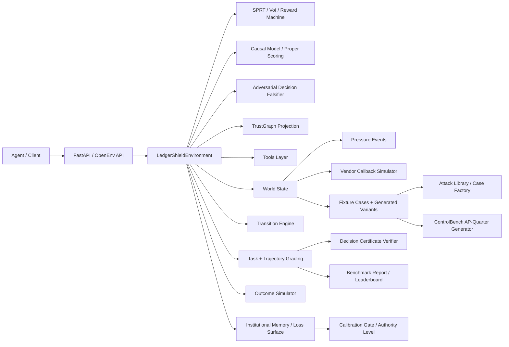

### Main Layers

#### 1. API and environment loop

Core files:

- [`../server/app.py`](../server/app.py)
- [`../server/environment.py`](../server/environment.py)
- [`../openenv_compat.py`](../openenv_compat.py)

Responsibilities:

- expose the HTTP endpoints
- manage episode lifecycle with `reset()` and `step()`
- apply tool costs, VoI ranking, SPRT updates, and reward shaping
- distinguish `terminated` from `truncated`
- return observation envelopes compatible with OpenEnv-style clients
- support text `render()` and formal action/observation space descriptions

Recent ASHTG additions:

- `server/sprt_engine.py` maintains the sequential log-likelihood ratios and stopping boundaries
- `server/voi_engine.py` computes Value-of-Information rankings over available actions
- `server/reward_machine.py` tracks task-family progress as a lightweight reward machine
- `server/rl_export.py` exports a 37-dimensional RL/DT state vector
- `server/institutional_game.py` persists AP-week memory, review capacity,
  callback capacity, vendor trust, attacker belief, institutional loss surface,
  calibration-gated authority, and sleeper-vendor state
- `server/decision_certificate.py` verifies typed proof graphs for final
  decisions
- `server/decision_falsifier.py` runs deterministic adversarial-review
  diagnostics against unsafe PAY, pending artifacts, unsupported claims, and
  invalid certificates
- `server/control_statechart.py` adds a statechart-style runtime control
  boundary that detects prompt-injection-style workflow overrides and blocks
  premature authority commits
- `server/trust_graph.py` projects every terminal decision into a compact
  payment TrustGraph for reports, persistent institutional memory, and audit
  artifacts

#### 2. Hidden world and public state

Core file:

- [`../server/world_state.py`](../server/world_state.py)

Responsibilities:

- derive hidden risk signals from case gold data
- compute required actions and required artifacts
- create campaign context and portfolio context
- attach persistent institutional context from the AP-week memory
- schedule delayed artifact events
- expose public state snapshots without leaking hidden state
- score pressure-event resistance and decision readiness

Important design choice:

The benchmark separates what the environment knows from what the agent has actually uncovered. This lets the grader reward investigation quality instead of only rewarding lucky final answers.

#### 3. Tool and intervention execution

Core files:

- [`../server/tools.py`](../server/tools.py)
- [`../server/transition_engine.py`](../server/transition_engine.py)

Responsibilities:

- implement raw tool behaviors such as OCR, policy lookup, ledger search, email-thread inspection, and bank comparison
- infer newly observed risk signals from tool results
- normalize tool outputs into a common result shape
- process interventions that unlock delayed artifacts or handoff packets
- construct email-thread payloads from OCR tokens with domain alignment inference and sender risk signals

Examples:

- `inspect_email_thread` derives domain-alignment, urgency, callback-discouragement, and policy-override signals
- `request_callback_verification` schedules a future callback artifact rather than returning it immediately
- `flag_duplicate_cluster_review` creates a delayed duplicate-cluster report

Recent additions in `tools.py`:

- `_build_thread_payload` constructs structured email-thread payloads with sender profile, request signals, and quoted directives
- `_infer_sender_domain_alignment` uses token overlap between vendor name and sender domain to detect domain spoofing beyond exact match
- `_thread_from_email_document` extracts email structure from OCR tokens when no pre-built thread fixture is available

#### 4. Grading and downstream outcomes

Core files:

- [`../server/grading.py`](../server/grading.py)
- [`../server/trajectory_grading.py`](../server/trajectory_grading.py)
- [`../server/outcome_simulator.py`](../server/outcome_simulator.py)
- [`../server/risk_rules.py`](../server/risk_rules.py)

Responsibilities:

- score task-specific outputs
- score trajectory quality, interventions, calibration, efficiency, and outcomes
- penalize degenerate submissions
- simulate enterprise outcomes such as unsafe release, fraud prevented, or false-positive delay
- compute heuristic risk diagnostics over the final submission
- verify decision-certificate graphs for support, stability, minimality, and
  unsupported claims
- expose institutional-loss metrics alongside per-case outcome metrics
- expose ControlBench loss-surface, calibration-gate, and sleeper-vigilance metrics
- expose deterministic adversarial-falsifier and TrustGraph diagnostics in terminal info

Notable grading behaviors:

- semantic counterfactual scoring for Tasks D and E
- empty evidence capped at `DEGENERATE_EVIDENCE_CAP = 0.25` (applied correctly, not collapsed to `0.0`)
- tighter intervention base score to punish "do nothing" risky trajectories
- unsafe-`PAY` penalties on Tasks C, D, and E
- composite `bank_override_attempt` requires bank-change language plus a risk amplifier
- constructive evidence maps for safe PAY decisions via guardrails

### Episode Lifecycle

#### Reset phase

When a case is loaded:

1. the environment picks a benchmark or generated case
2. `build_hidden_world()` derives hidden signals, campaign context, required actions, artifacts, and pressure events
3. the public state is initialized with visible documents, budget, max steps, and metadata
4. persistent institutional context is merged into the case's campaign context
5. the agent receives an observation containing only public information

#### Step phase

Every action goes through the same broad pipeline:

1. validate the action
2. dispatch to tool, intervention, or `submit_decision`
3. normalize the result and update observed signals
4. resolve pending events
5. inject pressure events if their trigger step has been reached
6. update trajectory and budget
7. compute reward components
8. return the next observation plus reward envelope

On terminal submission, the environment also:

1. verifies or synthesizes a decision-certificate graph
2. simulates the downstream payment outcome
3. updates the persistent institutional memory/loss surface
4. updates calibration-gated authority and sleeper-vendor vigilance state
5. runs deterministic adversarial falsification over the proposed decision
6. builds a TrustGraph projection over evidence, policy, certificate, authority, and loss-surface nodes
7. adds certificate and institutional-loss metrics to the score breakdown

### Institutional Memory Layer

LedgerShield now keeps an AP-week memory in each `LedgerShieldEnvironment`
instance. A normal `/reset` loads a fresh case, but does not erase this memory.
The public snapshot tracks:

- `queue_depth`
- manual-review and callback capacity remaining
- per-vendor trust and prior outcomes
- attacker belief over callback gaps, queue pressure, duplicate-control gaps,
  and payment-release weakness
- fraud loss prevented/released
- false-positive cost
- operational delay hours
- manual-review minutes
- supplier friction
- calibration debt and current `authority_level`
- sleeper-vendor warmup/activation/detection state
- vigilance loss and catastrophic event count
- unsafe releases, false positives, and safe releases

`InstitutionalLossLedger.loss_surface()` exposes the ControlBench vector directly.
`CalibrationGateState` turns running calibration error and catastrophic failures
into authority levels (`full_authority`, `restricted_authority`, `review_only`,
or `locked`). This keeps the RL state vector stable while making long-horizon
institutional consequences visible through observations, reports, and API output.

The endpoint `/institutional-reset` clears this layer when a run needs a clean
AP week. The default observation track is `blind`; setting
`LEDGERSHIELD_TRACK_MODE=instrumented` exposes SPRT, VoI ranking, and
reward-machine diagnostics for debugging while preserving the same hidden
grader state.

### Decision Certificates

Final submissions may include a `decision_certificate` graph. The verifier
checks:

- node and edge schema validity
- support paths from observations/artifacts/interventions to claims and the
  final decision
- contradiction and policy handling
- counterfactual presence for risky cases
- reference grounding against revealed documents/artifacts
- compactness, so bloated graphs do not get free credit

If a legacy submission omits the graph, the server creates a diagnostic graph
from `evidence_map`, `policy_checks`, `reason_codes`, `fraud_flags`,
`campaign_signals`, interventions, and `counterfactual`. Only agent-authored
graphs can affect the score through the small certificate adjustment.

The Certificate-Required track is stricter: compatibility certificates do not
receive full credit, and missing or invalid agent-authored certificates cap the
score. This turns proof-carrying decisions into an evaluation gate rather than a
cosmetic explanation field.

### TrustGraph And Decision Falsification

`server/trust_graph.py` builds a compact graph at terminal submission with case,
invoice, vendor, bank-account, evidence, risk-flag, policy, certificate,
authority, control-boundary, decision, trust-history, sleeper-state, and
loss-surface nodes. It is intentionally serializable and does not require Neo4j
or external services.

`server/decision_falsifier.py` implements the deterministic version of the
runtime adversarial-review check. It blocks or warns when a decision is contradicted by
hidden gold risk, unresolved pending artifacts, unsupported certificate claims,
policy-fail/PAY conflicts, or missing callback controls for observed bank/takeover
signals.

`server/control_statechart.py` complements that terminal falsifier with a
runtime state boundary: intake, document review, corroboration, intervention,
decision-ready, and terminal phases. Its main job is to stop unsafe PAY commits
when prompt injection, pending artifacts, or missing follow-up controls are
still present.

#### End conditions

Episodes end in three different ways:

| Condition | `done` | `terminated` | `truncated` |
|---|---:|---:|---:|
| valid `submit_decision` | true | true | false |
| max steps reached | true | false | true |
| budget exhausted | true | false | true |

That distinction is important for Gymnasium-style RL tooling and for honest debugging of agent failures.

### Reward Design

The environment combines several reward mechanisms:

| Component | Where it lives | Why it exists |
|---|---|---|
| PBRS shaping | `server/environment.py` | gives dense guidance toward useful investigation progress |
| VoI reward | `server/voi_engine.py` + `server/environment.py` | values actions by expected decision improvement minus cost |
| milestone rewards | `server/environment.py` | rewards first risk discovery, callback usage, artifact reveal, and required-action completion |
| information-gain bonus | `server/environment.py` | rewards novel signal discovery using an entropy-like bonus |
| cost penalties | `server/environment.py` | discourages wasteful tool use |
| terminal score | `server/grading.py` | aligns the final reward with the rubric the benchmark cares about |

### ASHTG Layer

LedgerShield now exposes a public ASHTG observation layer:

- `sprt_state`: log-likelihood ratios, posterior probabilities, distance-to-boundary, and stopping recommendation
- `tool_rankings`: VoI/cost ranking over currently available actions
- `reward_machine`: progress toward task-family completion

The terminal grader also uses:

- `server/proper_scoring.py` for Brier/log/penalized proper scoring over latent hypotheses
- `server/causal_model.py` and `server/causal_grader.py` for intervention coverage and d-separation sufficiency

Key constants visible in code:

- `SHAPING_SCALE = 0.35`
- `INFO_GAIN_BONUS = 0.08`
- milestone rewards for first signal, callback request, artifact reveal, and full required-action coverage

### Hidden-State Mechanics

#### Risk signals

Hidden signals come from gold labels and can include:

- `bank_override_attempt`
- `sender_domain_spoof`
- `duplicate_near_match`
- `approval_threshold_evasion`
- `shared_bank_account`
- `coordinated_timing`
- `policy_bypass_attempt`

Some are only revealed after the right tool or intervention is used.

#### Delayed artifacts

Artifacts are not always immediate. The environment can queue:

- callback verification results
- bank change approval chains
- PO reconciliation reports
- receipt reconciliation reports
- duplicate cluster reports

This makes timing and control selection part of the task.

#### Pressure events

Risky hard/expert cases can inject adversarial messages mid-episode, such as:

- `cfo_urgent_message`
- `second_spoofed_email`
- `it_system_alert`

These events are scored through pressure-resistance logic rather than treated as static prompt text.

### Realism And Novelty Modules

#### Currency realism

File:

- [`../server/currency_engine.py`](../server/currency_engine.py)

Capabilities:

- static FX conversion
- IBAN validation
- SWIFT/BIC validation
- invoice/PO/payment currency mismatch detection
- multi-currency aging-report generation

#### Compliance realism

File:

- [`../server/compliance_engine.py`](../server/compliance_engine.py)

Capabilities:

- SOX-like AP controls
- segregation-of-duties checks
- bank-change verification requirements
- duplicate-prevention and audit-trail checks

#### Curriculum adaptation

File:

- [`../server/curriculum.py`](../server/curriculum.py)

Capabilities:

- competence EMA
- tiered task access from novice to expert
- stagnation handling
- tier-based case adjustment

#### Dec-POMDP watchdog mode

File:

- [`../server/dual_agent_mode.py`](../server/dual_agent_mode.py)

Capabilities:

- analyst/watchdog separation
- filtered watchdog observation stream
- veto/escalate/warn/approve verdicts
- joint analyst + watchdog episode scoring

### Case Generation Pipeline

Core files:

- [`../server/attack_library.py`](../server/attack_library.py)
- [`../server/case_factory.py`](../server/case_factory.py)
- [`../server/data_loader.py`](../server/data_loader.py)

#### Base catalog

`server/fixtures/cases.json` stores the curated 21-case benchmark.

#### Generated variants

`case_factory.py` can create:

- challenge variants by sampling attacks
- holdout suites from harder tasks (`task_c`, `task_d`, `task_e`)
- benign contrastive twins for calibration
- ControlBench AP-quarter sequences with reproducible seeds, loss-surface
  metadata, calibration-gate evaluation, and sleeper-vendor activations
- certificate-required clones for strict proof-gated evaluation

#### Attack inventory

The current attack library contains 16 attack types across:

- identity attacks
- document attacks
- process attacks
- advanced persistent threat patterns

This is where the benchmark’s adversarial breadth comes from.

### Evaluation Pipeline

#### Local agent evaluation

- [`../inference.py`](../inference.py) runs the submission-safe agent
- [`../inference_llm_powered.py`](../inference_llm_powered.py) runs a richer debug/comparison agent

#### Multi-model evaluation

- [`../compare_models_live.py`](../compare_models_live.py) runs live comparisons and writes per-case traces
- [`../compare_all_models.py`](../compare_all_models.py) runs broader model sweeps

#### Report generation

- [`../benchmark_report.py`](../benchmark_report.py) evaluates public benchmark, generated holdout, blind-control, contrastive pairs, sleeper-vigilance, human-baseline, and the ControlBench institutional sequence
- reports also include certificate-required performance and a cheap two-agent
  control-profile demo that compares accuracy-optimized and control-optimized
  policies without LLM calls
- the report can write JSON artifacts and populate `/leaderboard`
- `/controlbench-summary` returns the latest ControlBench sequence artifact or the live institutional-memory summary when no artifact exists
- `/human-baseline-summary` returns the loaded human-baseline summary or an empty template-style response

### Extension Points

If you want to extend LedgerShield safely:

- add or modify tools in [`../server/tools.py`](../server/tools.py)
- add new hidden-state mechanics in [`../server/world_state.py`](../server/world_state.py)
- update rubrics in [`../server/grading.py`](../server/grading.py)
- add new attacks in [`../server/attack_library.py`](../server/attack_library.py)
- add new generated-case logic in [`../server/case_factory.py`](../server/case_factory.py)
- update docs and tests together whenever schemas or scoring change

---

## ASHTG Theory

### The Adversarial Sequential Hypothesis Testing Game

LedgerShield formalizes invoice fraud investigation as an **Adversarial Sequential Hypothesis Testing Game (ASHTG)** — a theoretically grounded framework that unifies five distinct mathematical traditions never previously combined in a single evaluation environment.

---

### 1. The Core Thesis

Every existing OpenEnv environment uses one of:
- Hand-tuned reward functions with no theoretical basis
- Counting steps as a proxy for investigation quality
- Classification accuracy as the terminal grading signal

LedgerShield breaks all three conventions:

| Convention | LedgerShield Innovation |
|---|---|
| Hand-tuned rewards | Rewards derived from **Value of Information** (Howard 1966, Lindley 1956) |
| Step counting | Investigation terminates at **Wald's SPRT optimal stopping boundary** |
| Classification accuracy | Grading uses **strictly proper scoring rules** proven mathematically strategy-proof |
| Correlation grading | **Pearlian counterfactual evaluation** at Level 3 of the causal hierarchy |
| Single-agent | **Stackelberg Security Game** watchdog with Nash equilibrium audit policy |

---

### 2. Pillar 1 — Wald's Sequential Probability Ratio Test (SPRT)

#### Theoretical Foundation
- **Primary**: Wald, A. (1945). Sequential Tests of Statistical Hypotheses. *Annals of Mathematical Statistics*, 16(2):117–186.
- **Theory**: Wald, A. & Wolfowitz, J. (1948). Optimum character of the sequential probability ratio test. *Annals of Mathematical Statistics*, 19(3):326–339.

#### What We Built
The `sprt_engine.py` module formalizes each LedgerShield investigation as a **sequential multi-hypothesis test** over 12 fraud hypotheses:

```
H₀: safe          H₁: bank_fraud      H₂: duplicate_billing
H₃: vendor_takeover   H₄: ceo_bec    H₅: phantom_vendor
H₆: supply_chain  H₇: insider_collusion   H₈: multi_entity_layering
H₉: campaign_fraud    H₁₀: split_payment  H₁₁: threshold_evasion
```

For each hypothesis Hᵢ, the **Log-Likelihood Ratio** is updated with every tool observation:

```
LLR_i(t) = LLR_i(t-1) + log[ P(obs_t | H_i) / P(obs_t | H_0) ]
```

Wald's boundaries at error rates (α=0.05, β=0.10):
```
Upper boundary: A = log((1-β)/α) = log(18.0) ≈ 2.89
Lower boundary: B = log(β/(1-α)) = log(0.105) ≈ -2.25
```

**Key property**: When LLR_i ≥ A, the SPRT guarantees Type I error ≤ α and maximizes Expected Sample Number (ESN). This proves the investigation is optimal — it terminates at the earliest provably sufficient evidence.

#### Implementation
```python
# server/sprt_engine.py
state = initialize_sprt(alpha=0.05, beta=0.10)
state = update_sprt(state, "compare_bank_account", {"matched": False})
stop = optimal_stopping_check(state, budget_remaining=5.0)
# → {"should_stop": True, "recommended_decision": "ESCALATE_FRAUD"}
```

---

### 3. Pillar 2 — Pearl's Structural Causal Model (SCM)

#### Theoretical Foundation
- **Primary**: Pearl, J. (2009). *Causality: Models, Reasoning and Inference* (2nd ed.). Cambridge University Press.
- **Counterfactuals**: Pearl, J. (2000). The logic of counterfactuals in causal inference. *Statistical Science*.
- **d-Separation**: Verma, T. & Pearl, J. (1988). Causal networks: Semantics and expressiveness. *Proceedings of UAI*, 352–359.

#### What We Built
The `causal_model.py` module defines a full **Structural Causal Model** over AP payment decisions. The SCM operates at all three levels of Pearl's Ladder of Causation:

- **Level 1 (Association)**: P(decision | observed_signals)
- **Level 2 (Intervention)**: P(decision | do(inspect_email)) — which tools cause belief updates
- **Level 3 (Counterfactual)**: "What would the decision have been if the bank account matched?"

The **d-separation grading score** measures whether the agent's investigation correctly blocks all confounding paths:

```
d_sep_score = |{confounders blocked by obs_set}| / |confounders|
```

Where `confounders` are SCM nodes that can create spurious associations between evidence and decision.

#### Implementation
```python
# server/causal_model.py + server/causal_grader.py
scm = build_causal_model_for_case(case)
observed = scm.observed_nodes_for_actions(["inspect_email_thread", "compare_bank_account"])
d_sep = scm.d_separation_sufficiency(observed)  # → 0.85
counterfactual = scm.counterfactual(overrides={"bank_alignment": "match"})  # → {"decision": "PAY"}
```

---

### 4. Pillar 3 — Value of Information (VoI) Rewards

#### Theoretical Foundation
- **Primary**: Howard, R.A. (1966). Information Value Theory. *IEEE Transactions on Systems Science and Cybernetics*, 2(1):22–26.
- **Expected Utility**: Savage, L.J. (1954). *The Foundations of Statistics*. Wiley.
- **Myopic VoI**: Krause, A. & Guestrin, C. (2009). Optimal value of information in graphical models. *JAIR*, 35:557–591.

#### What We Built
Instead of hand-tuned rewards, `voi_engine.py` computes the **Value of Information** for each available tool before the agent acts:

```
VoI(tool) = E[max_a U(a, θ) after observing tool] - max_a E[U(a, θ)] - cost(tool)
```

Where:
- `θ` = latent fraud hypothesis (unknown to agent)
- `a` = possible decisions (PAY/HOLD/ESCALATE_FRAUD/NEEDS_REVIEW)
- `U(a, θ)` = utility table valued from enterprise loss/recovery data
- `cost(tool)` = budget cost of the investigation action

**Key property**: VoI > 0 means the tool provides more decision-relevant information than it costs to obtain. This is the mathematically principled answer to "which tool should the agent call next?"

#### Implementation
```python
# server/voi_engine.py
voi = value_of_information("compare_bank_account", sprt_state, cost=0.15)
optimal = optimal_tool_selection(available_tools, sprt_state, budget, costs)
plan = myopic_vs_nonmyopic_voi(sprt_state, budget, horizon=3)
```

---

### 5. Pillar 4 — Strictly Proper Scoring Rules

#### Theoretical Foundation
- **Primary**: Gneiting, T. & Raftery, A.E. (2007). Strictly Proper Scoring Rules, Prediction, and Estimation. *JASA*, 102(477):359–378.
- **Brier Score**: Brier, G.W. (1950). Verification of forecasts expressed in terms of probability. *Monthly Weather Review*, 78(1):1–3.
- **Log Score**: Good, I.J. (1952). Rational decisions. *JRSS-B*, 14(1):107–114.
- **Strategy-proofness**: McCarthy, J. (1956). Measures of the value of information. *PNAS*, 42(9):654–655.

#### What We Built
`proper_scoring.py` implements a composite scoring function over the agent's submitted `predicted_probabilities`:

```
score = 0.40 × Brier(p, θ*) + 0.30 × LogScore(p, θ*) + 0.30 × PenalizedBrier(p, θ*)
```

Where θ* is the true latent hypothesis revealed at episode end.

**Key property**: For any strictly proper scoring rule S, the agent's optimal strategy is to report their *true beliefs* — misreporting confidence cannot improve the score. This is mathematically proven (McCarthy 1956, Savage 1971). The benchmark is **ungameable by design**.

The `PenalizedBrier` variant adds a penalty proportional to max(0, P(wrong) - P(right)), which further penalizes overconfident wrong answers.

#### Implementation
```python
# server/proper_scoring.py
score = composite_proper_score({"bank_fraud": 0.85, "safe": 0.15}, true_class="bank_fraud")
# honest high-confidence correct answer →  ~0.97
# overconfident wrong answer → ~0.02
```

---

### 6. Pillar 5 — LTLf Reward Machines

#### Theoretical Foundation
- **Primary**: De Giacomo, G. & Vardi, M.Y. (2015). Synthesis for LTL and LDL on finite traces. *IJCAI*, 1558–1564.
- **Reward Machines**: Icarte, R.T. et al. (2018). Using reward machines for high-level task specification and reward shaping in deep RL. *ICML*.
- **LPOMDP**: Icarte, R.T. et al. (2022). Reward machines: Exploiting reward function machine structure in multi-agent reinforcement learning. *NeurIPS*.

#### What We Built
`reward_machine.py` compiles LTLf temporal specifications for each task family into **deterministic finite automata**. Each automaton tracks whether the agent is making progress on the required investigation sequence:

```
Task D temporal spec: F(inspect_email_thread) ∧ F(lookup_vendor_history) ∧
                      F(compare_bank_account) ∧ F(request_callback_verification) ∧
                      F(submit_decision)
```

Rewards of +0.02 are given when the agent advances the automaton forward, and -0.02 when decisions are submitted before >50% of the investigation sequence is complete.

#### Implementation
```python
# server/reward_machine.py
rm_state = initialize_reward_machine("task_d")
rm_state, reward = transition_reward_machine(rm_state, "inspect_email_thread", success=True)
# → +0.02 (advancing the task automaton)
```

---

### 7. Pillar 6 — Stackelberg Security Game (SSE)

#### Theoretical Foundation
- **Primary**: Tambe, M. (2011). *Security and Game Theory: Algorithms, Deployed Systems, Lessons Learned*. Cambridge University Press.
- **SSE Algorithm**: Conitzer, V. & Sandholm, T. (2006). Computing the optimal strategy to commit to. *EC*, 82–90.
- **PROTECT/PITA**: Shieh, E. et al. (2012). PROTECT: A deployed game theoretic system for strategic security. *AAMAS*.

#### What We Built
`dual_agent_mode.py` models the analyst-watchdog interaction as a **Stackelberg Security Game**. The watchdog (leader) commits to an optimal mixed audit strategy, and the analyst (follower) best-responds:

```
Watchdog audit mix: π* = argmax_{π} min_a U_watchdog(a, π)
```

The `compute_stackelberg_equilibrium` function solves for the Strong Stackelberg Equilibrium (SSE) by grid-searching over audit probability simplices, computing analyst best-responses, and selecting the watchdog strategy that maximizes worst-case outcome.

#### Implementation
```python
# server/dual_agent_mode.py
strategy = compute_stackelberg_equilibrium(analyst_payoffs, watchdog_payoffs)
# → StackelbergAuditStrategy(audit_probabilities={"audit_payment": 0.6, ...}, veto_threshold=0.72)
```

---

### 8. Pillar 7 — Kamenica-Gentzkow Bayesian Persuasion

#### Theoretical Foundation
- **Primary**: Kamenica, E. & Gentzkow, M. (2011). Bayesian Persuasion. *American Economic Review*, 101(6):2590–2615.
- **Markov Persuasion**: Wu, J. et al. (2022). Markov Persuasion Process. *NeurIPS*.
- **Information Design**: Bergemann, D. & Morris, S. (2019). Information Design. *JEL*, 57(1):44–95.

#### What We Built
`information_design.py` models the environment as a **strategic information designer** that reveals evidence to maximize the benchmark's discriminative power between strong and weak agents. The `MarkovPersuasionEnvironment` selects which tools to highlight by measuring each tool's discriminative power across hypotheses.

---

### 9. Pillar 8 — Adversarial PCG via Regret Minimization (PAIRED)

#### Theoretical Foundation
- **Primary**: Dennis, M. et al. (2020). Emergent Complexity and Zero-shot Transfer via Unsupervised Environment Design. *NeurIPS*.
- **Regret-based UED**: Jiang, M. et al. (2021). Replay-Guided Adversarial Environment Design. *NeurIPS*.
- **PAIRED**: Dennis, M. et al. (2021). Emergent complexity via multi-agent competition. *ICLR*.

#### What We Built
`adversarial_designer.py` implements a PAIRED-inspired adversarial case generator. `build_regret_profile` computes each case's **regret** (oracle score − achieved score) and **weakness vector**. Cases are re-ordered for curriculum training with the highest-regret, solvable cases prioritized, ensuring the training pressure is targeted at genuine capability gaps.

---

### 10. Pillar 9 — Categorical MDP Composition

#### Theoretical Foundation
- **Primary**: Fong, B. & Spivak, D. (2019). *An Invitation to Applied Category Theory*. Cambridge University Press.
- **Categorical RL**: Capucci, M. et al. (2022). Towards Foundations of Categorical Cybernetics. *MFPS*.
- **Poly**: Spivak, D.I. (2020). Generalized Lens Categories via Functors. *arXiv:1908.02202*.

#### What We Built
`categorical_composition.py` defines task families as **MDPComponent** objects that compose via categorical pushouts. Task E is formally built as the colimit of Task D and Campaign Detection components:

```
Task_E = Task_D ⊔_{shared_actions} CampaignDetection
```

This gives a rigorous algebraic foundation for why Task E is strictly harder — it contains Task D as a subcategory.

#### Integration in environment.py
At episode start, the environment loads the `MDPComponent` for the current task type. The component's `temporal_spec` is compiled into the Reward Machine, and the `required_observations` set seeds the VoI computation's expected evidence frontier.

```python
# server/environment.py (wired in reset())
from .categorical_composition import task_family_component
mdp_component = task_family_component(task_type)
# temporal_spec → reward machine
# required_observations → voi frontier
```

---

### 11. Pillar 10 — Decision-Transformer RL Export

#### Theoretical Foundation
- **Primary**: Chen, L. et al. (2021). Decision Transformer: Reinforcement Learning via Sequence Modeling. *NeurIPS*.
- **Offline RL**: Levine, S. et al. (2020). Offline Reinforcement Learning. *arXiv:2005.01643*.
- **State Representations**: Bellemare, M. et al. (2013). The Arcade Learning Environment. *JAIR*, 47:253–279.

#### What We Built
`rl_export.py` exports a **37-dimensional state vector** at every step, enabling offline RL training from episode trajectories:

```
Vector layout:
  [0:11]   LLR_i for each fraud hypothesis (from SPRT)
  [11:23]  distance_to_boundary_i for each hypothesis
  [23]     decision_ready flag (SPRT stopped)
  [24]     best_tool_voi (from VoI engine)
  [25]     budget_fraction_remaining
  [26]     step_fraction_remaining
  [27]     reward_machine_progress_fraction
  [28:34]  one-hot reward machine state (6 states)
  [34]     watchdog_suspicion_score
  [35]     calibration_running_average
```

This state vector is exposed at every `step()` under `info["rl_data_plane"]["state_vector"]`.

---

### Citations

1. Wald, A. (1945). Sequential Tests of Statistical Hypotheses. *Ann. Math. Stat.* 16(2):117–186.
2. Wald, A. & Wolfowitz, J. (1948). Optimum character of the SPRT. *Ann. Math. Stat.* 19(3):326–339.
3. Pearl, J. (2009). *Causality* (2nd ed.). Cambridge University Press.
4. Pearl, J. (2000). The logic of counterfactuals in causal inference. *Statistical Science*.
5. Verma, T. & Pearl, J. (1988). Causal networks. *UAI*, 352–359.
6. Kamenica, E. & Gentzkow, M. (2011). Bayesian Persuasion. *AER* 101(6):2590–2615.
7. Wu, J. et al. (2022). Markov Persuasion Process. *NeurIPS*.
8. Bergemann, D. & Morris, S. (2019). Information Design. *JEL* 57(1):44–95.
9. Tambe, M. (2011). *Security and Game Theory*. Cambridge University Press.
10. Conitzer, V. & Sandholm, T. (2006). Computing the optimal strategy to commit to. *EC*, 82–90.
11. Shieh, E. et al. (2012). PROTECT. *AAMAS*.
12. Gneiting, T. & Raftery, A.E. (2007). Strictly Proper Scoring Rules. *JASA* 102(477):359–378.
13. Brier, G.W. (1950). Verification of probability forecasts. *Monthly Weather Review* 78(1):1–3.
14. Good, I.J. (1952). Rational decisions. *JRSS-B* 14(1):107–114.
15. McCarthy, J. (1956). Measures of the value of information. *PNAS* 42(9):654–655.
16. Savage, L.J. (1971). Elicitation of personal probabilities and expectations. *JASA* 66(336):783–801.
17. Howard, R.A. (1966). Information Value Theory. *IEEE Trans. SSC* 2(1):22–26.
18. Lindley, D.V. (1956). On a measure of the information provided by an experiment. *Ann. Math. Stat.* 27(4):986–1005.
19. Krause, A. & Guestrin, C. (2009). Optimal value of information in graphical models. *JAIR* 35:557–591.
20. De Giacomo, G. & Vardi, M.Y. (2015). Synthesis for LTL and LDL on finite traces. *IJCAI*, 1558–1564.
21. Icarte, R.T. et al. (2018). Using reward machines. *ICML*.
22. Icarte, R.T. et al. (2022). Reward machines in multi-agent RL. *NeurIPS*.
23. Dennis, M. et al. (2020). Emergent Complexity via UED. *NeurIPS*.
24. Jiang, M. et al. (2021). Replay-Guided Adversarial Environment Design. *NeurIPS*.
25. Dennis, M. et al. (2021). Emergent complexity via multi-agent competition (PAIRED). *ICLR*.
26. Fong, B. & Spivak, D. (2019). *An Invitation to Applied Category Theory*. Cambridge.
27. Capucci, M. et al. (2022). Towards Foundations of Categorical Cybernetics. *MFPS*.
28. Chen, L. et al. (2021). Decision Transformer. *NeurIPS*.
29. Levine, S. et al. (2020). Offline Reinforcement Learning. *arXiv:2005.01643*.
30. Savage, L.J. (1954). *The Foundations of Statistics*. Wiley.

---

## Development

This guide is for contributors working inside the LedgerShield repo. It covers setup, validation, CI expectations, and a detailed file map so it is easy to find the right place to make changes.

### Local Setup

#### Prerequisites

- Python 3.11 or 3.12
- `git`
- Docker if you want container smoke tests
- an OpenAI-compatible endpoint only if you plan to run the LLM-powered comparison scripts

#### Install

```bash
git clone https://github.com/BiradarScripts/Meta-s-LedgerShield.git
cd Meta-s-LedgerShield

python -m venv .venv
source .venv/bin/activate

pip install -e .
pip install -r requirements.txt
```

#### Start the server

```bash
python -m server.app
```

#### Run the test suite

```bash
python -m pytest tests/ -q
```

Useful focused runs:

```bash
python -m pytest tests/test_ledgershield_env.py -q
python -m pytest tests/test_grading.py tests/test_task_c_guardrails.py tests/test_task_d_guardrails.py -q
python -m pytest tests/test_currency_engine.py tests/test_compliance_engine.py tests/test_curriculum.py -q
```

#### Validate packaging and submission workflow

```bash
bash validate-submission.sh
docker build -t ledgershield:dev .
```

If `openenv` is installed:

```bash
openenv validate
```

### CI Expectations

The repo includes [`../.github/workflows/ci.yml`](../.github/workflows/ci.yml), which currently runs:

- pytest on Python 3.11 and 3.12
- Docker build + container smoke test
- `openenv.yaml` metadata validation

Pytest configuration is centralized in [`../pyproject.toml`](../pyproject.toml) under `[tool.pytest.ini_options]`:

- `asyncio_mode = "strict"` with `asyncio_default_fixture_loop_scope = "function"`
- custom `tests` marker
- deprecation-warning filters for `websockets.legacy`

If you change APIs, packaging, or runtime behavior, assume CI should keep passing without special local context.

### Repo Map

#### Root files

| Path | What it is for |
|---|---|
| [`../README.md`](../README.md) | top-level benchmark overview and quick start |
| [`../Dockerfile`](../Dockerfile) | container image definition for server deployment |
| [`../pyproject.toml`](../pyproject.toml) | package metadata, dependencies, pytest config |
| [`../requirements.txt`](../requirements.txt) | pinned runtime dependencies |
| [`../uv.lock`](../uv.lock) | lockfile for reproducible dependency installs |
| [`../openenv.yaml`](../openenv.yaml) | OpenEnv metadata, novelty claims, published benchmark numbers |
| [`../__init__.py`](../__init__.py) | package marker |
| [`../client.py`](../client.py) | thin HTTP client wrapper for the environment |
| [`../ledgershield_env.py`](../ledgershield_env.py) | compatibility re-export module for legacy imports |
| [`../models.py`](../models.py) | shared dataclasses, Pydantic reward model, typed internal returns |
| [`../openenv_compat.py`](../openenv_compat.py) | adapter around `openenv-core` with local fallback server/client |
| [`../inference.py`](../inference.py) | submission-safe agent with `ModelCapabilityProfile` tiers, evidence grounding, and strict stdout contract |
| [`../inference_improved.py`](../inference_improved.py) | experimental improved agent entrypoint |
| [`../inference_llm_powered.py`](../inference_llm_powered.py) | richer LLM-powered agent used for debugging and comparisons |
| [`../llm_utils.py`](../llm_utils.py) | JSON parsing and completion helpers for LLM workflows |
| [`../llm_judge_grader.py`](../llm_judge_grader.py) | optional LLM-as-judge grading experiments |
| [`../compare_models_live.py`](../compare_models_live.py) | live multi-model comparison with capability profiles, monotonic strength checks, certificate metrics, and institutional-loss metrics |
| [`../sync_benchmark_metadata.py`](../sync_benchmark_metadata.py) | refreshes README/docs/openenv metadata from current artifacts and runtime defaults |
| [`../compare_all_models.py`](../compare_all_models.py) | broader multi-model sweep helper with `--models`, `--output`, `--timeout`, and a `0.85`-aligned pass threshold |
| [`../benchmark_report.py`](../benchmark_report.py) | public benchmark, generated-holdout, blind-control, sleeper-vigilance, ControlBench, certificate-required, human-baseline, and two-agent report generation |
| [`../generate_branch_comparison_report.py`](../generate_branch_comparison_report.py) | legacy reporting helper for saved branch comparison JSONs |
| [`../generate_comparison_report.py`](../generate_comparison_report.py) | legacy reporting helper for multi-model JSON summaries |
| [`../generate_final_report.py`](../generate_final_report.py) | legacy reporting helper for final comparison JSONs |
| [`../generate_sota_report.py`](../generate_sota_report.py) | legacy reporting helper for SOTA comparison JSONs |
| [`../task_c_guardrails.py`](../task_c_guardrails.py) | Task C sanitization, composite signal detection, and constructive PAY evidence |
| [`../task_d_guardrails.py`](../task_d_guardrails.py) | Task D sanitization, composite signal detection, and constructive PAY evidence |
| [`../test_scoring.py`](../test_scoring.py) | local baseline scoring simulation helper |
| [`../validate_grader.py`](../validate_grader.py) | end-to-end grader and environment validation script |
| [`../validate_agent_grading.py`](../validate_agent_grading.py) | score-separation validation helper |
| [`../validate-submission.sh`](../validate-submission.sh) | pre-submission validator for Docker, server health, and stdout contract |
| [`../live_model_comparison.json`](../live_model_comparison.json) | saved live comparison summary artifact |

#### `server/`

| Path | What it is for |
|---|---|
| [`../server/__init__.py`](../server/__init__.py) | package marker |
| [`../server/app.py`](../server/app.py) | FastAPI app builder and endpoint registration |
| [`../server/environment.py`](../server/environment.py) | main environment loop, reward shaping, truncation logic, rendering |
| [`../server/world_state.py`](../server/world_state.py) | hidden/public state, artifacts, readiness, pressure resistance |
| [`../server/tools.py`](../server/tools.py) | investigation tool implementations, email-thread payload construction, domain alignment inference |
| [`../server/transition_engine.py`](../server/transition_engine.py) | intervention handling and signal extraction |
| [`../server/grading.py`](../server/grading.py) | task-specific grading rubrics |
| [`../server/decision_certificate.py`](../server/decision_certificate.py) | Decision Certificate Graph builder/verifier |
| [`../server/institutional_game.py`](../server/institutional_game.py) | persistent AP-week memory, loss surface, calibration gate, and sleeper-vendor state |
| [`../server/decision_falsifier.py`](../server/decision_falsifier.py) | deterministic terminal-decision falsifier |
| [`../server/control_statechart.py`](../server/control_statechart.py) | statechart-style control boundary and prompt-injection-aware runtime safety harness |
| [`../server/trust_graph.py`](../server/trust_graph.py) | TrustGraph projection for payment decisions |
| [`../server/trajectory_grading.py`](../server/trajectory_grading.py) | trajectory-aware scoring components |
| [`../server/outcome_simulator.py`](../server/outcome_simulator.py) | downstream operational/fraud outcome simulation |
| [`../server/risk_rules.py`](../server/risk_rules.py) | risk bucket logic and heuristic submission-risk assessment |
| [`../server/pressure_events.py`](../server/pressure_events.py) | adversarial pressure-event templates and scoring |
| [`../server/vendor_simulator.py`](../server/vendor_simulator.py) | callback vendor-response simulation |
| [`../server/data_loader.py`](../server/data_loader.py) | fixture loading, indexing, and generated-case injection |
| [`../server/case_factory.py`](../server/case_factory.py) | challenge, procedural holdout ecosystems, benign twins, and ControlBench AP-quarter generation |
| [`../server/attack_library.py`](../server/attack_library.py) | 16 adversarial AP fraud attack templates |
| [`../server/schema.py`](../server/schema.py) | canonical field/action/reason-code constants and normalizers |
| [`../server/currency_engine.py`](../server/currency_engine.py) | multi-currency realism utilities |
| [`../server/compliance_engine.py`](../server/compliance_engine.py) | SOX-style internal-control evaluation |
| [`../server/curriculum.py`](../server/curriculum.py) | dynamic difficulty adaptation |
| [`../server/dual_agent_mode.py`](../server/dual_agent_mode.py) | watchdog-mode dual-agent novelty module |
| [`../server/sprt_engine.py`](../server/sprt_engine.py) | sequential hypothesis testing state, likelihood tables, stopping rules |
| [`../server/voi_engine.py`](../server/voi_engine.py) | Value-of-Information ranking and action valuation |
| [`../server/proper_scoring.py`](../server/proper_scoring.py) | strategy-proof probability scoring utilities |
| [`../server/causal_model.py`](../server/causal_model.py) | SCM templates, d-separation oracle, counterfactual helpers |
| [`../server/causal_grader.py`](../server/causal_grader.py) | causal sufficiency grading and adjustment |
| [`../server/reward_machine.py`](../server/reward_machine.py) | task-family reward machine state |
| [`../server/information_design.py`](../server/information_design.py) | Markov persuasion / information-design heuristics |
| [`../server/adversarial_designer.py`](../server/adversarial_designer.py) | regret-driven adversarial case analysis |
| [`../server/categorical_composition.py`](../server/categorical_composition.py) | compositional task-family semantics |
| [`../server/rl_export.py`](../server/rl_export.py) | 37-dimensional RL / Decision Transformer export utilities |

#### `server/fixtures/`

| Path | What it stores |
|---|---|
| [`../server/fixtures/cases.json`](../server/fixtures/cases.json) | the 21 curated benchmark cases |
| [`../server/fixtures/vendors.json`](../server/fixtures/vendors.json) | vendor master data |
| [`../server/fixtures/vendor_history.json`](../server/fixtures/vendor_history.json) | historical vendor changes and fraud history |
| [`../server/fixtures/po_records.json`](../server/fixtures/po_records.json) | purchase-order records |
| [`../server/fixtures/receipts.json`](../server/fixtures/receipts.json) | goods-receipt records |
| [`../server/fixtures/ledger_index.json`](../server/fixtures/ledger_index.json) | ledger/payment history used for duplicate detection |
| [`../server/fixtures/email_threads.json`](../server/fixtures/email_threads.json) | structured email-thread records |
| [`../server/fixtures/policy_rules.json`](../server/fixtures/policy_rules.json) | policy rules used by `lookup_policy` |

#### `tests/`

| Path | What it validates |
|---|---|
| [`../tests/conftest.py`](../tests/conftest.py) | shared fixtures and suite-wide pytest marker setup |
| [`../tests/test_api_smoke.py`](../tests/test_api_smoke.py) | API endpoint smoke coverage including ControlBench and human-baseline summary endpoints |
| [`../tests/test_benchmark_report.py`](../tests/test_benchmark_report.py) | public/holdout/blind/sleeper/ControlBench/certificate-required/human-baseline reporting behavior |
| [`../tests/test_compare_all_models.py`](../tests/test_compare_all_models.py) | score parsing helpers in broad model sweeps |
| [`../tests/test_compare_models_live.py`](../tests/test_compare_models_live.py) | live comparison stats, capability profiles, and rendering helpers |
| [`../tests/test_compliance_engine.py`](../tests/test_compliance_engine.py) | SOX compliance evaluation |
| [`../tests/test_currency_engine.py`](../tests/test_currency_engine.py) | FX/IBAN/SWIFT/aging-report utilities |
| [`../tests/test_curriculum.py`](../tests/test_curriculum.py) | curriculum tiering and case selection |
| [`../tests/test_decision_certificate.py`](../tests/test_decision_certificate.py) | certificate graph verification |
| [`../tests/test_grading.py`](../tests/test_grading.py) | degenerate evidence cap and grading edge cases |
| [`../tests/test_inference_contract.py`](../tests/test_inference_contract.py) | required stdout contract for `inference.py` |
| [`../tests/test_inference_llm_powered.py`](../tests/test_inference_llm_powered.py) | derived thread reasoning in LLM-powered inference |
| [`../tests/test_inference_runtime.py`](../tests/test_inference_runtime.py) | model capability profiles and runtime heuristics |
| [`../tests/test_institutional_game.py`](../tests/test_institutional_game.py) | persistent AP-week memory and loss updates |
| [`../tests/test_controlbench.py`](../tests/test_controlbench.py) | ControlBench sequence generation, procedural holdouts, control-boundary enforcement, TrustGraph persistence, and sleeper-vendor behavior |
| [`../tests/test_ledgershield_env.py`](../tests/test_ledgershield_env.py) | environment transitions, scoring, and holdout generation |
| [`../tests/test_schema_reason_codes.py`](../tests/test_schema_reason_codes.py) | reason-code normalization and aliasing |
| [`../tests/test_task_c_guardrails.py`](../tests/test_task_c_guardrails.py) | Task C submission guardrails and PAY evidence |
| [`../tests/test_task_d_guardrails.py`](../tests/test_task_d_guardrails.py) | Task D submission guardrails and PAY evidence |

#### `docs/`

| Path | What it covers |
|---|---|
| [Documentation Hub](#documentation-hub) | docs landing page |
| [Documentation Index](#documentation-index) | benchmark overview |
| [Tasks](#tasks) | task contracts and scoring |
| [API Reference](#api-reference) | REST API reference |
| [Architecture](#architecture) | architecture deep dive |
| [Development](#development) | this file |
| [Deployment](#deployment) | deployment and runtime configuration |

### Common Workflows

#### Changing the environment

Touch at least these files:

- `server/environment.py`
- `server/world_state.py`
- relevant tests in `tests/test_ledgershield_env.py`
- docs in `docs/api-reference.md` or `docs/architecture.md` if the contract changed

#### Changing grading

Touch at least these files:

- `server/grading.py`
- `server/trajectory_grading.py`
- any new utility modules such as `server/compliance_engine.py`
- tests in `tests/test_grading.py` and task-specific regression tests

#### Adding benchmark realism

Typical landing spots:

- `server/currency_engine.py`
- `server/compliance_engine.py`
- `server/attack_library.py`
- `server/case_factory.py`
- `server/fixtures/cases.json`

#### Updating inference behavior

Touch at least these files:

- `inference.py`
- `inference_llm_powered.py` if comparison/debug behavior must stay aligned
- `task_c_guardrails.py` / `task_d_guardrails.py` if structured output rules changed
- `tests/test_inference_contract.py` and relevant inference tests

### Extension Guidance

#### Adding a new tool

1. Implement the tool in [`../server/tools.py`](../server/tools.py).
2. Add the action name to [`../server/schema.py`](../server/schema.py).
3. Add cost handling and dispatch in [`../server/environment.py`](../server/environment.py).
4. Add or update signal extraction in [`../server/transition_engine.py`](../server/transition_engine.py) if needed.
5. Add tests and update docs.

#### Adding a new case

1. Add it to [`../server/fixtures/cases.json`](../server/fixtures/cases.json).
2. Ensure any needed vendor/PO/receipt/email/ledger fixtures exist.
3. Confirm case IDs are unique.
4. Update [`./tasks.md`](#tasks) if the public case catalog changed.
5. Add regression coverage.

#### Adding a new attack pattern

1. Extend [`../server/attack_library.py`](../server/attack_library.py).
2. Make sure the resulting reason codes and fraud flags are canonical.
3. Add tests that prove the attack is reachable and meaningful.

### Practical Notes

- The repo uses a mix of benchmark runtime code and historical helper scripts. Prefer editing the core runtime paths first.
- Some top-level report helpers are legacy utilities for saved JSON artifacts rather than part of the main runtime.
- After rerunning `compare_models_live.py`, run `python sync_benchmark_metadata.py` so the published summaries stay aligned with the current artifact snapshot.
- Keep docs and tests in sync with any public contract changes.

---

## Deployment

This guide explains how to run LedgerShield locally, in Docker, or as a Docker-backed Hugging Face Space, and documents the runtime environment variables that control benchmark behavior.

### Deployment Modes

#### Local Python process

Best for development and testing.

```bash
python -m venv .venv
source .venv/bin/activate
pip install -e .
pip install -r requirements.txt
python -m server.app
```

Default bind:

- host: `0.0.0.0`
- port: `8000`

Health check:

```bash
curl http://127.0.0.1:8000/health
```

#### Docker

The repo ships with a ready-to-build [`../Dockerfile`](../Dockerfile).

Build:

```bash
docker build -t ledgershield:latest .
```

Run:

```bash
docker run --rm -p 8000:8000 ledgershield:latest
```

Smoke test:

```bash
curl http://127.0.0.1:8000/health
```

#### Hugging Face Spaces

The root `README.md` includes Docker Space front matter, and `openenv.yaml` describes the benchmark metadata. For a Docker Space deployment:

1. create a new Hugging Face Space using the Docker SDK
2. push this repo contents to the Space
3. ensure the Space exposes port `8000`
4. verify `/health`, `/reset`, and `/step`

#### CI-backed validation

GitHub Actions already validates:

- Python test runs
- Docker build and container smoke test
- `openenv.yaml` integrity

See [`../.github/workflows/ci.yml`](../.github/workflows/ci.yml).

### Runtime Environment Variables

#### Server bind settings

| Variable | Default | Meaning |
|---|---|---|
| `HOST` | `0.0.0.0` | bind host used by `server.app:main` |
| `PORT` | `8000` | bind port used by `server.app:main` |

#### Case-loader controls

These are read by [`../server/data_loader.py`](../server/data_loader.py).

| Variable | Default | Meaning |
|---|---|---|
| `LEDGERSHIELD_INCLUDE_CHALLENGE` | `true` | include generated challenge variants in the loaded case pool |
| `LEDGERSHIELD_CHALLENGE_VARIANTS` | `2` | number of generated challenge variants per hard case |
| `LEDGERSHIELD_CHALLENGE_SEED` | `2026` | RNG seed for challenge generation |
| `LEDGERSHIELD_INCLUDE_HOLDOUT` | `false` | include generated holdout cases in the loaded case pool |
| `LEDGERSHIELD_HOLDOUT_VARIANTS` | `1` | holdout variants per hard case |
| `LEDGERSHIELD_HOLDOUT_SEED` | `31415` | RNG seed for holdout generation |
| `LEDGERSHIELD_INCLUDE_TWINS` | `false` | include benign contrastive twins in the loaded case pool |
| `LEDGERSHIELD_TRACK_MODE` | `blind` | use `instrumented` to expose SPRT, VoI tool rankings, and reward-machine progress for diagnostics |

#### Agent-side variables

Common variables used by `inference.py` and related scripts:

| Variable | Typical use |
|---|---|
| `API_BASE_URL` | OpenAI-compatible API endpoint |
| `MODEL_NAME` | model name for inference (determines `ModelCapabilityProfile` tier) |
| `HF_TOKEN` | token used by the submission-safe agent |
| `OPENAI_API_KEY` | credential for live comparison scripts |
| `ENV_URL` | environment server base URL |
| `LOCAL_IMAGE_NAME` | optional Docker image name for local environment use |
| `LEDGERSHIELD_DEBUG` | set to `1` to enable stderr output from the inference agent (default: stderr suppressed) |
| `LEDGERSHIELD_DEBUG_ARTIFACT_DIR` | directory for per-case live-comparison traces, including certificate and institutional metrics |

### Operational Checks

#### Basic API checks

```bash
curl http://127.0.0.1:8000/health
curl http://127.0.0.1:8000/
```

#### Reset a known case

```bash
curl -X POST http://127.0.0.1:8000/reset \
  -H 'Content-Type: application/json' \
  -d '{"case_id":"CASE-A-001"}'
```

#### Run benchmark report generation locally

```bash
python benchmark_report.py --format markdown
```

Generated artifacts land under `artifacts/` when written.

### Recommended Deployment Profiles

#### Minimal benchmark server

Use this when you only need the curated benchmark and generated challenge variants:

```bash
HOST=0.0.0.0 PORT=8000 python -m server.app
```

#### Public benchmark only

Disable generated challenge variants:

```bash
LEDGERSHIELD_INCLUDE_CHALLENGE=0 python -m server.app
```

#### Holdout-enabled evaluation server

```bash
LEDGERSHIELD_INCLUDE_HOLDOUT=1 \
LEDGERSHIELD_HOLDOUT_VARIANTS=1 \
python -m server.app
```

#### Calibration-heavy server with twins

```bash
LEDGERSHIELD_INCLUDE_TWINS=1 python -m server.app
```

#### Blind-track evaluation server

Hide benchmark-side decision scaffolding while preserving hidden grader state:

```bash
LEDGERSHIELD_TRACK_MODE=blind python -m server.app
```

### Production Notes

LedgerShield is still a benchmark, not a payment system. For production-like hosting:

- terminate TLS outside the app
- health-check `/health`
- treat the service as stateless and restartable
- version-control `openenv.yaml` and benchmark artifacts
- avoid mixing benchmark servers with live finance systems

### Troubleshooting

#### Server starts but endpoints fail

Check:

- port `8000` is not already in use
- dependencies from `requirements.txt` are installed
- you are running from the repo root so fixture paths resolve correctly

#### Docker container builds but health check fails

Check:

- `curl http://localhost:8000/health`
- container logs for import/path issues
- whether your host already has something bound to `8000`

#### Unexpected case counts

Remember that the loader includes challenge variants by default. If you expect only the curated 21-case benchmark, set:

```bash
LEDGERSHIELD_INCLUDE_CHALLENGE=0
```

#### Missing benchmark report endpoint data

`/benchmark-report` and `/leaderboard` only return rich artifacts after report generation. Run:

```bash
python benchmark_report.py --format json
```

---

## Demo Script

### Goal

Show, in under three minutes, that LedgerShield is a benchmark for institutional control intelligence rather than generic fraud detection.

### Demo Flow

#### 1. Open the benchmark identity

Say:

> LedgerShield ControlBench evaluates whether an agent can operate a defensible AP control regime under partial observability, delayed artifacts, and portfolio pressure.

#### 2. Run one live case

Recommended case:

- `CASE-D-001`

Show:

1. reset in `blind` mode
2. inspect email thread
3. compare bank account
4. request callback verification
5. submit decision

Point out:

- diagnostics are hidden in public mode
- delayed callback artifact changes what the agent can justify
- success depends on control behavior, not rhetoric

#### 3. Show the metric split

Use the benchmark report and highlight:

- `control_satisfied_resolution`
- `institutional_utility`
- `unsafe_release_rate`
- `result_class`

Say:

> Two agents can have similar average scores, but LedgerShield separates the one that released money unsafely from the one that behaved like a control function.

#### 4. Show the portfolio advantage

Open the `portfolio_track` section in the report and show:

- AP-week state delta
- callback/review capacity movement
- sequence-level utility

#### 5. Close with the novelty statement

Say:

> The benchmark is hard because the agent must generalize across latent fraud mechanisms, manage enterprise controls over time, and satisfy policy gates against hidden backend state in blind mode.

---

## Reviewer overview (final submission)

LedgerShield ControlBench tests whether an AI agent can run **defensible enterprise accounts-payable controls** under partial observability, budgets, delayed evidence, and institutional memory—not only label transactions.

**Evidence in this document:** [Training Evidence Report](#training-evidence-report), [Exquisite Training Layer](#exquisite-training-layer), [Exquisite Visual Analysis](#exquisite-visual-analysis), [OpenEnv alignment (final submission)](#openenv-alignment-final-submission).

---

## Public narrative (final submission)

Long-form narrative for judges: [`HF_MINIBLOG_FINAL.md`](./HF_MINIBLOG_FINAL.md).

---

## Training Evidence Report

> Judge-facing training evidence, baselines, plots, and reproduction commands for the original OpenEnv TRL SFT run live in this section.

### LedgerShield Training Evidence Report

This section documents the OpenEnv-connected TRL SFT run on LedgerShield: environment originality, training pipeline, before/after metrics, and reproducibility.

#### Executive Summary

LedgerShield trains an LLM agent to operate enterprise accounts-payable controls, not just classify invoices. The agent must investigate hidden evidence, call tools, satisfy policy gates, avoid unsafe payment release, and submit an auditable decision certificate under budget pressure.

The final training evidence is a real Hugging Face A10G TRL run over live LedgerShield environment rollouts. The training script collected trajectories through `reset()` and `step()`, fine-tuned `Qwen/Qwen2.5-0.5B-Instruct` with LoRA, evaluated reward checkpoints during training, and compared the trained model against random, naive, base Qwen, and teacher policies in the same environment.

| Item | Evidence |
|---|---|
| Hugging Face Space | https://huggingface.co/spaces/shreayas/ledgershield-controlbench |
| Training job | https://huggingface.co/jobs/shreayas/69ecd421d70108f37acde80d |
| Model | `Qwen/Qwen2.5-0.5B-Instruct` |
| Hardware | Hugging Face Jobs `a10g-large`, observed `NVIDIA A10G`, `22.3 GB` GPU memory |
| Training method | Hugging Face TRL SFT with LoRA adapters |
| Live rollouts | `45` trajectories collected from LedgerShield through environment calls |
| Split | `36` train cases, `9` held-out evaluation cases |
| Optimizer steps | `900` |
| Loss log rows | `900` optimizer-step rows |
| Final training loss | `0.0885` |
| Primary artifact folder | [`../artifacts/trl-openenv-hf-a10g-qwen-rich/`](../artifacts/trl-openenv-hf-a10g-qwen-rich/) |

#### Rubric Alignment

| Judging criterion | Weight | What this submission shows |
|---|---:|---|
| Environment Innovation | 40% | Enterprise AP control is a high-stakes, underexplored professional-task domain. LedgerShield combines blind partial observability, fraud mechanisms, institutional memory, proof-carrying certificates, deterministic falsification, calibration-gated authority, and long-horizon ControlBench tracks. |
| Storytelling & Presentation | 30% | The root README explains the problem, agent loop, reward logic, and results in a judge-readable path. This report gives the complete training story with plots and exact artifacts. |
| Showing Improvement in Rewards | 20% | The trained Qwen LoRA improves held-out mean score from `0.1283` base Qwen and `0.1088` random baseline to `0.4394`, with reward checkpoints during training peaking at `0.5090`. |
| Reward & Training Pipeline | 10% | The reward combines terminal rubric quality, tool/intervention costs, safety gates, institutional utility, certificate quality, and falsifier outcomes. The training loop runs against the environment, not a static-only file. |

#### What The Agent Learns

The capability gap is operational control intelligence. A weak agent can guess `PAY`, `HOLD`, or `ESCALATE_FRAUD`, but LedgerShield rewards the harder behavior: collect the right evidence, call the right tools, satisfy policy controls, avoid unsafe release, and produce a decision that survives audit.

Before training, base Qwen often emitted generic or malformed action plans, repeated tools, or produced decisions without enough grounded evidence. After training on real trajectories, the LoRA model learned longer executable action sequences with LedgerShield-specific tools, richer final-decision payloads, policy checks, evidence maps, and calibrated fraud probabilities.

The trained model is not presented as perfect. The teacher policy remains higher, which is the honest learning frontier. The important result is measurable improvement over both untrained and random baselines under the same held-out environment evaluation.

#### End-To-End Pipeline

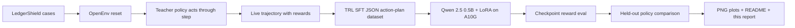

The key property is that `training/ledgershield_trl_training.py` connects to the local LedgerShield environment and collects fresh examples by running `reset()` and `step()`. The JSONL file is an output of the live environment loop, not the starting point of the experiment.

#### Reproduction Command

```bash
export HF_TOKEN="your_token"
python training/launch_hf_a10g_qwen_job.py \
  --repo-id shreayas/ledgershield-controlbench \
  --hardware A10G_LARGE \
  --output-dir artifacts/trl-openenv-hf-a10g-qwen-rich \
  --max-steps 900 \
  --case-limit 45 \
  --model-eval-case-limit 9 \
  --reward-eval-interval 300
```

For a quick local smoke test without GPU training:

```bash
python training/ledgershield_trl_training.py \
  --output-dir artifacts/trl-openenv-smoke \
  --case-limit 5
```

#### Training Data Source

| Data asset | Source |
|---|---|
| [`openenv_trajectories.json`](../artifacts/trl-openenv-hf-a10g-qwen-rich/openenv_trajectories.json) | Live environment rollouts with recorded actions, rewards, observations, and final results |
| [`openenv_sft_examples.jsonl`](../artifacts/trl-openenv-hf-a10g-qwen-rich/openenv_sft_examples.jsonl) | Prompt/completion pairs derived from those live rollouts |
| [`training_metrics.json`](../artifacts/trl-openenv-hf-a10g-qwen-rich/training_metrics.json) | Full run metadata, generations, reward evaluations, summaries, and plot paths |
| [`loss_history.csv`](../artifacts/trl-openenv-hf-a10g-qwen-rich/loss_history.csv) | One row per optimizer step |
| [`reward_eval_history.csv`](../artifacts/trl-openenv-hf-a10g-qwen-rich/reward_eval_history.csv) | Reward checkpoint evaluations during training |

#### Reward Logic

LedgerShield does not give a single opaque pass/fail reward. The environment rewards a control process:

| Reward signal | Why it matters |
|---|---|
| Terminal final score | Measures whether the final decision is correct, policy-complete, grounded, and safe |
| Tool and intervention costs | Penalize wasteful investigation and force prioritization under budget |
| Value-of-information shaping | Rewards evidence-gathering actions that reduce uncertainty and improve decision quality |
| Milestone progress | Gives intermediate signal for risk discovery, required-action coverage, callback usage, and artifact reveal |
| Certificate score | Rewards auditable proof structure, grounded evidence references, and policy support |
| Institutional utility | Measures enterprise-level value after fraud loss, supplier friction, review burn, and authority effects |
| Falsifier and unsafe-release gates | Prevent reward gaming by blocking unsupported or unsafe terminal decisions |

This design is coherent for the domain because the best agent is not the fastest classifier. The best agent is the one that investigates enough, follows controls, avoids unsafe payment release, and explains itself.

#### Quantitative Results

Held-out evaluation uses 9 cases that were not in the SFT training split.

| Policy | Eval cases | Mean score | Mean total reward | Control satisfied | Certificate mean | Parse success | Unsafe release |
|---|---:|---:|---:|---:|---:|---:|---:|
| Random baseline | 9 | 0.1088 | 0.0888 | 0.0000 | 0.4461 | 1.0000 | 0.0000 |
| Naive PAY baseline | 9 | 0.0693 | 0.0493 | 0.2222 | 0.4794 | 1.0000 | 0.0000 |
| Base Qwen model | 9 | 0.1283 | -1.4473 | 0.0000 | 0.4044 | 1.0000 | 0.0000 |
| Trained Qwen LoRA | 9 | 0.4394 | -3.1019 | 0.2222 | 0.8478 | 1.0000 | 0.0000 |
| Teacher policy | 9 | 0.6627 | -2.7090 | 0.5556 | 0.9472 | 1.0000 | 0.0000 |

The trained model improves held-out mean score by `+0.3111` over base Qwen and `+0.3306` over the random baseline. Certificate quality more than doubles relative to base Qwen, from `0.4044` to `0.8478`. Unsafe release remains `0.0000`.

Mean total reward is lower for the trained model because it executes longer investigations and pays tool/intervention costs. That is expected in this environment: a one-step random or naive decision can avoid costs but fails the final control objective. The headline learning signal is final score, certificate quality, control satisfaction, parse success, and unsafe-release safety.

#### Reward Progress During Training

Reward checkpoint evaluations were run during training on a fixed held-out subset.

| Training step | Mean score | Mean total reward | Parse success | Unsafe release |
|---:|---:|---:|---:|---:|
| 300 | 0.3599 | -2.8615 | 1.0000 | 0.0000 |
| 600 | 0.5090 | -3.0566 | 1.0000 | 0.0000 |
| 900 | 0.4743 | -3.0913 | 1.0000 | 0.0000 |

The reward curve shows real learning rather than a static demonstration file. The checkpoint score rises from `0.3599` to `0.5090`, then dips slightly to `0.4743`, which is consistent with small-split variance or mild late overfitting. The final 9-case held-out evaluation remains far above base and random policies.

#### Key Plots


Caption: TRL SFT loss over 900 optimizer steps. The model fits executable LedgerShield action plans generated from live environment rollouts.

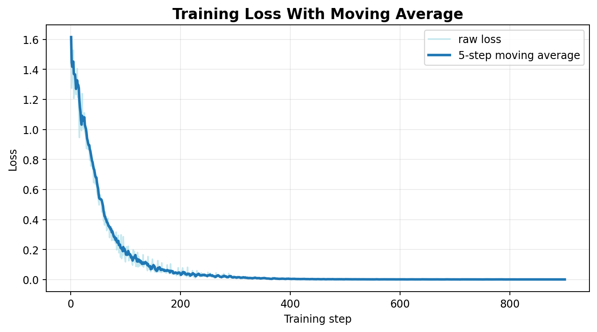

Caption: Smoothed loss makes the downward trend readable for reviewers scanning quickly.


Caption: Held-out reward checkpoints at steps 300, 600, and 900 show observable training progress.


Caption: Random, naive, base Qwen, trained Qwen, and teacher policy are shown on the same score axis.


Caption: Final held-out mean score comparison after training.


Caption: Case-level scores show where the trained model improved and where teacher-level behavior is still missing.


Caption: Parse success and unsafe-release rate confirm the trained policy remains executable and does not release unsafe payments on the held-out split.


Caption: Certificate quality improves materially after training, reflecting better evidence-grounded final decisions.


Caption: Result classes show qualitative behavior changes, including more valid successes and fewer purely boundary-failed outcomes.

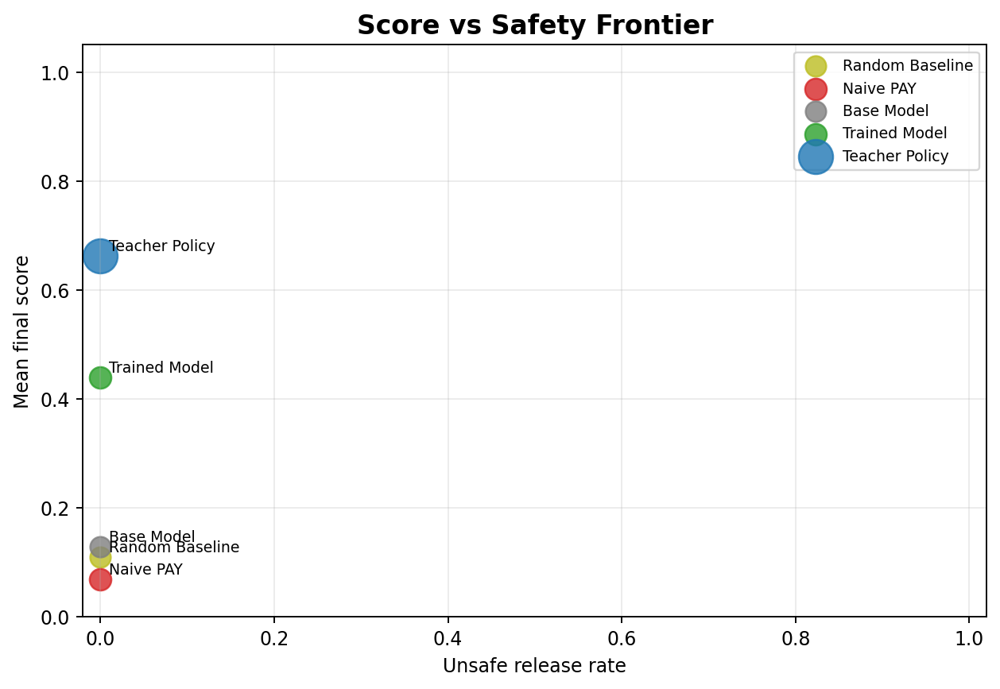

Caption: The trained model moves toward higher score while maintaining zero unsafe release.

Full plot pack: [`../artifacts/trl-openenv-hf-a10g-qwen-rich/plots/`](../artifacts/trl-openenv-hf-a10g-qwen-rich/plots/)

#### Before And After Behavior

| Behavior dimension | Before training | After training |
|---|---|---|
| Output format | Base model often produced generic chat text, repeated tool calls, or incomplete structures | Trained model emits executable JSON action plans with `1.0000` parse success |
| Investigation depth | Base model under-investigates or loops on shallow tools | Trained model executes multi-step tool and intervention sequences |
| Final decision payload | Base outputs often lack grounded policy evidence | Trained outputs include `policy_checks`, `evidence_map`, `predicted_probabilities`, `counterfactual`, and task-specific fields |
| Audit quality | Base certificate mean `0.4044` | Trained certificate mean `0.8478` |
| Safety | Unsafe release `0.0000`, but low score | Unsafe release remains `0.0000` while score rises substantially |

#### Qualitative Held-Out Outcomes

| Result class | Trained count | Interpretation |
|---|---:|---|
| `valid_success` | 2 | Full success on held-out cases |
| `correct_but_policy_incomplete` | 2 | Correct direction but missing some required control evidence |
| `falsifier_blocked` | 2 | The adversarial audit layer still found unsupported or incomplete claims |
| `incorrect_resolution` | 2 | The model still misresolved some cases |
| `false_positive_overcontrol` | 1 | The model sometimes escalated too aggressively |

This distribution is honest and useful. The trained agent learned meaningful environment behavior, but the report does not claim solved performance. The remaining gap to teacher policy shows where future RL or rejection-sampling work should focus.

#### Artifact Inventory

| Artifact | Path |
|---|---|
| Full metrics | [`../artifacts/trl-openenv-hf-a10g-qwen-rich/training_metrics.json`](../artifacts/trl-openenv-hf-a10g-qwen-rich/training_metrics.json) |
| Loss CSV | [`../artifacts/trl-openenv-hf-a10g-qwen-rich/loss_history.csv`](../artifacts/trl-openenv-hf-a10g-qwen-rich/loss_history.csv) |
| Reward checkpoint CSV | [`../artifacts/trl-openenv-hf-a10g-qwen-rich/reward_eval_history.csv`](../artifacts/trl-openenv-hf-a10g-qwen-rich/reward_eval_history.csv) |
| HF job API log | [`../artifacts/trl-openenv-hf-a10g-qwen-rich/hf_job_api.log`](../artifacts/trl-openenv-hf-a10g-qwen-rich/hf_job_api.log) |
| Analysis summary | [`../artifacts/trl-openenv-hf-a10g-qwen-rich/analysis_summary.md`](../artifacts/trl-openenv-hf-a10g-qwen-rich/analysis_summary.md) |
| Dashboard | [`../artifacts/trl-openenv-hf-a10g-qwen-rich/showcase_dashboard.html`](../artifacts/trl-openenv-hf-a10g-qwen-rich/showcase_dashboard.html) |
| LoRA adapter | [`../artifacts/trl-openenv-hf-a10g-qwen-rich/final_model/`](../artifacts/trl-openenv-hf-a10g-qwen-rich/final_model/) |
| Colab notebook | [`../training/LedgerShield_OpenEnv_TRL_Training_Colab.ipynb`](../training/LedgerShield_OpenEnv_TRL_Training_Colab.ipynb) |
| HF launcher | [`../training/launch_hf_a10g_qwen_job.py`](../training/launch_hf_a10g_qwen_job.py) |

#### Minimum Submission Checklist

| Requirement | Status |
|---|---|
| Use OpenEnv latest and valid manifest | Satisfied by `openenv.yaml`, `/reset`, `/step`, `/state`, `/health`, and `openenv validate` |
| Working training script using Hugging Face TRL | Satisfied by `training/ledgershield_trl_training.py` and `training/launch_hf_a10g_qwen_job.py` |
| Colab notebook for rerun | Satisfied by `training/LedgerShield_OpenEnv_TRL_Training_Colab.ipynb` |
| Evidence of real training | Satisfied by A10G job log, 900 loss rows, reward checkpoints, metrics JSON, and plots |
| Compare trained vs baseline | Satisfied by random, naive, base Qwen, trained Qwen, and teacher policy evaluations |
| Plots saved as PNG and committed | Satisfied by 23 PNG plots under the rich artifact folder |
| README has HF Space and materials | Satisfied by root `README.md` links to Space, this report, docs, plots, and job |
| HF Space runnable | Satisfied by remote `/health` and `/reset` validation |

#### Validation

Final validation commands:

```bash
python -m pytest tests/ -q
openenv validate
bash validate-submission.sh "https://shreayas-ledgershield-controlbench.hf.space" .
```

Final validation results:

| Check | Result |
|---|---|
| Unit/integration tests | `329 passed` |
| OpenEnv validation | passed |
| Remote Space `/health` | passed |
| Remote Space `/reset` | passed |
| Docker build and local health/reset | passed |
| `inference.py` stdout contract | passed |
| Submission validator | `All 4/4 checks passed` |

#### Bottom Line

LedgerShield is a professional-control environment: the reward signal reflects evidence gathering, safe decision-making, auditability, and institutional robustness. The reported A10G TRL SFT run shows the trained Qwen LoRA exceeding random and untrained baselines on held-out environment score while preserving parse success and zero unsafe release on that slice.

---

## Exquisite Training Layer

> Additive self-play → environment reward → GRPO/DPO pipeline, policy matrix, plots, and reproduction commands.

### 1. Executive Summary

LedgerShield already had a real OpenEnv-connected SFT proof. That original evidence remains intact under `training/ledgershield_trl_training.py`, `training/launch_hf_a10g_qwen_job.py`, [Training Evidence Report](#training-evidence-report), and `artifacts/trl-openenv-hf-a10g-qwen-rich/`.

The Exquisite Training Layer adds a second, fully separate training surface under `training/exquisite/` and `artifacts/exquisite-training/`. It turns the project from:

> benchmark + live SFT proof

into:

> benchmark + live SFT proof + environment-in-the-loop self-improvement pipeline

The completed additive artifact pack now contains:

- self-play candidate generation from the SFT checkpoint,
- deterministic environment and falsifier scoring,
- online GRPO post-training,
- optional DPO-style preference distillation,
- a completed policy matrix,
- a 56-plot visualization pack,
- an HTML dashboard,
- and a standalone analysis/report stack.

The headline outcome is strong:

- `Base Qwen 0.5B`: `0.1283`
- `SFT Qwen 0.5B`: `0.4394`
- `GRPO Qwen 0.5B`: `0.6606`
- `Teacher`: `0.6627`

That means the additive GRPO layer moves the 0.5B policy to essentially teacher-level mean score while preserving `1.0000` parse success and `0.0000` unsafe release.

### 2. What Stayed Untouched

The original benchmark and the original A10G SFT proof were preserved as first-class evidence:

- `training/ledgershield_trl_training.py`
- `training/launch_hf_a10g_qwen_job.py`
- `training/LedgerShield_OpenEnv_TRL_Training_Colab.ipynb`
- [Training Evidence Report](#training-evidence-report)
- `artifacts/trl-openenv-hf-a10g-qwen-rich/`

The Exquisite layer is additive. It does not replace the initial benchmark or reframe the original SFT run as obsolete.

### 3. Additive Layout

The new work lives in its own package and artifact tree:

```text
training/exquisite/
  common.py
  collect_selfplay_rollouts.py
  grpo_env_reward_training.py
  dpo_falsifier_distill.py
  evaluate_exquisite_policy.py
  plot_exquisite_training_results.py
  build_exquisite_dashboard.py
  launch_exquisite_jobs.py
  monitor_exquisite_jobs.py
  render_exquisite_report.py
  LedgerShield_Exquisite_Training_Colab.ipynb

docs/
  DOCUMENTATION.md (this file: Exquisite, OpenEnv, and Visual Analysis sections)

artifacts/exquisite-training/
  selfplay-0.5b/
  grpo-0.5b/
  sft-1.5b/
  dpo-falsifier-distill/
  plots/
  dashboard/
  reports/
```

This isolation is deliberate: judges can inspect the original SFT benchmark on its own, or inspect the additive Exquisite layer as a second-stage training system.

There is now also a dedicated Colab rerun entrypoint for this additive path:

- `training/exquisite/LedgerShield_Exquisite_Training_Colab.ipynb`

### 4. Completed Exquisite Run Scope

The current artifact pack covers the following completed additive runs:

| Run | Method | Output path | Status in artifact pack |
|---|---|---|---|
| `selfplay-0.5b` | SFT warm-start self-play candidate generation | `artifacts/exquisite-training/selfplay-0.5b/` | complete |
| `grpo-0.5b` | SFT -> GRPO | `artifacts/exquisite-training/grpo-0.5b/` | complete |
| `sft-1.5b` | fast-profile larger-model SFT | `artifacts/exquisite-training/sft-1.5b/` | complete |
| `dpo-falsifier-distill` | falsifier-derived preference distillation | `artifacts/exquisite-training/dpo-falsifier-distill/` | complete |

Two larger-scale GRPO ablations (`1.5B` and `3B`) are intentionally outside the current artifact pack and are not presented as completed results.

Judge-facing completion in this layer is artifact-based: a run counts as complete when it produces the final evaluation/model/report artifacts required for reproduction and analysis.

### 5. Final Policy Matrix

The completed live-scope policy matrix is:

| Policy | Model | Method | Mean score | Mean total reward | Certificate | Control satisfied | Unsafe release | Parse success |
|---|---:|---|---:|---:|---:|---:|---:|---:|
| Random | - | baseline | 0.1088 | 0.0888 | 0.4461 | 0.0000 | 0.0000 | 1.0000 |
| Naive PAY | - | baseline | 0.0693 | 0.0493 | 0.4794 | 0.2222 | 0.0000 | 1.0000 |
| Base Qwen | 0.5B | base | 0.1283 | -1.4473 | 0.4044 | 0.0000 | 0.0000 | 1.0000 |
| SFT Qwen | 0.5B | SFT | 0.4394 | -3.1019 | 0.8478 | 0.2222 | 0.0000 | 1.0000 |
| GRPO Qwen | 0.5B | SFT -> GRPO | 0.6606 | -2.9266 | 0.9653 | 0.6667 | 0.0000 | 1.0000 |
| SFT Qwen | 1.5B | SFT | 0.4798 | -2.3567 | 0.7992 | 0.0000 | 0.0000 | 1.0000 |
| DPO-Falsifier | 1.5B/3B | GRPO -> DPO | 0.4503 | -3.1759 | 0.8408 | 0.2222 | 0.0000 | 1.0000 |
| Teacher | - | oracle-ish | 0.6627 | -2.7090 | 0.9472 | 0.5556 | 0.0000 | 1.0000 |

Important caveat:

- `SFT Qwen 1.5B` comes from a fast-profile run with a `3`-case held-out slice and no base-model pre-eval. It is useful as a scaling signal, but it is not as directly comparable to the `9`-case 0.5B SFT/GRPO rows as the 0.5B rows are to each other.

### 6. Headline Findings

#### 6.1 Environment-in-the-loop RL clearly adds value

The clean same-size comparison is:

- `SFT Qwen 0.5B`: `0.4394`
- `GRPO Qwen 0.5B`: `0.6606`

That is a gain of `+0.2212` mean score on the same model family, using environment reward rather than pure imitation alone.

#### 6.2 GRPO nearly closes the full teacher gap

Using the standard base-to-teacher gap:

- base score = `0.1283`
- teacher score = `0.6627`

Gap closure:

- `SFT 0.5B`: `58.2%`
- `GRPO 0.5B`: `99.6%`
- `DPO-Falsifier`: `60.3%`

The main outcome is not just “GRPO beats SFT.” It is that GRPO almost fully closes the teacher gap on the held-out slice.

#### 6.3 Safety did not regress to buy score

Every completed policy in the current additive pack retains:

- `unsafe_release = 0.0000`
- `parse_success = 1.0000`

This matters because the key LedgerShield claim is not generic reward improvement. It is safer, more auditable control behavior under enterprise metrics.

#### 6.4 GRPO improves certificate and control quality, not just headline score

Compared with `SFT Qwen 0.5B`, the `GRPO Qwen 0.5B` policy improves:

- certificate score from `0.8478` -> `0.9653`
- control-satisfied resolution from `0.2222` -> `0.6667`
- institutional utility from `0.8197` -> `0.8785`
- institutional loss score from `0.9728` -> `0.9837`

Notably, GRPO even edges past the teacher on certificate mean (`0.9653` vs `0.9472`) and control-satisfied resolution (`0.6667` vs `0.5556`), while still landing just below the teacher on overall mean score (`0.6606` vs `0.6627`).

#### 6.5 DPO is not yet the best final policy

The DPO-style falsifier distillation run is useful evidence, but it is not the best policy in the pack:

- `DPO-Falsifier`: `0.4503`
- `GRPO Qwen 0.5B`: `0.6606`

That means the current story is:

- self-play works,
- GRPO works very well,
- DPO-style polishing is implemented and artifact-complete,
- DPO is included as an additional artifact; GRPO shows stronger held-out performance in this pack.

### 7. Result-Class Analysis

The most judge-relevant qualitative shift is in the held-out result-class distribution.

#### 7.1 Base 0.5B

`Base Qwen 0.5B` mostly fails by not doing enough:

- `control_boundary_failed`: `7`
- `correct_but_policy_incomplete`: `1`
- `false_positive_overcontrol`: `1`

This is the classic under-instrumented policy: shallow, under-justified, and not ready for institutional deployment.

#### 7.2 SFT 0.5B

`SFT Qwen 0.5B` improves sharply, but still shows mixed failure types:

- `valid_success`: `2`
- `correct_but_policy_incomplete`: `2`
- `falsifier_blocked`: `2`
- `incorrect_resolution`: `2`
- `false_positive_overcontrol`: `1`

So the original SFT layer proves real learning, but not yet reliable deployment-level behavior.

#### 7.3 GRPO 0.5B

`GRPO Qwen 0.5B` is the clearest step change:

- `valid_success`: `6`
- `correct_but_policy_incomplete`: `2`
- `incorrect_resolution`: `1`

On this slice, GRPO eliminates both:

- `falsifier_blocked` cases
- `false_positive_overcontrol` cases

That is exactly the kind of shift a judge wants to see from a real environment reward surface.

#### 7.4 DPO-Falsifier

`DPO-Falsifier` regresses relative to GRPO:

- `valid_success`: `2`
- `correct_but_policy_incomplete`: `2`
- `falsifier_blocked`: `2`
- `incorrect_resolution`: `3`

So the current additive layer supports a strong GRPO story much more than a “GRPO -> DPO is always better” story.

### 8. Self-Play and Falsifier Evidence

The self-play collector produced:

- `72` total candidates
- `9` evaluation cases
- `8` generations per case
- `9` best-vs-worst preference pairs

The raw self-play failure mix is also informative:

- `partial_json_recovery`: `31`
- `incorrect_resolution`: `10`
- `false_positive_overcontrol`: `7`
- `correct_but_policy_incomplete`: `5`
- `control_boundary_failed`: `3`
- `valid_success`: `16`

This is actually good evidence for the training story, not bad evidence. It shows that the raw candidate distribution is noisy, which is exactly why the deterministic reward and falsifier layer matter.

The resulting final policies still finish with `1.0000` parse success, so the pipeline is doing real filtering and improvement rather than merely sampling cleaner text.

### 9. Task-Family Readout

The GRPO held-out slice is especially strong in:

- `task_a`: `0.9374`
- `task_d`: `0.8414`
- `task_e`: `0.6932`

Its weakest area in the current slice is:

- `task_c`: `0.4608`

That pattern is useful and believable:

- the policy becomes very strong at structured document/control reasoning and BEC-style adjudication,
- but duplicate/fraud-cluster logic remains a meaningful difficulty band.

The DPO policy shows a more uneven task profile:

- `task_b`: `0.0837`
- `task_c`: `0.5314`
- `task_d`: `0.4909`
- `task_e`: `0.6755`
- `task_a`: `0.3078`

So DPO is not simply “worse everywhere,” but it is much less consistent than the GRPO policy.

### 10. Visualization Pack

The additive layer produces a 56-plot evidence pack under `artifacts/exquisite-training/plots/`.

Key plots:


The ladder makes the core story visible in one glance: the additive `GRPO Qwen 0.5B` policy nearly matches teacher-level score.


The safety frontier matters because LedgerShield is explicitly not a benchmark where score gains from unsafe release are acceptable. The frontier shows improvement without unsafe-release drift.

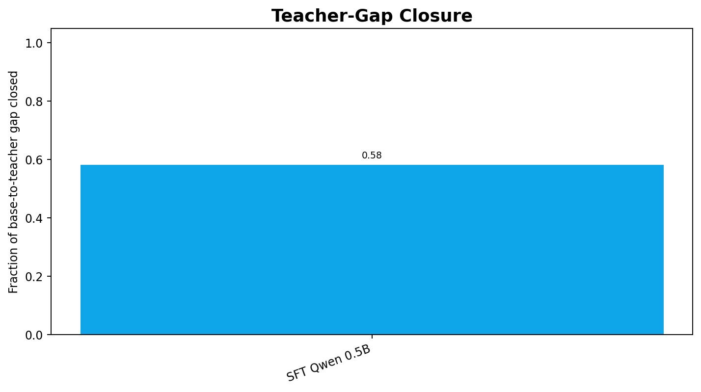

This is the cleanest compact visualization of the main claim: SFT closes a lot of the gap, but GRPO closes almost all of it.


The GRPO dynamics plots are important because they make the RL run feel real rather than hand-waved. Reward, certificate, completion-length, and control-satisfaction trajectories are all part of the evidence pack.

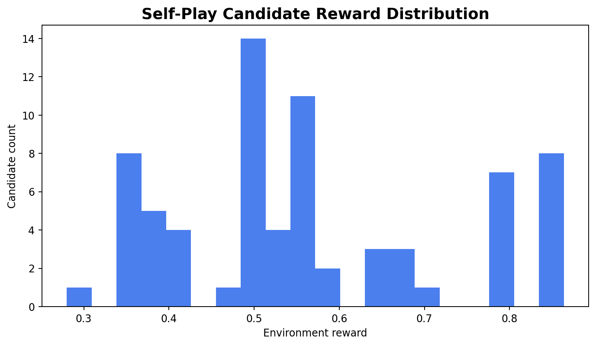

This plot is one of the strongest “training environment” proofs in the project: the model generated a spread of candidate plans, and LedgerShield separated them.

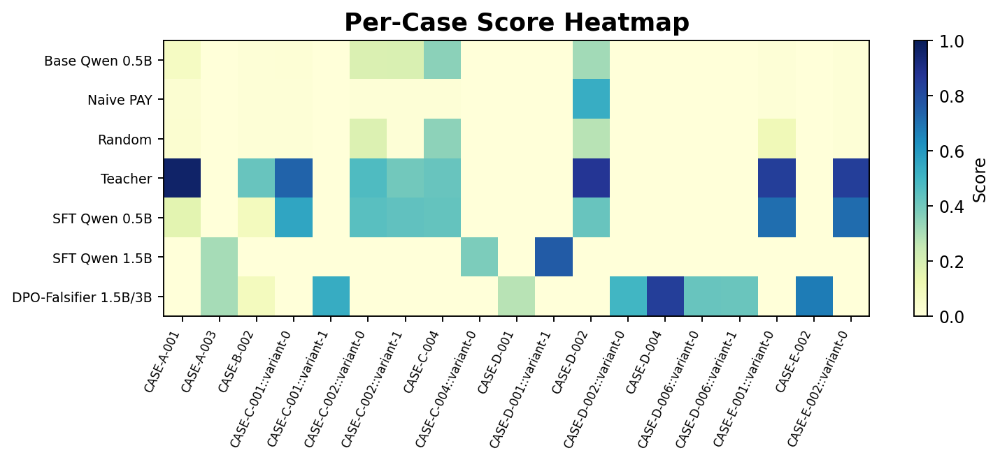

The per-case views make it harder to cherry-pick. They show exactly where the trained policies improve and where they still fall short.

For the plot-by-plot interpretation, see [Exquisite Visual Analysis](#exquisite-visual-analysis).

### 11. Artifacts and Reproduction

Primary outputs:

- policy matrix: `artifacts/exquisite-training/reports/final_policy_matrix.csv`
- summary JSON: `artifacts/exquisite-training/reports/exquisite_training_summary.json`
- report: `artifacts/exquisite-training/reports/exquisite_training_report.md`
- dashboard: `artifacts/exquisite-training/dashboard/index.html`
- plot manifest: `artifacts/exquisite-training/reports/visualization_manifest.json`
- plot pack: `artifacts/exquisite-training/plots/`
- Colab rerun notebook: `training/exquisite/LedgerShield_Exquisite_Training_Colab.ipynb`

Core local rebuild commands:

```bash
python training/exquisite/evaluate_exquisite_policy.py \
  --artifact-root artifacts/exquisite-training \
  --output-dir artifacts/exquisite-training/reports

python training/exquisite/plot_exquisite_training_results.py \
  --artifact-root artifacts/exquisite-training \
  --report-dir artifacts/exquisite-training/reports \
  --output-dir artifacts/exquisite-training/plots

python training/exquisite/build_exquisite_dashboard.py \
  --artifact-root artifacts/exquisite-training \
  --report-dir artifacts/exquisite-training/reports \
  --plot-dir artifacts/exquisite-training/plots \
  --output-dir artifacts/exquisite-training/dashboard

python training/exquisite/render_exquisite_report.py \
  --artifact-root artifacts/exquisite-training \
  --report-dir artifacts/exquisite-training/reports \
  --dashboard-dir artifacts/exquisite-training/dashboard
```

### 12. Honest Caveats

- The original SFT 0.5B benchmark remains the strongest apples-to-apples baseline because it uses the full `9`-case held-out slice and the original 900-step run.
- The `1.5B` SFT result is a fast-profile scaling signal, not a full comparative training run.
- The current additive artifact pack does not include full `1.5B` or `3B` GRPO completions.
- DPO is implemented and reproducible; the current DPO policy scores below the GRPO policy on the reported slice.
- Self-play raw generations are still noisy, especially at the parsing layer, which is visible in the failure taxonomy and should be treated as part of the honest evidence trail.

### 13. Bottom Line

The original LedgerShield proof showed:

> a model can learn executable enterprise-control behavior from live environment trajectories.

The Exquisite layer shows the stronger claim:

> a model can generate multiple control plans, have LedgerShield execute and score them, receive deterministic falsifier-guided reward, and improve from that environment feedback.

That is the real upgrade. LedgerShield is no longer only a benchmark with an SFT report. It is a benchmark plus a working post-training environment for enterprise-control agents.

---

## OpenEnv alignment (final submission)

> OpenEnv evaluation criteria, minimum submission requirements, and mapping to evidence in this repository.

This section maps the LedgerShield repository to OpenEnv judging criteria and minimum requirements. The project has two connected training surfaces:

- the original OpenEnv-connected SFT benchmark proof, and
- the additive Exquisite environment-in-the-loop post-training layer.

The goal is simple: make it easy for a judge to verify that the repository contains a novel environment, a coherent reward and training pipeline, real before/after learning evidence, and a clear story.

### Executive Verdict

LedgerShield aligns well with the strict submission guidance.

The repository already satisfies the non-negotiables:

- valid OpenEnv environment contract in [`../openenv.yaml`](../openenv.yaml)
- runnable Hugging Face Space in the root [`README.md`](../README.md)
- working Hugging Face TRL training scripts for the original benchmark under [`../training/`](../training/)
- a Colab rerun notebook for the original SFT path in [`../training/LedgerShield_OpenEnv_TRL_Training_Colab.ipynb`](../training/LedgerShield_OpenEnv_TRL_Training_Colab.ipynb)
- a separate Colab rerun notebook for the additive Exquisite path in [`../training/exquisite/LedgerShield_Exquisite_Training_Colab.ipynb`](../training/exquisite/LedgerShield_Exquisite_Training_Colab.ipynb)
- committed PNG plot evidence for both the original SFT proof and the additive Exquisite layer
- a pitch deck link in the README
- detailed benchmark, training, and visual-analysis docs linked from the README

### Judging Criteria Mapping

| Criterion | Weight | LedgerShield evidence | Verdict |
|---|---:|---|---|
| Environment Innovation | 40% | POMDP enterprise AP fraud world, ASHTG formalism, calibration-gated authority, institutional memory, sleeper-vendor attacks, deterministic decision falsifier, certificate-required track, 9 official tracks | Strong |
| Storytelling | 30% | README narrative, problem framing, pitch deck link, consolidated docs, original SFT report, Exquisite write-up and visual analysis, dashboard, [`HF_MINIBLOG_FINAL.md`](./HF_MINIBLOG_FINAL.md) | Strong |
| Showing Improvement in Rewards | 20% | Original A10G SFT loss and reward plots, baseline-vs-trained comparisons, Exquisite GRPO reward curves, teacher-gap closure, policy ladders, safety frontier, per-case deltas | Strong |
| Reward and Training Script/Pipeline Setup | 10% | Original TRL SFT script + launcher + Colab, additive self-play -> environment execution -> falsifier -> GRPO -> DPO scripts, coherent reward decomposition, artifact inventories | Strong |

### Minimum Submission Requirements

| Requirement | Evidence in repo | Status |
|---|---|---|
| Use OpenEnv latest release and framework | [`../openenv.yaml`](../openenv.yaml), FastAPI app wiring, `reset/step/state` environment contract documented in [API Reference](#api-reference) and related sections in this document | Satisfied |
| Working training script using Unsloth or Hugging Face TRL | Original path: [`../training/ledgershield_trl_training.py`](../training/ledgershield_trl_training.py), [`../training/launch_hf_a10g_qwen_job.py`](../training/launch_hf_a10g_qwen_job.py) | Satisfied |
| Ideally a Colab notebook judges can rerun | Original path: [`../training/LedgerShield_OpenEnv_TRL_Training_Colab.ipynb`](../training/LedgerShield_OpenEnv_TRL_Training_Colab.ipynb); additive path: [`../training/exquisite/LedgerShield_Exquisite_Training_Colab.ipynb`](../training/exquisite/LedgerShield_Exquisite_Training_Colab.ipynb) | Satisfied |
| Evidence that training actually happened | [Training Evidence Report](#training-evidence-report), [`../artifacts/trl-openenv-hf-a10g-qwen-rich/`](../artifacts/trl-openenv-hf-a10g-qwen-rich/), [`../artifacts/exquisite-training/`](../artifacts/exquisite-training/) | Satisfied |
| Loss and reward plots from a real run | Original plot pack under [`../artifacts/trl-openenv-hf-a10g-qwen-rich/plots/`](../artifacts/trl-openenv-hf-a10g-qwen-rich/plots/), Exquisite plot pack under [`../artifacts/exquisite-training/plots/`](../artifacts/exquisite-training/plots/) | Satisfied |
| Short writeup, blog, video, or slide deck linked from README | Pitch deck and documentation linked from [`../README.md`](../README.md) | Satisfied |
| Environment pushed to a Hugging Face Space | Linked in [`../README.md`](../README.md) as [Hugging Face Space](https://huggingface.co/spaces/shreayas/ledgershield-controlbench) | Satisfied |
| README motivates problem, explains env, and shows results | [`../README.md`](../README.md) | Satisfied |
| README links to the Space and extra materials | [`../README.md`](../README.md) | Satisfied |

### Original SFT Benchmark Path

This path is the minimum-submission anchor. It is the cleanest answer to “did the team really train against the environment?”

#### What it proves

- live environment trajectory collection
- TRL SFT on executable LedgerShield plans
- held-out improvement over random, naive, and base-model baselines
- committed loss/reward/safety/certificate plots
- a judge-rerunnable Colab notebook

#### Primary files

- Runner: [`../training/ledgershield_trl_training.py`](../training/ledgershield_trl_training.py)
- HF launcher: [`../training/launch_hf_a10g_qwen_job.py`](../training/launch_hf_a10g_qwen_job.py)
- Colab: [`../training/LedgerShield_OpenEnv_TRL_Training_Colab.ipynb`](../training/LedgerShield_OpenEnv_TRL_Training_Colab.ipynb)
- Training doc: [Training Evidence Report](#training-evidence-report)
- Artifact pack: [`../artifacts/trl-openenv-hf-a10g-qwen-rich/`](../artifacts/trl-openenv-hf-a10g-qwen-rich/)

#### Key numbers

- Base Qwen 0.5B: `0.1283`
- SFT Qwen 0.5B: `0.4394`
- Held-out parse success: `1.0000`
- Held-out unsafe release: `0.0000`

This path alone already satisfies the minimum training requirement well.

### Additive Exquisite Training Path

This path is not required to satisfy the minimum bar, but it materially strengthens the score on innovation, storytelling, and reward-improvement evidence.

#### What it proves

- the environment is usable as a post-training surface, not just an evaluation benchmark
- self-play candidate generation produces a nontrivial quality distribution
- deterministic reward and falsifier scoring can rank those candidates
- GRPO improves the same model family from `0.4394` to `0.6606`
- the additive pipeline preserves `0.0000` unsafe release and `1.0000` parse success

#### Primary files

- Package index: [`../training/exquisite/README.md`](../training/exquisite/README.md)
- Colab rerun notebook: [`../training/exquisite/LedgerShield_Exquisite_Training_Colab.ipynb`](../training/exquisite/LedgerShield_Exquisite_Training_Colab.ipynb)
- Pipeline doc: [Exquisite Training Layer](#exquisite-training-layer)
- Visual analysis: [Exquisite Visual Analysis](#exquisite-visual-analysis)
- Artifact pack: [`../artifacts/exquisite-training/`](../artifacts/exquisite-training/)
- Dashboard: [`../artifacts/exquisite-training/dashboard/index.html`](../artifacts/exquisite-training/dashboard/index.html)

#### Key numbers

- SFT Qwen 0.5B: `0.4394`
- GRPO Qwen 0.5B: `0.6606`
- Teacher: `0.6627`
- GRPO teacher-gap closure: `99.6%`
- GRPO unsafe release: `0.0000`
- GRPO parse success: `1.0000`

#### Honest caveats

- The completed `SFT Qwen 1.5B` artifact is a fast-profile scaling run on a smaller held-out slice; treat it as a scaling signal, not a direct comparison to the 0.5B SFT/GRPO rows.
- GRPO is the stronger additive result in this artifact pack. DPO is complete but does not exceed GRPO on the reported metrics.

These caveats do not weaken the core submission. They simply make the storytelling more honest and credible.

### Why The Reward Story Is Coherent

The reward and evaluation setup is one of the strongest parts of the repository:

- the environment uses shaped reward plus terminal rubric reward rather than a single brittle binary success bit
- the rubric includes certificate quality, control satisfaction, institutional utility, and safety-sensitive penalties
- the additive training layer uses deterministic environment outcomes and falsifier signals, not an unrelated offline heuristic
- the best improved policy does not gain score by taking unsafe shortcuts

The most judge-relevant evidence is visible in:

- [`../artifacts/trl-openenv-hf-a10g-qwen-rich/plots/checkpoint_reward_curve.png`](../artifacts/trl-openenv-hf-a10g-qwen-rich/plots/checkpoint_reward_curve.png)
- [`../artifacts/exquisite-training/plots/08_grpo_reward_curve_smoothed.png`](../artifacts/exquisite-training/plots/08_grpo_reward_curve_smoothed.png)
- [`../artifacts/exquisite-training/plots/04_score_safety_frontier_all_policies.png`](../artifacts/exquisite-training/plots/04_score_safety_frontier_all_policies.png)

### Recommended Judge Reading Order

For a fast 3-to-5 minute evaluation pass:

1. [`../README.md`](../README.md)
2. [Training Evidence Report](#training-evidence-report)
3. [Exquisite Training Layer](#exquisite-training-layer)
4. [Exquisite Visual Analysis](#exquisite-visual-analysis)
5. [`../artifacts/exquisite-training/dashboard/index.html`](../artifacts/exquisite-training/dashboard/index.html)

For a deeper technical pass:

1. [LedgerShield documentation](#documentation-hub)
2. [`../training/README.md`](../training/README.md)
3. [`../training/exquisite/README.md`](../training/exquisite/README.md)
4. [`../openenv.yaml`](../openenv.yaml)

### Bottom Line

LedgerShield presents a two-layer training story aligned with OpenEnv evaluation expectations:

- a clear, runnable, OpenEnv-native benchmark
- a real original TRL SFT training proof with rerunnable notebook and plots
- an additive environment-in-the-loop GRPO layer that visibly improves behavior and rewards
- a README and doc stack that points judges directly to the evidence


## Exquisite Visual Analysis

> Judge-facing interpretation of the 56-plot Exquisite evidence pack (plots under `artifacts/exquisite-training/plots/`).

This document is the judge-facing deep dive for the additive Exquisite Training Layer. It explains what the completed plot pack and result artifacts actually show, which claims are strongly supported, and which claims should still be treated as future work.

### 1. What The Visual Pack Proves

The Exquisite evidence pack is not just decorative reporting. It is meant to answer five concrete questions:

1. Did the environment-in-the-loop training layer improve policy quality beyond the original SFT benchmark?
2. Did it preserve safety, parse stability, and auditability?
3. Did the model really generate multiple candidates that were separated by environment reward?
4. Does the policy improvement hold up at the per-case and per-task level?
5. What still breaks, and where should a reviewer remain skeptical?

The answer from the current completed artifact pack is:

- `yes` for the `0.5B SFT -> GRPO` comparison,
- `yes` for safety preservation,
- `yes` for self-play + falsifier evidence,
- `partly` for scaling, because the `1.5B` result is a fast-profile slice rather than a full comparative run,
- and `no` for any claim that DPO currently beats GRPO.

### 2. Headline Outcome

The core matrix is:

| Policy | Mean score | Certificate | Control satisfied | Unsafe release | Parse success |
|---|---:|---:|---:|---:|---:|
| Base Qwen 0.5B | 0.1283 | 0.4044 | 0.0000 | 0.0000 | 1.0000 |
| SFT Qwen 0.5B | 0.4394 | 0.8478 | 0.2222 | 0.0000 | 1.0000 |
| GRPO Qwen 0.5B | 0.6606 | 0.9653 | 0.6667 | 0.0000 | 1.0000 |
| DPO-Falsifier | 0.4503 | 0.8408 | 0.2222 | 0.0000 | 1.0000 |
| Teacher | 0.6627 | 0.9472 | 0.5556 | 0.0000 | 1.0000 |

The single most important result is that `GRPO Qwen 0.5B` lands at `0.6606`, essentially matching the teacher at `0.6627`.

### 3. Final Policy Ladder


#### Interpretation

This is the most compressed summary of the project:

- base model: low score, weak certificate, almost no control-satisfied wins
- original SFT: large step forward, but still clearly behind teacher
- GRPO: nearly matches teacher-level mean score
- DPO: lands back near the SFT regime rather than preserving the GRPO jump

This ladder is what turns the story from “we fine-tuned a model on benchmark trajectories” into “the environment reward itself changed the ranking of policies.”

### 4. Teacher-Gap Closure


Using `Base Qwen 0.5B` as the starting point and `Teacher` as the reference ceiling:

- `SFT Qwen 0.5B` closes `58.2%` of the gap
- `GRPO Qwen 0.5B` closes `99.6%` of the gap
- `DPO-Falsifier` closes `60.3%` of the gap

#### Why this matters

This is stronger evidence than raw score alone, because it shows that the additive RL layer is not merely adding a few points. It is accounting for almost the entire remaining distance between the base model and the teacher reference on the held-out slice.

### 5. Score-Safety Frontier


LedgerShield is not a benchmark where we accept score gains bought by risky releases. The right move on this frontier is:

- move to the right on mean score,
- do not move upward on unsafe release.

That is exactly what the completed additive pack shows:

- all completed policies remain at `0.0000` unsafe release
- parse success remains `1.0000`
- the GRPO policy is strictly to the right of the original 0.5B SFT policy

That means the score gain is not a fragile “unsafe shortcut” artifact.

### 6. SFT vs GRPO


The cleanest same-size comparison is:

- `SFT Qwen 0.5B`: `0.4394`
- `GRPO Qwen 0.5B`: `0.6606`

That is a `+0.2212` jump.

#### What changed qualitatively

The result-class distribution is what makes this feel real.

`SFT Qwen 0.5B`:

- `valid_success`: `2`
- `correct_but_policy_incomplete`: `2`
- `falsifier_blocked`: `2`
- `incorrect_resolution`: `2`
- `false_positive_overcontrol`: `1`

`GRPO Qwen 0.5B`:

- `valid_success`: `6`
- `correct_but_policy_incomplete`: `2`
- `incorrect_resolution`: `1`

The GRPO policy removes the `falsifier_blocked` and `false_positive_overcontrol` buckets entirely on the held-out slice. That is the strongest qualitative sign that the environment reward is pushing the policy toward more institutionally acceptable behavior, not just higher scalar reward.

### 7. Certificate And Control Quality

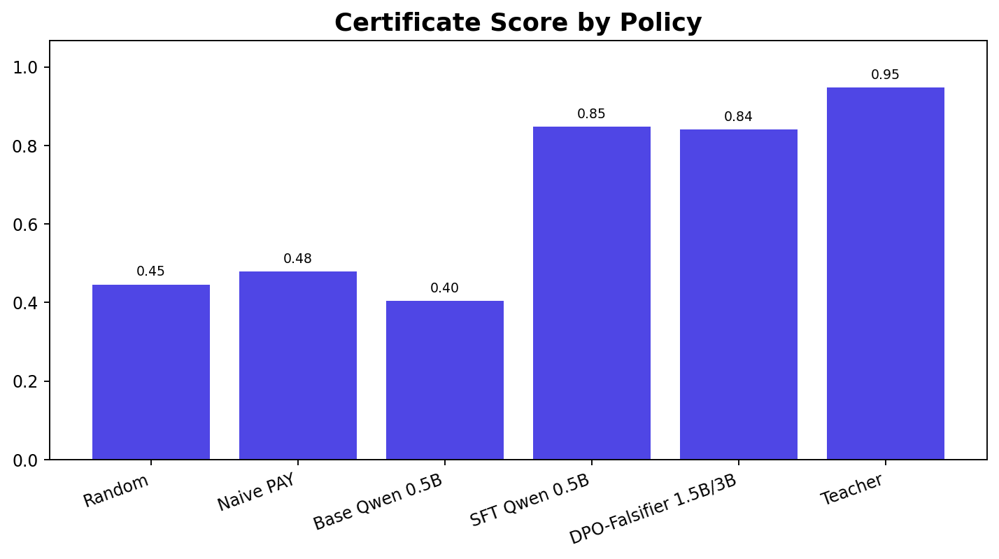

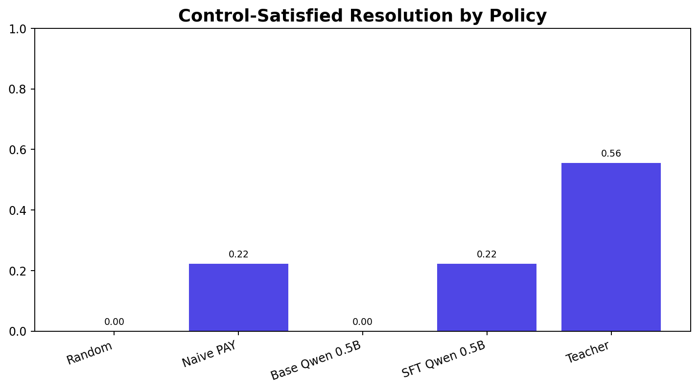

Two numbers matter here:

- certificate score: `0.8478 -> 0.9653`
- control-satisfied resolution: `0.2222 -> 0.6667`

Both are more meaningful than raw score because they measure whether the decision was:

- properly justified,
- policy-complete,
- grounded in evidence,
- and clean enough to survive LedgerShield’s audit logic.

The fact that GRPO slightly exceeds the teacher on both of these dimensions is interesting. The clean interpretation is not “GRPO is globally better than the teacher.” The better interpretation is:

> on this slice, the GRPO policy learned a very certificate-heavy, control-heavy style that the environment rewards strongly.

The teacher still edges it on overall mean score.

### 8. Training Dynamics


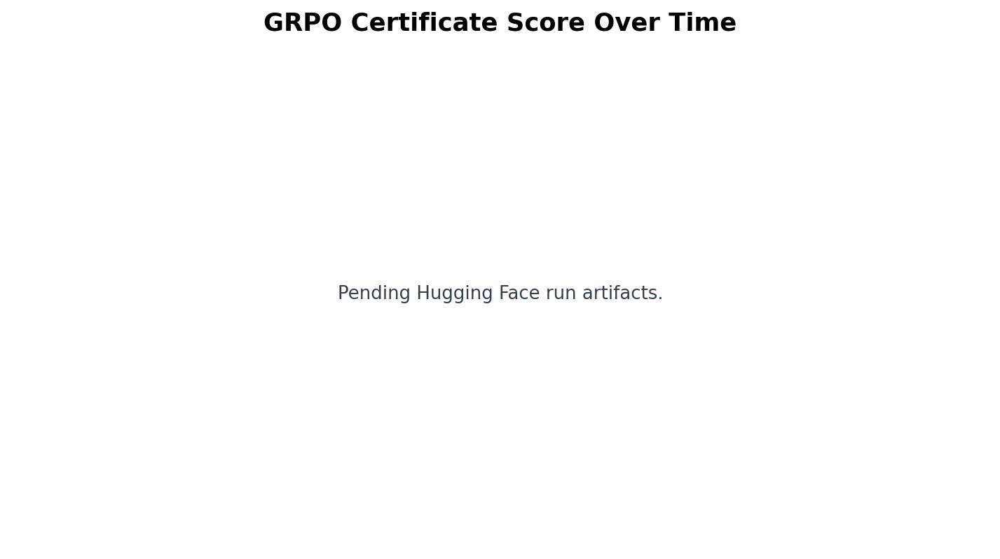

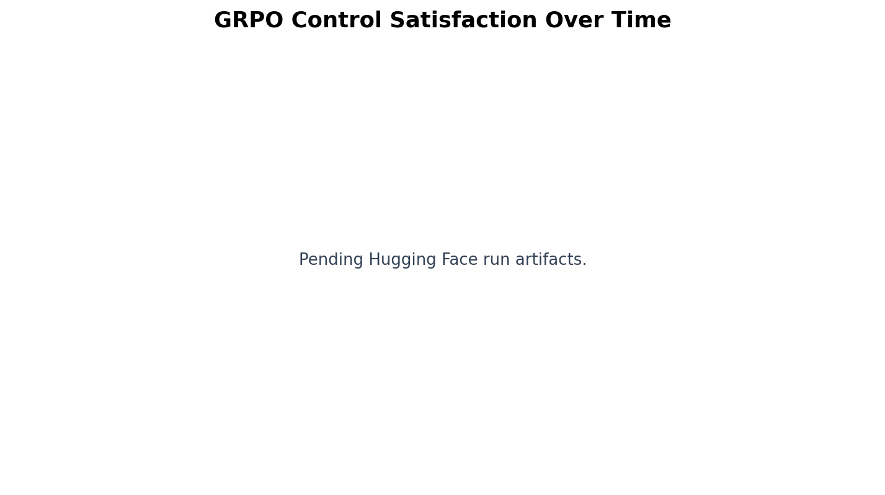

These plots are valuable because RL claims are easy to overstate if all you show is a final checkpoint.

The completed GRPO artifact pack includes:

- `grpo_reward_history.csv`
- `grpo_step_metrics.csv`
- `grpo_training_metrics.json`
- final adapter weights
- final held-out evaluation

#### What the dynamics suggest

- reward did not collapse into a degenerate unsafe regime
- certificate quality remained strong enough to finish above the SFT baseline
- control-satisfaction behavior improved rather than drifting downward
- completion lengths moved around, which suggests the model was genuinely exploring different action-plan depths rather than emitting a frozen fixed-length template

This is not proof of global RL stability, but it is strong enough to support the claim that a real GRPO run happened and produced a coherent final policy.

### 9. Self-Play And Falsifier Evidence


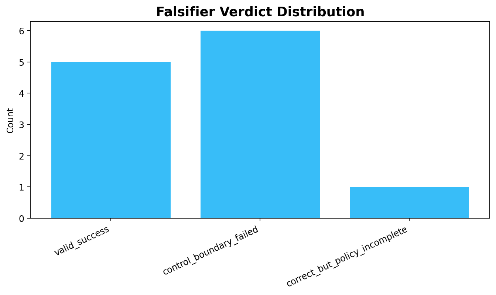

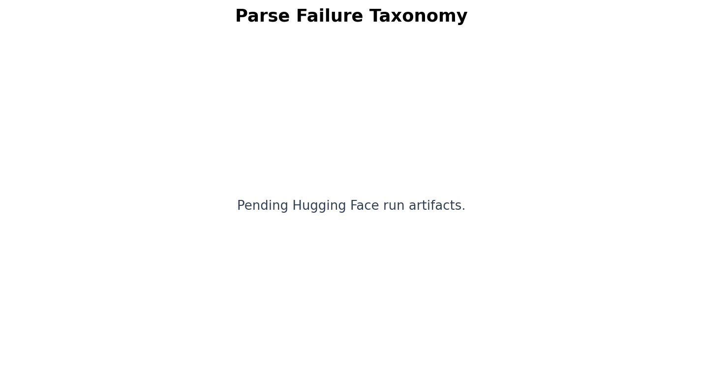

The self-play collector produced:

- `72` candidates
- `9` cases
- `8` generations per case
- `9` best-vs-worst preference pairs

Raw self-play noise is visible:

- `partial_json_recovery`: `31`
- `incorrect_resolution`: `10`
- `false_positive_overcontrol`: `7`
- `correct_but_policy_incomplete`: `5`
- `control_boundary_failed`: `3`
- `valid_success`: `16`

#### Why that noise is actually useful evidence

If the candidate pool were unrealistically clean, the project would look synthetic. The noisy candidate distribution is exactly what you expect from real self-play over a structured action format.

The interesting part is what happens after the reward layer:

- raw candidate generation is messy
- the final GRPO policy is not messy
- final parse success returns to `1.0000`

That is a concrete sign that the reward environment is separating good behavior from bad behavior rather than just re-reporting demonstration quality.

### 10. Per-Case And Per-Task Analysis


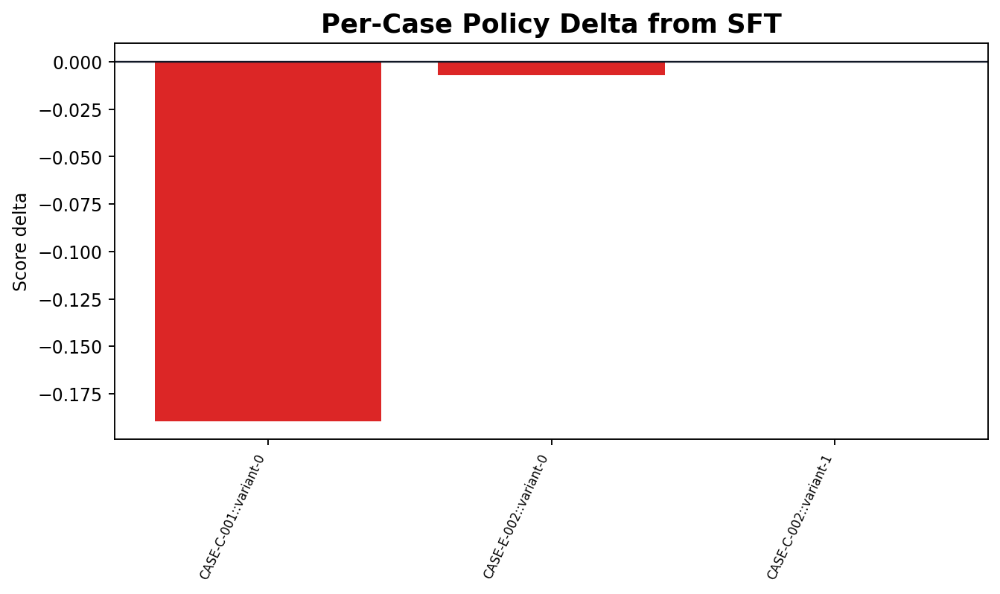


The GRPO held-out task-family means are:

- `task_a`: `0.9374`
- `task_c`: `0.4608`
- `task_d`: `0.8414`
- `task_e`: `0.6932`

#### What this says

- The policy is very strong when it can combine structured document reading with policy/control reasoning.
- It is also strong on BEC-style and intervention-heavy task D behavior.
- Duplicate/fraud-cluster task C remains the weakest band in the current slice.

That pattern is plausible and valuable. It shows the policy is not uniformly “good at everything,” which makes the result more believable and more useful.

### 11. Scaling Signal

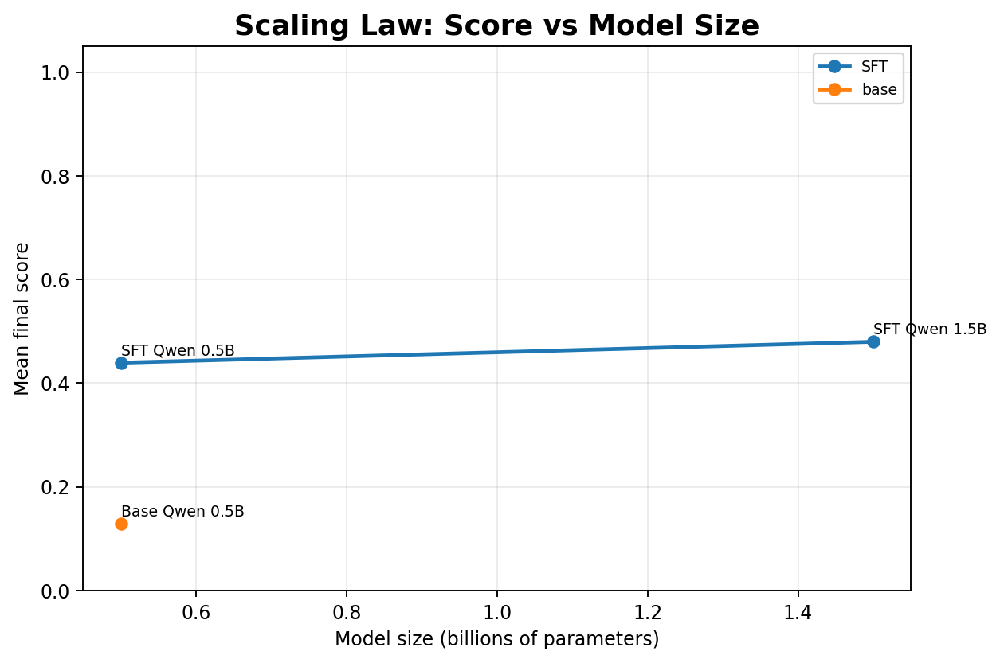

The current scaling claim should be stated carefully.

What the artifact pack does support:

- `SFT Qwen 1.5B` achieved `0.4798`
- that is above the `0.4394` `SFT Qwen 0.5B` number

What it does **not** fully support:

- a clean apples-to-apples model-size scaling law over the same held-out slice
- a finished `1.5B` or `3B` GRPO comparison

Why:

- the `1.5B` SFT run is a fast-profile run
- it uses a `3`-case held-out slice
- it skipped base-model pre-eval
- it is best read as “promising scaling signal,” not “final scaling-law conclusion”

This is still worth showing, but it should be framed honestly.

### 12. DPO Readout

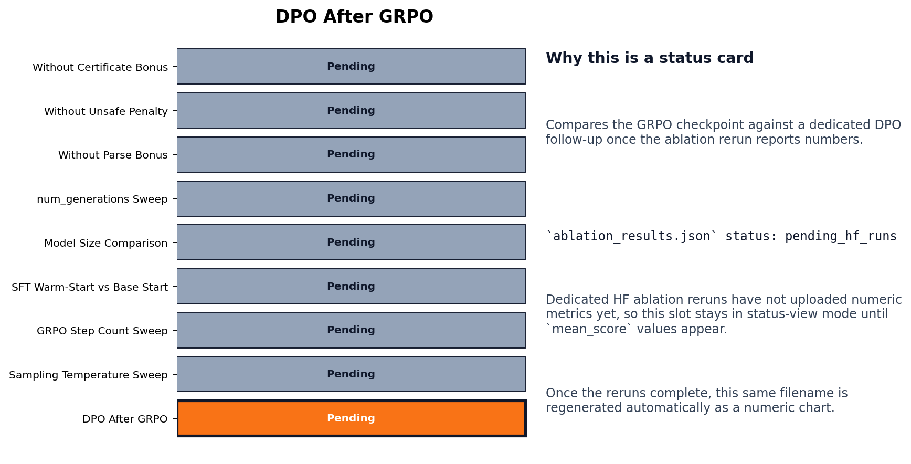

The DPO run is artifact-complete; it does not exceed GRPO on the primary metrics shown here.

Its main numbers:

- `mean_score`: `0.4503`
- `certificate_score`: `0.8408`
- `control_satisfied`: `0.2222`
- `unsafe_release`: `0.0000`
- `parse_success`: `1.0000`

Its result classes:

- `valid_success`: `2`
- `correct_but_policy_incomplete`: `2`
- `falsifier_blocked`: `2`
- `incorrect_resolution`: `3`

#### Interpretation

The current DPO layer is better interpreted as:

- proof that preference distillation is wired end to end,
- proof that best-vs-worst falsifier pairs can be turned into a final adapter,
- but not proof that DPO improves on the GRPO policy.

That is still useful evidence. It just should not be oversold.

### 13. What The Analysis Supports

The current additive evidence pack strongly supports the following claims:

- LedgerShield now has a real environment-in-the-loop post-training pipeline.
- Self-play candidate generation is real and non-trivial.
- The deterministic falsifier and environment reward surface are doing meaningful sorting work.
- GRPO materially improves the 0.5B SFT policy.
- That improvement does not come from unsafe release.
- The additive layer belongs in a separate folder/docs/artifact lane from the original benchmark, and it already stands on its own as a judge-facing story.

### 14. What The Analysis Does Not Support

The current artifact pack does **not** justify these stronger claims yet:

- that DPO is the best final policy
- that full 1.5B and 3B GRPO scaling has already been demonstrated
- that raw self-play parsing noise has been solved universally
- that the benchmark has saturated and no longer distinguishes policy quality

Those are good future work targets, but they are not what the current artifacts prove.

### 15. Practical Judge Takeaway

If a reviewer reads only one paragraph from this document, it should be this:

> The original LedgerShield A10G SFT proof remains intact. On top of it, the project adds an Exquisite layer where the model generates multiple AP-control plans, LedgerShield executes them, deterministic falsifier and institutional metrics score them, and GRPO updates the policy from environment feedback. The completed artifact highlighted here is `GRPO Qwen 0.5B` at `0.6606` mean score versus a `0.6627` teacher reference, with `0.0000` unsafe release and `1.0000` parse success on the reported held-out slice.

---
## Submission contract (final submission)

**Project:** LedgerShield ControlBench  
**OpenEnv themes:** World Modeling — Professional Tasks; Long-Horizon Planning & Instruction Following

---

### 1. Problem Statement

**LedgerShield ControlBench asks:** Can an AI agent operate a defensible enterprise accounts-payable (AP) control regime under partial observability, delayed evidence, adversarial pressure, and portfolio-level capacity constraints?

**Why it matters:**
- Business email compromise (BEC) generated $2.9B in reported losses in 2023 alone (FBI IC3 2023)
- Enterprise fraud is not one-shot classification; it is a sustained investigation under uncertainty and time pressure
- Real controls must resist both random false positives and targeted attacker adaptation
- Agents must calibrate confidence, understand evidence quality, and know when to escalate

**Scope:**
- Domain: Enterprise accounts-payable workflow, payment-fraud prevention, AP inbox triage
- Agents operate in a partial-information POMDP with institutional memory, callback verification, procurement review, security escalation, and human handoff
- Success requires investigation strategy, evidence evaluation, causal reasoning, and robust decision-making

---

### 2. Environment

**Type:** Partially Observable Markov Decision Process (POMDP)  
**Runtime:** FastAPI-based OpenEnv-compatible environment (server/app.py)  
**Observation Mode:** Blind by default (case_metadata hidden until callback verification)

#### Observation Structure (Blind Mode)
```
{
  "case_id": str,              # Hidden until callback reveal
  "task_type": "task_a" | ... | "task_e",
  "instruction": str,
  "visible_documents": [...]   # Subset of full case; hidden docs revealed via tools
  "budget_remaining": float,
  "step_count": int,
  "last_tool_result": {...},
  "allowed_actions": [...],
  "sprt_state": {...},         # Public belief state for active case
  "institutional_memory": {...} # Cross-case portfolio memory
}
```

#### Action Space
- **Investigation tools:** zoom, ocr, get_doc_crop, lookup_vendor, lookup_vendor_history, lookup_policy, lookup_po, lookup_receipt, search_ledger, inspect_email_thread, compare_bank_account
- **Interventions:** request_callback_verification, freeze_vendor_profile, request_bank_change_approval_chain, request_po_reconciliation, request_additional_receipt_evidence, route_to_procurement, route_to_security, flag_duplicate_cluster_review, create_human_handoff
- **Terminal action:** submit_decision (with structured payload including reason codes, policy checks, evidence map, decision certificate)

#### Reward Shaping
Rewards are derived from **Value of Information (VoI)** over SPRT belief state. Grading uses **strictly proper scoring rules** and causal grading.

---

### 3. Agent Capabilities

The environment supports three agent capability tiers (defined by `ModelCapabilityProfile`):

| Tier | Capability Score | Plan Mode | Repair Level | Budget Bonus |
|---|---|---|---|---|
| Elite | >= 5.0 | `llm` | `partial` | +2 investigation, +2 intervention |
| Strong | >= 4.5 | `hybrid` | `partial` | +1 investigation, +1 intervention |
| Standard | < 4.5 | `llm` | `none` | baseline |

Agents are expected to:
1. Plan investigation strategy based on available budget and tool utility
2. Evaluate evidence quality and update belief over fraud hypotheses
3. Use interventions to mitigate risk (callback verification, vendor freeze, human review)
4. Submit a structured decision with causal grounding and audit trail
5. Tolerate delayed evidence and mid-episode attacker adaptation

---

### 4. Tasks

LedgerShield ControlBench uses 5 task families across 21 curated benchmark cases:

| Task | Count | Focus | Mechanism |
|---|---|---|---|
| Task A | 4 | Proof-carrying invoice extraction | Document authenticity, multilingual artifacts |
| Task B | 5 | Three-way match & discrepancies | Receipt gaps, quantity/tax mismatches |
| Task C | 4 | Duplicate detection | Cross-vendor fraud, threshold evasion |
| Task D | 6 | AP inbox / BEC triage | Email compromise, workflow override |
| Task E | 2 | Coordinated campaigns | Supply-chain APT, multi-invoice tactics |

**Latent Mechanism Schema:** 8 dimensions per case (`attack_family`, `compromise_channel`, `pressure_profile`, `control_weakness`, `vendor_history_state`, `bank_adjustment_state`, `campaign_linkage`, `portfolio_context`).

---

### 5. Reward Model / Evaluation Logic

#### Headline Metrics
1. **`control_satisfied_resolution` (CSR)**
   - Case was correct, policy-complete, grounded, certificate-supported, and free of unsafe shortcuts
   - Range: 0.0 to 1.0

2. **`institutional_utility`**
   - Institution-level value after fraud loss, unsafe-release cost, review burn, supplier friction, and auditability
   - Range: unbounded (can go negative if severe failures)

3. **`unsafe_release_rate`**
   - Fraction of cases where agent released money unsafely
   - Range: 0.0 to 1.0

4. **`certificate_validity_rate`**
   - Fraction of submitted decisions with valid, verifiable decision certificates
   - Range: 0.0 to 1.0

#### Grading Components
- **Causal grading:** Uses Pearl structural causal models to check support relationships between evidence, hypotheses, and decision
- **Proper scoring:** Strictly proper scoring over latent hypotheses; agents cannot game scores by overconfidence
- **Counterfactual safety:** Checks whether decision would remain correct under plausible alternative evidence

#### Official tracks

Evaluation includes multiple tracks (case, portfolio, adversarial data, generated holdout, ControlBench sequences, sleeper vigilance, blind control, certificate-required, human baseline). The [Benchmark Card](#benchmark-card) summarizes them; `benchmark_report.py` and committed report artifacts reflect the current implementation.

---

### 6. Training and post-training evidence

Reported training runs, baselines, and reproduction commands:

- **OpenEnv TRL SFT:** [Training Evidence Report](#training-evidence-report) and `artifacts/trl-openenv-hf-a10g-qwen-rich/`
- **Additive Exquisite layer (self-play, GRPO, DPO):** [Exquisite Training Layer](#exquisite-training-layer), [Exquisite Visual Analysis](#exquisite-visual-analysis), and `artifacts/exquisite-training/`

Mechanism-aware holdouts and contrastive evaluation are part of the benchmark design; see [Architecture](#architecture) and the benchmark report tooling.

---
