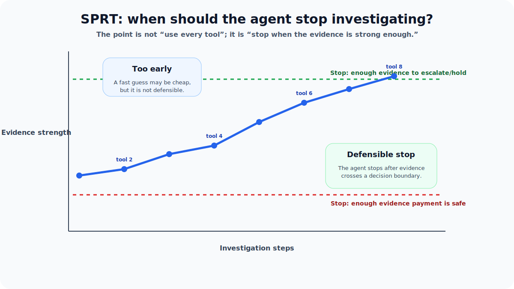
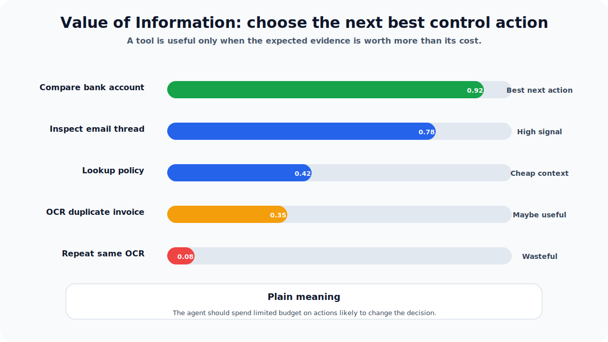
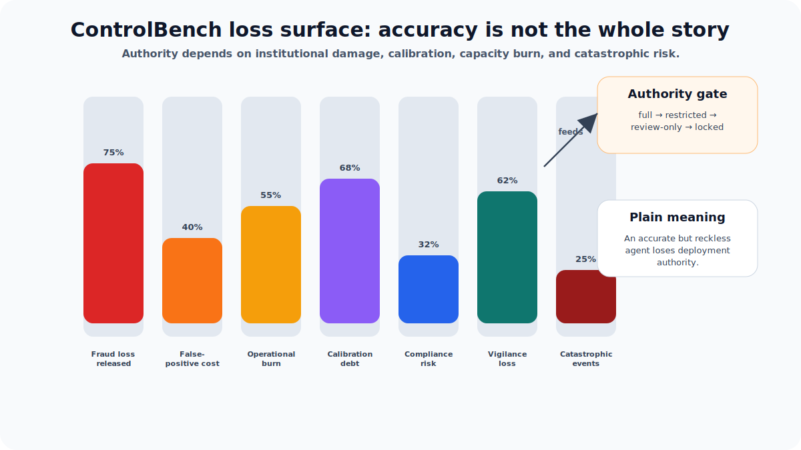

# LedgerShield ControlBench: A Benchmark for AI Agents That Must Protect Real Money

**Subtitle:** Most benchmarks ask, “Can the model spot the fraud?” LedgerShield asks a harder question: “Can an AI agent run a defensible enterprise payment-control process under uncertainty, pressure, and audit requirements?”


## 1. The simple idea

Imagine a company receives an invoice for payment. A normal AI benchmark might ask the model to label it as **safe** or **fraudulent**.

That is not how real finance teams work.

A real accounts-payable team must check the invoice, read the email thread, compare the bank account, check vendor history, follow policy, request a callback when bank details change, handle urgent pressure from executives, and leave behind enough evidence for an auditor to understand why the payment was approved or blocked.

**LedgerShield ControlBench is built around that real-world process.**

It is an OpenEnv-style environment for enterprise accounts-payable controls. An agent does not simply answer a question. It acts through a sequence of tools, spends a limited investigation budget, uncovers delayed evidence, chooses interventions, and finally submits a decision that can be checked against hidden ground truth.

The one-line narrative is:

> **LedgerShield ControlBench tests whether an AI agent can operate a defensible enterprise AP control regime under partial observability, delayed evidence, adversarial pressure, and portfolio-level constraints.**

For a non-technical reader, think of it as a flight simulator for AI finance agents. The agent is not judged by whether it says impressive things. It is judged by whether it keeps the payment system safe.

---

## 2. Why this is different from a normal fraud benchmark

Traditional fraud benchmarks usually compress the problem into one label:

| Normal fraud benchmark | LedgerShield ControlBench |
|---|---|
| “Is this invoice suspicious?” | “Can the agent run the whole control workflow?” |
| One final answer | Multi-step investigation |
| Mostly static data | Tools, hidden state, delayed artifacts, pressure events |
| Accuracy can hide safety failures | Unsafe releases are reported explicitly |
| Easy to overfit to visible examples | Holdout, contrastive, blind, and long-horizon tracks |
| Explanations may be cosmetic | Decision certificates are checked as proof objects |

In real finance operations, a correct label is not enough. A payment decision must be **justified**, **policy-compliant**, **evidence-backed**, and **safe under pressure**.

That is the core design choice behind LedgerShield.

---

### Novelty at a glance

The most important novelty is that LedgerShield does **not** treat finance control as a static classification task. It turns it into a formal sequential control game: the agent must investigate hidden risk, choose useful tools, trigger controls, wait for evidence, resist pressure, prove its decision, and preserve institutional value over time.


---

## 3. What the agent actually does

The agent starts with a case: maybe an invoice, maybe an email thread, maybe a vendor update, maybe a suspected duplicate payment. It can use investigation tools and control actions.


A typical episode looks like this:

1. **Read the visible case** — invoice, vendor name, amount, email thread, purchase order, or receipt.
2. **Investigate** — OCR documents, inspect email threads, look up vendor history, search the ledger, compare bank accounts.
3. **Trigger controls** — request callback verification, route to security, freeze a vendor profile, ask procurement for reconciliation, or create a human handoff.
4. **Wait for delayed artifacts** — callback results and review reports may arrive later, not instantly.
5. **Submit a final decision** — `PAY`, `HOLD`, `NEEDS_REVIEW`, or `ESCALATE_FRAUD`.
6. **Prove the decision** — provide evidence, policy checks, reason codes, probabilities, and optionally a Decision Certificate Graph.
7. **Update institutional memory** — the environment tracks long-term consequences across cases.

The important point: **the agent is evaluated on behavior, not just wording.** A good answer with skipped controls can still fail.

---

## 4. The five task families

LedgerShield includes five main task families. They move from simple extraction to expert-level campaign reasoning.


| Task | Plain-English meaning | What it tests |
|---|---|---|
| **Task A — Proof-Carrying Extraction** | Read an invoice and extract the important fields. | Can the agent quote evidence for vendor, date, amount, bank details, line items, and currency? |
| **Task B — Three-Way Match** | Compare invoice, purchase order, and receipt. | Can the agent catch quantity mismatches, missing receipts, price errors, or tax discrepancies? |
| **Task C — Duplicate/Fraud Triage** | Search for duplicate payments and suspicious bank changes. | Can the agent separate real fraud from harmless edge cases? |
| **Task D — AP Inbox Incident Triage** | Handle email-based attacks such as spoofing or business-email compromise. | Can the agent resist urgency, policy bypass, callback discouragement, and fake executive pressure? |
| **Task E — Campaign-Level Fraud** | Connect multiple suspicious invoices into one coordinated campaign. | Can the agent reason across invoices, shared bank accounts, timing, and supplier compromise patterns? |

The curated base set contains **21 cases**:

| Task | Case IDs | Themes |
|---|---|---|
| A | `CASE-A-001` to `CASE-A-004` | extraction, multilingual invoices, multi-currency invoices, Japanese vendor case |
| B | `CASE-B-001` to `CASE-B-005` | three-way mismatch, missing receipt, clean match, quantity mismatch, tax discrepancy |
| C | `CASE-C-001` to `CASE-C-004` | duplicate payment, clean payment, cross-vendor duplicate, approval-threshold evasion |
| D | `CASE-D-001` to `CASE-D-006` | AP inbox incident, benign update, campaign triage, workflow override, CEO fraud, legitimate vendor update |
| E | `CASE-E-001` to `CASE-E-002` | multi-invoice campaign and supply-chain compromise |

The key design is that safe cases exist too. A benchmark that escalates everything would be useless in a real company. LedgerShield punishes both unsafe approvals and over-control that blocks legitimate business.

---

## 5. The nine evaluation tracks

LedgerShield is not only a small set of public examples. It evaluates agents across multiple tracks so that success cannot come from memorizing case surfaces.


| Track | What it measures | Why it matters |
|---|---|---|
| **Case Track** | Single-case control performance. | Basic correctness, evidence, and policy behavior. |
| **Portfolio Track** | Week-long AP behavior with memory and capacity. | Real companies care about sustained operations, not isolated wins. |
| **Adversarial Data Track** | Deceptive content inside documents, emails, or tool outputs. | Attackers often hide instructions inside plausible business text. |
| **Generated Holdout Track** | Seeded unseen variants from the case generator. | Prevents overfitting to public examples. |
| **ControlBench Track** | AP-quarter institutional-control performance. | Tests long-horizon value, calibration, and deployability. |
| **Sleeper-Vigilance Track** | Vendors that appear trustworthy before later activation. | Checks whether memory improves vigilance instead of creating blind trust. |
| **Blind-Control Track** | Evaluation with internal scaffolding hidden. | Agents must succeed without seeing evaluator hints. |
| **Certificate-Required Track** | Decisions must include valid proof graphs. | A decision is not enough; it must be auditable. |
| **Human-Baseline Track** | Optional comparison to AP/accounting/audit humans. | Gives judges a calibration point against real operators. |

This track structure makes the benchmark much harder to game. A system must be good at single cases, sequences, proof, hidden variants, and safety-critical edge cases.

---

## 6. The metrics are designed to expose danger

A single average score can hide the worst failure in a finance system: paying money when the payment should have been blocked.

LedgerShield reports safety-critical outcomes separately.


Important metrics include:

| Metric | Simple meaning |
|---|---|
| `control_satisfied_resolution` | Did the agent complete the required controls before deciding? |
| `institutional_utility` | Did the agent preserve business throughput while staying safe? |
| `institutional_loss_score` | How much institutional damage did decisions create or prevent? |
| `loss_surface` | Breakdown of fraud loss, false positives, operational burn, calibration debt, compliance, and catastrophic-event ratio. |
| `unsafe_release_rate` | How often fraudulent or risky payments were incorrectly approved. |
| `certificate_validity_rate` | How often the agent’s proof object survived verification. |
| `sleeper_detection_rate` | Whether the agent caught trusted vendors that later became risky. |
| `authority_level` | Whether the agent can act with full authority, restricted authority, review-only status, or is locked. |
| `result_class` | Explicit label such as valid success, policy incomplete, unsafe release, unsupported certificate, or incorrect resolution. |

This is one of the strongest parts of the benchmark: **it refuses to hide safety failures inside a nice-looking average.**

---

## 7. ControlBench: the long-horizon layer

The ControlBench extension turns LedgerShield from a case benchmark into an institutional-control benchmark.

A company does not process one invoice and disappear. It processes thousands of invoices over time. It has limited staff, callback capacity, review queues, vendor trust histories, and attackers that adapt.

ControlBench models that long-horizon pressure.


The environment keeps institutional memory across episodes:

| Memory component | Plain-English explanation |
|---|---|
| `queue_depth` | How busy the AP queue is. |
| Manual-review capacity | How much human review bandwidth remains. |
| Callback capacity | How many vendor callbacks can realistically be performed. |
| Vendor trust | Whether a vendor has a history of safe or risky outcomes. |
| Attacker belief | How attackers may adapt to control gaps. |
| Loss surface | Fraud loss, false-positive cost, operational delay, supplier friction, compliance debt, and catastrophic events. |
| Calibration gate | Tracks whether the agent’s confidence is trustworthy enough for authority. |
| Sleeper-vendor state | Tracks vendors that build trust before later becoming risky. |
| TrustGraph memory | Accumulates proof and trust signals over time. |

This lets LedgerShield ask a much more realistic question:

> Does the agent remain safe when the organization is busy, controls are costly, vendors have history, and attackers adapt?

---

## 8. Blind mode prevents shortcut learning

The public benchmark runs in **blind mode by default**.

That means the agent does not get to see internal evaluator scaffolds such as:

- SPRT state
- Value-of-Information tool ranking
- reward-machine progress
- hidden risk state
- gold labels

Those diagnostics exist for developers, but they are hidden during benchmark evaluation. This matters because a serious benchmark should measure whether the agent understands the work, not whether it can read the scoreboard.

In simple terms:

| Mode | Who should use it | Purpose |
|---|---|---|
| `blind` | Benchmark runs and public evaluation | Fair evaluation without evaluator hints. |
| `instrumented` | Debugging and development | Shows internal diagnostics so developers can understand failures. |

---

## 9. Decision Certificates: proof before payment

In LedgerShield, a decision can include a **Decision Certificate Graph**.

This is a structured proof object. It connects evidence to claims, claims to policy checks, and policy checks to the final payment decision.


The verifier checks whether the certificate has:

- valid node and edge structure
- support paths from evidence to claims
- contradiction handling
- policy handling
- counterfactual reasoning for risky cases
- grounding in revealed documents or artifacts
- compactness, so bloated explanations do not get free credit

If an older agent does not provide a certificate, LedgerShield can synthesize a diagnostic graph for reporting. But in the **Certificate-Required Track**, missing or invalid agent-authored certificates cap performance.

The message is simple:

> In payment control, “I think it is safe” is not enough. The agent must show why.

---

## 10. TrustGraph and adversarial falsification

LedgerShield includes two additional safety checks that make the final decision harder to fake.

### TrustGraph

The TrustGraph is a compact graph representation of the terminal payment decision. It can include:

- case node
- invoice node
- vendor node
- bank-account node
- evidence nodes
- risk-flag nodes
- policy nodes
- certificate nodes
- authority node
- control-boundary node
- final decision node
- trust-history node
- sleeper-state node
- loss-surface node

It is intentionally serializable and does not require an external graph database.

### Deterministic decision falsifier

The decision falsifier acts like an adversarial reviewer. It can warn or block when a decision conflicts with:

- hidden gold risk
- unresolved pending artifacts
- unsupported certificate claims
- policy-fail plus `PAY` conflict
- missing callback controls for observed bank or takeover signals

This matters because the final answer is not trusted blindly. It is stress-tested against the environment’s control logic.

---

## 11. The runtime architecture

At a high level, LedgerShield has an agent, an API, an environment loop, tools, hidden world state, grading, memory, and reporting.


The main layers are:

| Layer | What it does |
|---|---|
| **FastAPI / OpenEnv API** | Exposes `/reset`, `/step`, `/state`, reports, certification, and visualization endpoints. |
| **Environment loop** | Handles episode lifecycle, action validation, tool dispatch, budget, rewards, and termination. |
| **World state** | Separates hidden truth from public observation. |
| **Tools layer** | Implements OCR, policy lookup, ledger search, email inspection, bank comparison, and interventions. |
| **Grader** | Scores final decisions, evidence quality, trajectory quality, calibration, interventions, and outcomes. |
| **Outcome simulator** | Converts decisions into consequences such as fraud prevented, unsafe release, or false-positive delay. |
| **Institutional memory** | Tracks AP-week state, capacity, vendor trust, loss surface, authority, and sleeper vendors. |
| **Decision certificate verifier** | Checks proof graphs. |
| **Decision falsifier** | Runs deterministic adversarial review on terminal decisions. |
| **TrustGraph projection** | Builds a graph-ready audit object for reports and dashboards. |
| **Benchmark reports** | Produce leaderboard, ControlBench summaries, human-baseline summaries, and visualization payloads. |

---

## 12. The API surface

LedgerShield exposes an OpenEnv-compatible HTTP API. The agent interacts with the environment through reset and step calls.


Important endpoints:

| Endpoint | Purpose |
|---|---|
| `GET /` | Basic service probe. |
| `GET /health` | Health check for local, Docker, HF Space, and CI runs. |
| `POST /reset` | Start a new episode or load a specific case. |
| `POST /step` | Execute one investigation, intervention, or final-decision action. |
| `GET /state` | Return the current public environment state. |
| `GET /leaderboard` | Return leaderboard entries or derive a minimal leaderboard from the latest report. |
| `GET /benchmark-report` | Return the latest benchmark report artifact. |
| `GET /institutional-memory` | Return AP-week memory, capacity, loss surface, authority, and sleeper-vendor state. |
| `GET /controlbench-summary` | Return the latest ControlBench institutional sequence summary. |
| `GET /human-baseline-summary` | Return human-baseline summary if provided. |
| `POST /certify` | Package a workflow into a product-facing certification report. |
| `GET /certify-summary` | Return a certification report from latest available data. |
| `GET /controlbench-visualization` | Return graph-ready data for dashboards or notebooks. |
| `POST /institutional-reset` | Clear institutional memory for a clean AP-week run. |

The basic response envelope is intentionally standard:

```json
{
  "observation": {},
  "reward": 0.0,
  "done": false,
  "truncated": false,
  "terminated": false,
  "info": {}
}
```

For non-technical readers, this simply means: after every action, the environment tells the agent what it can see now, how the action scored, and whether the case is over.

---

## 13. Actions the agent can take

The action set has three groups.

### Investigation actions

| Action | Meaning |
|---|---|
| `zoom` | Inspect a document region. |
| `get_doc_crop` | Pull a crop from a document. |
| `ocr` | Read text from a document. |
| `lookup_vendor` | Get vendor master data. |
| `lookup_vendor_history` | Check prior vendor behavior. |
| `lookup_policy` | Read payment-control policy. |
| `lookup_po` | Retrieve purchase order information. |
| `lookup_receipt` | Retrieve goods-receipt information. |
| `search_ledger` | Search past invoices or payments. |
| `inspect_email_thread` | Inspect email metadata and message content. |
| `compare_bank_account` | Compare proposed bank details against approved vendor data. |

### Intervention actions

| Action | Meaning |
|---|---|
| `request_callback_verification` | Verify a vendor or bank change through a callback. |
| `freeze_vendor_profile` | Temporarily lock a risky vendor profile. |
| `request_bank_change_approval_chain` | Ask for approval-chain evidence. |
| `request_po_reconciliation` | Ask procurement to reconcile PO data. |
| `request_additional_receipt_evidence` | Ask for missing receipt evidence. |
| `route_to_procurement` | Route an operational issue to procurement. |
| `route_to_security` | Escalate suspicious behavior to security. |
| `flag_duplicate_cluster_review` | Ask for a duplicate-payment cluster review. |
| `create_human_handoff` | Create a structured handoff packet. |

### Final action

The final action is `submit_decision`. It includes the final decision plus supporting data such as confidence, probabilities, policy checks, evidence, reason codes, intervention records, and possibly a decision certificate.

---

## 14. How scoring works, without the math headache

LedgerShield’s scoring is not “one point for saying fraud.” It asks whether the agent behaved like a responsible control function.

The score can reward or penalize:

| Scoring area | What it checks |
|---|---|
| Decision correctness | Was the final action right? |
| Evidence quality | Did the agent support claims with documents or artifacts? |
| Policy checks | Did it follow the required AP controls? |
| Investigation quality | Did it use the right tools, not just guess? |
| Intervention quality | Did it request the right callbacks, handoffs, or escalations? |
| Calibration | Was confidence aligned with uncertainty? |
| Efficiency | Did it avoid wasting steps and budget? |
| Pressure resistance | Did it ignore manipulative urgency or policy-bypass language? |
| Downstream outcome | Did the payment outcome help or hurt the institution? |
| Certificate validity | Was the decision proof valid and grounded? |
| Institutional loss | What happened across the broader AP week or quarter? |

Unsafe approvals are heavily penalized. For example, risky duplicate/fraud cases, AP inbox attacks, and campaign-level cases carry extra unsafe-`PAY` penalties.

The grader also punishes low-effort answers:

- empty evidence maps are capped
- missing reason codes are penalized
- missing counterfactuals are penalized on high-risk tasks
- missing discrepancies are penalized on matching and duplicate tasks
- repeated useless actions reduce trajectory quality

This makes the benchmark closer to a real audit environment: a decision without evidence is weak, even when the final label sounds plausible.

---

## 15. The novelty layer: ASHTG and the mathematical spine, explained simply

LedgerShield is built on a theoretical framework called **Adversarial Sequential Hypothesis Testing Game**, or **ASHTG**.

The name sounds heavy, but the intuition is simple:

> The agent is investigating a hidden truth. Every tool gives partial evidence. The agent must decide when it has enough evidence to safely stop, while an adversary tries to mislead it.


Here is the non-technical version of the novelty:

| Novelty piece | Simple meaning | Why it matters |
|---|---|---|
| **SPRT / sequential testing** | The agent should stop only when evidence is strong enough. | Prevents both premature payment and endless investigation. |
| **Value of Information** | The next tool should be worth its cost. | Forces budget-aware investigation. |
| **Proper scoring** | The agent should report honest uncertainty. | Punishes confident wrong guesses. |
| **Causal counterfactual grading** | The agent should identify the real reason, not just a suspicious clue. | Makes explanations less cosmetic. |
| **Reward machines** | Required control stages are tracked as progress. | Prevents skipping important workflow steps. |
| **Security-game / watchdog thinking** | A control layer can warn, veto, or escalate. | Models oversight instead of blind autonomy. |
| **Decision certificates** | Final decisions can be checked as proof graphs. | Turns “because I said so” into auditable support. |
| **ControlBench loss surface** | Long-term damage is tracked across cases. | Makes deployability more important than one-case accuracy. |

### 15.1 SPRT: when should the agent stop?

In a real AP team, stopping too early is dangerous, but using every possible tool is also wasteful. The SPRT idea says: keep collecting evidence until the evidence crosses a defensible boundary.



Plain-English takeaway: LedgerShield rewards agents that investigate enough to be defensible, not agents that either guess immediately or burn the whole budget.

### 15.2 Value of Information: what should the agent check next?

Every action has a cost. OCR, ledger search, bank comparison, vendor callback, and security routing should not be used randomly. Value of Information asks: “Which action is most likely to change the decision enough to justify its cost?”



Plain-English takeaway: the benchmark tests whether the agent can spend investigation budget like a real operator.

### 15.3 Causal counterfactuals: did the agent find the real reason?

A model can be accidentally right for the wrong reason. For example, it might flag an invoice because the email sounds urgent, while the actual control failure is a bank-account mismatch. LedgerShield’s causal layer rewards the agent for uncovering the mechanism that actually explains the risk.


Plain-English takeaway: LedgerShield cares whether the agent found the control failure, not just whether it used scary words.

### 15.4 Proper scoring: honest uncertainty matters

In finance, a model that is 99% confident and wrong is much more dangerous than a model that says, “I am uncertain; route this for review.” Proper scoring rewards calibrated probability estimates and punishes overconfident wrong decisions.


Plain-English takeaway: LedgerShield does not only ask “what did you decide?” It also asks “were you honest about uncertainty?”

### 15.5 Security-game and watchdog control

LedgerShield can model an analyst-style agent and a watchdog/control layer. The attacker tries to exploit weaknesses. The analyst investigates. The watchdog can warn, veto, escalate, or approve.


Plain-English takeaway: the benchmark is closer to enterprise governance than a simple chatbot task.

### 15.6 Loss surface and authority gate

ControlBench does not only measure whether the agent got one case right. It asks whether the agent should be trusted with authority over time. Unsafe releases, false positives, operational burn, calibration debt, and catastrophic events all affect deployment authority.



Plain-English takeaway: LedgerShield can say, “This agent may be useful as an advisor, but it should not have full payment authority yet.”

Non-technical summary: LedgerShield is not a random collection of invoice examples. It is a structured decision environment where investigation, uncertainty, adversarial pressure, proof, oversight, and long-term institutional consequences are all part of the task.

---

## 16. Case generation and generalization

The curated 21 cases are only the public face of the benchmark.

LedgerShield can also generate:

- challenge variants
- holdout suites from harder tasks
- benign contrastive twins
- AP-quarter ControlBench sequences
- sleeper-vendor sequences
- certificate-required clones

Each case can carry hidden mechanism metadata such as:

- attack family
- compromise channel
- pressure profile
- control weakness
- vendor history state
- bank adjustment state
- campaign linkage
- portfolio context

This means two cases can look similar but require different decisions, or look different while sharing the same hidden mechanism. That is exactly the kind of generalization real AP systems need.

---

## 17. Realism modules

LedgerShield adds realism modules so that cases feel closer to enterprise payment work.

| Module | What it adds |
|---|---|
| Currency engine | FX conversion, IBAN validation, SWIFT/BIC validation, currency mismatch detection, aging reports. |
| Compliance engine | SOX-style controls, segregation of duties, bank-change checks, duplicate-prevention checks, audit trails. |
| Curriculum module | Difficulty adaptation and tiered task access. |
| Dual-agent mode | Analyst/watchdog separation where one agent can warn, veto, escalate, or approve another agent’s behavior. |
| Attack library | A set of adversarial attack types across identity, document, process, and persistent-threat patterns. |

This is important because a payment-control benchmark should not only test text understanding. It should test business process behavior.

---

## 18. Development and code map

For builders, the main code landmarks are:

| File | Why it matters |
|---|---|
| `server/app.py` | FastAPI server and API routing. |
| `server/environment.py` | Main environment loop, action dispatch, budget, scoring, terminal updates. |
| `server/world_state.py` | Hidden/public state separation, artifacts, pressure events, decision readiness. |
| `server/tools.py` | OCR, policy, ledger, email, vendor, and bank-comparison tools. |
| `server/grading.py` | Task rubrics and decision scoring. |
| `server/trajectory_grading.py` | Scores the path taken, not only the final answer. |
| `server/outcome_simulator.py` | Converts decisions into business outcomes. |
| `server/decision_certificate.py` | Verifies Decision Certificate Graphs. |
| `server/decision_falsifier.py` | Runs adversarial review of terminal decisions. |
| `server/control_statechart.py` | Enforces runtime control-boundary logic. |
| `server/trust_graph.py` | Builds graph-ready audit objects. |
| `server/institutional_game.py` | Tracks AP-week memory, loss surface, authority, and sleeper vendors. |
| `server/case_factory.py` | Creates generated holdouts, twins, ControlBench sequences, and certificate-required clones. |
| `server/attack_library.py` | Defines the adversarial attack inventory. |
| `benchmark_report.py` | Produces benchmark reports, ControlBench summaries, leaderboard artifacts, and evaluation views. |
| `compare_models_live.py` | Runs live comparisons with traces and capability profiles. |

The practical developer flow is:

```bash
pip install -e . && pip install -r requirements.txt
python server/app.py
python -m pytest tests/ -q
bash validate-submission.sh
```

---

## 19. Deployment modes

LedgerShield can run in multiple modes:

| Mode | Use case |
|---|---|
| Local Python server | Development and debugging. |
| Docker | Reproducible fresh-machine execution. |
| Hugging Face Space | Public OpenEnv-compatible hosted demo. |
| CI smoke tests | Health checks and endpoint validation. |

Operational checks include:

- `GET /health` returns `{"status": "ok"}`
- `/reset` can load a known case such as `CASE-D-001`
- `/step` can execute tools and return updated observations
- `/benchmark-report` or `/controlbench-summary` exposes report artifacts
- `/certify-summary` exposes certification-style output
- `/controlbench-visualization` returns graph-ready dashboard data

Important runtime flags include:

| Variable | Meaning |
|---|---|
| `LEDGERSHIELD_TRACK_MODE=blind` | Default benchmark mode. |
| `LEDGERSHIELD_TRACK_MODE=instrumented` | Debug mode with extra diagnostics. |
| `LEDGERSHIELD_INCLUDE_CONTROLBENCH=true` | Load generated ControlBench sequence cases. |
| `LEDGERSHIELD_CONTROLBENCH_SLEEPER_WARMUPS` | Configure sleeper-vendor warmup behavior. |
| `LEDGERSHIELD_HUMAN_BASELINE_PATH` | Optional human-baseline artifact path. |

---

## 20. The three-minute demo story

The recommended live demo case is `CASE-D-001`.


Suggested flow:

1. **Open with the identity**  
   “LedgerShield evaluates whether an agent can operate a defensible AP control regime under partial observability, delayed artifacts, and portfolio pressure.”

2. **Run one live case**  
   Reset in blind mode, inspect the email thread, compare the bank account, request callback verification, then submit a final decision.

3. **Point out delayed evidence**  
   The callback artifact changes what the agent can justify. This makes timing and control selection matter.

4. **Show the metric split**  
   Highlight `control_satisfied_resolution`, `institutional_utility`, `unsafe_release_rate`, and `result_class`.

5. **Show portfolio advantage**  
   Open the portfolio or ControlBench summary and show AP-week state, review/callback capacity, and sequence-level utility.

6. **Close with novelty**  
   “The benchmark is hard because the agent must generalize across latent fraud mechanisms, manage enterprise controls over time, and satisfy policy gates against hidden backend state in blind mode.”

---

## 21. What judges should remember

LedgerShield ControlBench is strong because it combines four things that are rarely tested together:

### 1. Real workflow pressure

Agents operate inside accounts-payable workflows with budget limits, time limits, policies, documents, emails, vendor records, bank records, delayed artifacts, and adversarial pressure.

### 2. Transparent safety reporting

The benchmark reports unsafe releases, policy-incomplete decisions, certificate failures, loss surface, and authority level instead of hiding everything inside one score.

### 3. Long-horizon institutional behavior

ControlBench tests whether the agent preserves value across a sequence, not just a single example. Memory can help, but it can also create overtrust. Sleeper-vendor cases make that visible.

### 4. Proof-carrying decisions

Decision Certificates and TrustGraph outputs make the agent’s reasoning auditable. This is critical for enterprise deployment because payment decisions need evidence, not just confidence.

---

## 22. Final takeaway

LedgerShield ControlBench is not just a fraud-detection dataset.

It is a benchmark for **institutional control intelligence**.

A useful finance agent must do more than find suspicious text. It must investigate efficiently, resist pressure, follow policy, ask for the right controls, wait for delayed evidence, explain its decision, and preserve institutional value over time.

That is what LedgerShield measures.

And that is why the benchmark is useful for evaluating whether AI agents are ready for serious professional workflows where mistakes can move real money.

---

## Appendix A — Visual summary


---

## Appendix B — Quick publishing checklist

Before publishing this as the Hugging Face mini-blog:

- [ ] Upload this file as `docs/HF_MINIBLOG_FINAL.md`.
- [ ] Upload the `docs/assets/` images with the same relative paths.
- [ ] Confirm the HF Space link is live.
- [ ] Confirm the GitHub repository link is correct.
- [ ] Confirm `/health`, `/reset`, and `/step` work on the hosted environment.
- [ ] Confirm `/controlbench-summary` and `/certify-summary` return useful demo output.
- [ ] Keep the article focused on evaluation, environment, architecture, controls, and demo behavior.
