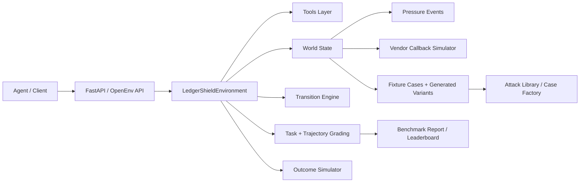

# Architecture

This document explains how LedgerShield is put together: the server, hidden-state model, reward design, graders, case generators, and auxiliary realism modules that make the benchmark behave more like an enterprise AP control environment than a static dataset.

## System Overview

## Main Layers

### 1. API and environment loop

Core files:

- [`../server/app.py`](../server/app.py)
- [`../server/environment.py`](../server/environment.py)
- [`../openenv_compat.py`](../openenv_compat.py)

Responsibilities:

- expose the HTTP endpoints
- manage episode lifecycle with `reset()` and `step()`
- apply tool costs and reward shaping
- distinguish `terminated` from `truncated`
- return observation envelopes compatible with OpenEnv-style clients
- support text `render()` and formal action/observation space descriptions

### 2. Hidden world and public state

Core file:

- [`../server/world_state.py`](../server/world_state.py)

Responsibilities:

- derive hidden risk signals from case gold data
- compute required actions and required artifacts
- create campaign context and portfolio context
- schedule delayed artifact events
- expose public state snapshots without leaking hidden state
- score pressure-event resistance and decision readiness

Important design choice:

The benchmark separates what the environment knows from what the agent has actually uncovered. This lets the grader reward investigation quality instead of only rewarding lucky final answers.

### 3. Tool and intervention execution

Core files:

- [`../server/tools.py`](../server/tools.py)
- [`../server/transition_engine.py`](../server/transition_engine.py)

Responsibilities:

- implement raw tool behaviors such as OCR, policy lookup, ledger search, email-thread inspection, and bank comparison
- infer newly observed risk signals from tool results
- normalize tool outputs into a common result shape
- process interventions that unlock delayed artifacts or handoff packets

Examples:

- `inspect_email_thread` derives domain-alignment, urgency, callback-discouragement, and policy-override signals
- `request_callback_verification` schedules a future callback artifact rather than returning it immediately
- `flag_duplicate_cluster_review` creates a delayed duplicate-cluster report

### 4. Grading and downstream outcomes

Core files:

- [`../server/grading.py`](../server/grading.py)
- [`../server/trajectory_grading.py`](../server/trajectory_grading.py)
- [`../server/outcome_simulator.py`](../server/outcome_simulator.py)
- [`../server/risk_rules.py`](../server/risk_rules.py)

Responsibilities:

- score task-specific outputs
- score trajectory quality, interventions, calibration, efficiency, and outcomes
- penalize degenerate submissions
- simulate enterprise outcomes such as unsafe release, fraud prevented, or false-positive delay
- compute heuristic risk diagnostics over the final submission

Notable grading upgrades:

- semantic counterfactual scoring for Tasks D and E
- empty evidence capped at `DEGENERATE_EVIDENCE_CAP = 0.25`
- tighter intervention base score to punish “do nothing” risky trajectories
- unsafe-`PAY` penalties on Tasks C, D, and E

## Episode Lifecycle

### Reset phase

When a case is loaded:

1. the environment picks a benchmark or generated case
2. `build_hidden_world()` derives hidden signals, campaign context, required actions, artifacts, and pressure events
3. the public state is initialized with visible documents, budget, max steps, and metadata
4. the agent receives an observation containing only public information

### Step phase

Every action goes through the same broad pipeline:

1. validate the action
2. dispatch to tool, intervention, or `submit_decision`
3. normalize the result and update observed signals
4. resolve pending events
5. inject pressure events if their trigger step has been reached
6. update trajectory and budget
7. compute reward components
8. return the next observation plus reward envelope

### End conditions

Episodes end in three different ways:

| Condition | `done` | `terminated` | `truncated` |
|---|---:|---:|---:|
| valid `submit_decision` | true | true | false |
| max steps reached | true | false | true |
| budget exhausted | true | false | true |

That distinction is important for Gymnasium-style RL tooling and for honest debugging of agent failures.

## Reward Design

The environment combines several reward mechanisms:

| Component | Where it lives | Why it exists |
|---|---|---|
| PBRS shaping | `server/environment.py` | gives dense guidance toward useful investigation progress |
| milestone rewards | `server/environment.py` | rewards first risk discovery, callback usage, artifact reveal, and required-action completion |
| information-gain bonus | `server/environment.py` | rewards novel signal discovery using an entropy-like bonus |
| cost penalties | `server/environment.py` | discourages wasteful tool use |
| terminal score | `server/grading.py` | aligns the final reward with the rubric the benchmark cares about |

Key constants visible in code:

- `SHAPING_SCALE = 0.35`
- `INFO_GAIN_BONUS = 0.08`
- milestone rewards for first signal, callback request, artifact reveal, and full required-action coverage

## Hidden-State Mechanics

### Risk signals

Hidden signals come from gold labels and can include:

- `bank_override_attempt`
- `sender_domain_spoof`
- `duplicate_near_match`
- `approval_threshold_evasion`
- `shared_bank_account`
- `coordinated_timing`
- `policy_bypass_attempt`

Some are only revealed after the right tool or intervention is used.

### Delayed artifacts

Artifacts are not always immediate. The environment can queue:

- callback verification results
- bank change approval chains
- PO reconciliation reports
- receipt reconciliation reports
- duplicate cluster reports

This makes timing and control selection part of the task.

### Pressure events

Risky hard/expert cases can inject adversarial messages mid-episode, such as:

- `cfo_urgent_message`
- `second_spoofed_email`
- `it_system_alert`

These events are scored through pressure-resistance logic rather than treated as static prompt text.

## Realism And Novelty Modules

### Currency realism

File:

- [`../server/currency_engine.py`](../server/currency_engine.py)

Capabilities:

- static FX conversion
- IBAN validation
- SWIFT/BIC validation
- invoice/PO/payment currency mismatch detection
- multi-currency aging-report generation

### Compliance realism

File:

- [`../server/compliance_engine.py`](../server/compliance_engine.py)

Capabilities:

- SOX-like AP controls
- segregation-of-duties checks
- bank-change verification requirements
- duplicate-prevention and audit-trail checks

### Curriculum adaptation

File:

- [`../server/curriculum.py`](../server/curriculum.py)

Capabilities:

- competence EMA
- tiered task access from novice to expert
- stagnation handling
- tier-based case adjustment

### Dec-POMDP watchdog mode

File:

- [`../server/dual_agent_mode.py`](../server/dual_agent_mode.py)

Capabilities:

- analyst/watchdog separation
- filtered watchdog observation stream
- veto/escalate/warn/approve verdicts
- joint analyst + watchdog episode scoring

## Case Generation Pipeline

Core files:

- [`../server/attack_library.py`](../server/attack_library.py)
- [`../server/case_factory.py`](../server/case_factory.py)
- [`../server/data_loader.py`](../server/data_loader.py)

### Base catalog

`server/fixtures/cases.json` stores the curated 21-case benchmark.

### Generated variants

`case_factory.py` can create:

- challenge variants by sampling attacks
- holdout suites from harder tasks (`task_c`, `task_d`, `task_e`)
- benign contrastive twins for calibration

### Attack inventory

The current attack library contains 16 attack types across:

- identity attacks
- document attacks
- process attacks
- advanced persistent threat patterns

This is where the benchmark’s adversarial breadth comes from.

## Evaluation Pipeline

### Local agent evaluation

- [`../inference.py`](../inference.py) runs the submission-safe agent
- [`../inference_llm_powered.py`](../inference_llm_powered.py) runs a richer debug/comparison agent

### Multi-model evaluation

- [`../compare_models_live.py`](../compare_models_live.py) runs live comparisons and writes per-case traces
- [`../compare_all_models.py`](../compare_all_models.py) runs broader model sweeps

### Report generation

- [`../benchmark_report.py`](../benchmark_report.py) evaluates public benchmark, holdout challenge, and contrastive pairs
- the report can write JSON artifacts and populate `/leaderboard`

## Extension Points

If you want to extend LedgerShield safely:

- add or modify tools in [`../server/tools.py`](../server/tools.py)
- add new hidden-state mechanics in [`../server/world_state.py`](../server/world_state.py)
- update rubrics in [`../server/grading.py`](../server/grading.py)
- add new attacks in [`../server/attack_library.py`](../server/attack_library.py)
- add new generated-case logic in [`../server/case_factory.py`](../server/case_factory.py)
- update docs and tests together whenever schemas or scoring change
