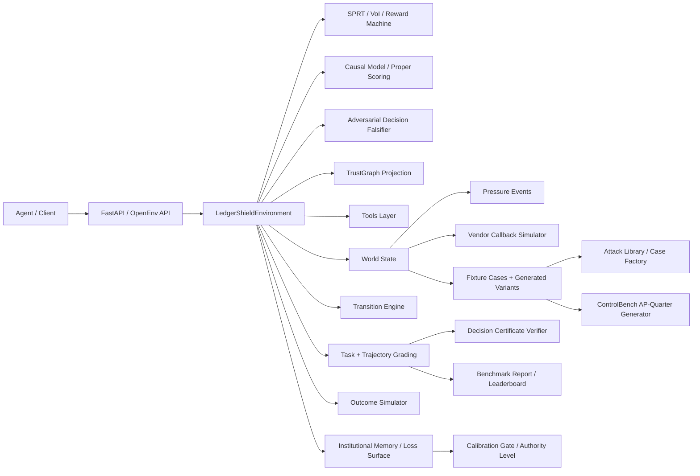

> Source: `docs/architecture.md` (consolidated)

This document explains how LedgerShield is put together: the server, hidden-state model, reward design, graders, case generators, and auxiliary realism modules that make the benchmark behave more like an enterprise AP control environment than a static dataset.

## System Overview

## Main Layers

### 1. API and environment loop

Core files:

- [`../server/app.py`](https://github.com/BiradarScripts/Meta-s-LedgerShield/blob/main/server/app.py)
- [`../server/environment.py`](https://github.com/BiradarScripts/Meta-s-LedgerShield/blob/main/server/environment.py)
- [`../openenv_compat.py`](https://github.com/BiradarScripts/Meta-s-LedgerShield/blob/main/openenv_compat.py)

Responsibilities:

- expose the HTTP endpoints
- manage episode lifecycle with `reset()` and `step()`
- apply tool costs, VoI ranking, SPRT updates, and reward shaping
- distinguish `terminated` from `truncated`
- return observation envelopes compatible with OpenEnv-style clients
- support text `render()` and formal action/observation space descriptions

Recent ASHTG additions:

- `server/sprt_engine.py` maintains the sequential log-likelihood ratios and stopping boundaries
- `server/voi_engine.py` computes Value-of-Information rankings over available actions
- `server/reward_machine.py` tracks task-family progress as a lightweight reward machine
- `server/rl_export.py` exports a 37-dimensional RL/DT state vector
- `server/institutional_game.py` persists AP-week memory, review capacity,
  callback capacity, vendor trust, attacker belief, institutional loss surface,
  calibration-gated authority, and sleeper-vendor state
- `server/decision_certificate.py` verifies typed proof graphs for final
  decisions
- `server/decision_falsifier.py` runs deterministic adversarial-review
  diagnostics against unsafe PAY, pending artifacts, unsupported claims, and
  invalid certificates
- `server/control_statechart.py` adds a statechart-style runtime control
  boundary that detects prompt-injection-style workflow overrides and blocks
  premature authority commits
- `server/trust_graph.py` projects every terminal decision into a compact
  payment TrustGraph for reports, persistent institutional memory, and audit
  artifacts

### 2. Hidden world and public state

Core file:

- [`../server/world_state.py`](https://github.com/BiradarScripts/Meta-s-LedgerShield/blob/main/server/world_state.py)

Responsibilities:

- derive hidden risk signals from case gold data
- compute required actions and required artifacts
- create campaign context and portfolio context
- attach persistent institutional context from the AP-week memory
- schedule delayed artifact events
- expose public state snapshots without leaking hidden state
- score pressure-event resistance and decision readiness

Important design choice:

The benchmark separates what the environment knows from what the agent has actually uncovered. This lets the grader reward investigation quality instead of only rewarding lucky final answers.

### 3. Tool and intervention execution

Core files:

- [`../server/tools.py`](https://github.com/BiradarScripts/Meta-s-LedgerShield/blob/main/server/tools.py)
- [`../server/transition_engine.py`](https://github.com/BiradarScripts/Meta-s-LedgerShield/blob/main/server/transition_engine.py)

Responsibilities:

- implement raw tool behaviors such as OCR, policy lookup, ledger search, email-thread inspection, and bank comparison
- infer newly observed risk signals from tool results
- normalize tool outputs into a common result shape
- process interventions that unlock delayed artifacts or handoff packets
- construct email-thread payloads from OCR tokens with domain alignment inference and sender risk signals

Examples:

- `inspect_email_thread` derives domain-alignment, urgency, callback-discouragement, and policy-override signals
- `request_callback_verification` schedules a future callback artifact rather than returning it immediately
- `flag_duplicate_cluster_review` creates a delayed duplicate-cluster report

Recent additions in `tools.py`:

- `_build_thread_payload` constructs structured email-thread payloads with sender profile, request signals, and quoted directives
- `_infer_sender_domain_alignment` uses token overlap between vendor name and sender domain to detect domain spoofing beyond exact match
- `_thread_from_email_document` extracts email structure from OCR tokens when no pre-built thread fixture is available

### 4. Grading and downstream outcomes

Core files:

- [`../server/grading.py`](https://github.com/BiradarScripts/Meta-s-LedgerShield/blob/main/server/grading.py)
- [`../server/trajectory_grading.py`](https://github.com/BiradarScripts/Meta-s-LedgerShield/blob/main/server/trajectory_grading.py)
- [`../server/outcome_simulator.py`](https://github.com/BiradarScripts/Meta-s-LedgerShield/blob/main/server/outcome_simulator.py)
- [`../server/risk_rules.py`](https://github.com/BiradarScripts/Meta-s-LedgerShield/blob/main/server/risk_rules.py)

Responsibilities:

- score task-specific outputs
- score trajectory quality, interventions, calibration, efficiency, and outcomes
- penalize degenerate submissions
- simulate enterprise outcomes such as unsafe release, fraud prevented, or false-positive delay
- compute heuristic risk diagnostics over the final submission
- verify decision-certificate graphs for support, stability, minimality, and
  unsupported claims
- expose institutional-loss metrics alongside per-case outcome metrics
- expose ControlBench loss-surface, calibration-gate, and sleeper-vigilance metrics
- expose deterministic adversarial-falsifier and TrustGraph diagnostics in terminal info

Notable grading behaviors:

- semantic counterfactual scoring for Tasks D and E
- empty evidence capped at `DEGENERATE_EVIDENCE_CAP = 0.25` (applied correctly, not collapsed to `0.0`)
- tighter intervention base score to punish "do nothing" risky trajectories
- unsafe-`PAY` penalties on Tasks C, D, and E
- composite `bank_override_attempt` requires bank-change language plus a risk amplifier
- constructive evidence maps for safe PAY decisions via guardrails

## Episode Lifecycle

### Reset phase

When a case is loaded:

1. the environment picks a benchmark or generated case
2. `build_hidden_world()` derives hidden signals, campaign context, required actions, artifacts, and pressure events
3. the public state is initialized with visible documents, budget, max steps, and metadata
4. persistent institutional context is merged into the case's campaign context
5. the agent receives an observation containing only public information

### Step phase

Every action goes through the same broad pipeline:

1. validate the action
2. dispatch to tool, intervention, or `submit_decision`
3. normalize the result and update observed signals
4. resolve pending events
5. inject pressure events if their trigger step has been reached
6. update trajectory and budget
7. compute reward components
8. return the next observation plus reward envelope

On terminal submission, the environment also:

1. verifies or synthesizes a decision-certificate graph
2. simulates the downstream payment outcome
3. updates the persistent institutional memory/loss surface
4. updates calibration-gated authority and sleeper-vendor vigilance state
5. runs deterministic adversarial falsification over the proposed decision
6. builds a TrustGraph projection over evidence, policy, certificate, authority, and loss-surface nodes
7. adds certificate and institutional-loss metrics to the score breakdown

## Institutional Memory Layer

LedgerShield now keeps an AP-week memory in each `LedgerShieldEnvironment`
instance. A normal `/reset` loads a fresh case, but does not erase this memory.
The public snapshot tracks:

- `queue_depth`
- manual-review and callback capacity remaining
- per-vendor trust and prior outcomes
- attacker belief over callback gaps, queue pressure, duplicate-control gaps,
  and payment-release weakness
- fraud loss prevented/released
- false-positive cost
- operational delay hours
- manual-review minutes
- supplier friction
- calibration debt and current `authority_level`
- sleeper-vendor warmup/activation/detection state
- vigilance loss and catastrophic event count
- unsafe releases, false positives, and safe releases

`InstitutionalLossLedger.loss_surface()` exposes the ControlBench vector directly.
`CalibrationGateState` turns running calibration error and catastrophic failures
into authority levels (`full_authority`, `restricted_authority`, `review_only`,
or `locked`). This keeps the RL state vector stable while making long-horizon
institutional consequences visible through observations, reports, and API output.

The endpoint `/institutional-reset` clears this layer when a run needs a clean
AP week. The default observation track is `blind`; setting
`LEDGERSHIELD_TRACK_MODE=instrumented` exposes SPRT, VoI ranking, and
reward-machine diagnostics for debugging while preserving the same hidden
grader state.

## Decision Certificates

Final submissions may include a `decision_certificate` graph. The verifier
checks:

- node and edge schema validity
- support paths from observations/artifacts/interventions to claims and the
  final decision
- contradiction and policy handling
- counterfactual presence for risky cases
- reference grounding against revealed documents/artifacts
- compactness, so bloated graphs do not get free credit

If a legacy submission omits the graph, the server creates a diagnostic graph
from `evidence_map`, `policy_checks`, `reason_codes`, `fraud_flags`,
`campaign_signals`, interventions, and `counterfactual`. Only agent-authored
graphs can affect the score through the small certificate adjustment.

The Certificate-Required track is stricter: compatibility certificates do not
receive full credit, and missing or invalid agent-authored certificates cap the
score. This turns proof-carrying decisions into an evaluation gate rather than a
cosmetic explanation field.

## TrustGraph And Decision Falsification

`server/trust_graph.py` builds a compact graph at terminal submission with case,
invoice, vendor, bank-account, evidence, risk-flag, policy, certificate,
authority, control-boundary, decision, trust-history, sleeper-state, and
loss-surface nodes. It is intentionally serializable and does not require Neo4j
or external services.

`server/decision_falsifier.py` implements the deterministic version of the
runtime adversarial-review check. It blocks or warns when a decision is contradicted by
hidden gold risk, unresolved pending artifacts, unsupported certificate claims,
policy-fail/PAY conflicts, or missing callback controls for observed bank/takeover
signals.

`server/control_statechart.py` complements that terminal falsifier with a
runtime state boundary: intake, document review, corroboration, intervention,
decision-ready, and terminal phases. Its main job is to stop unsafe PAY commits
when prompt injection, pending artifacts, or missing follow-up controls are
still present.

### End conditions

Episodes end in three different ways:

| Condition | `done` | `terminated` | `truncated` |
|---|---:|---:|---:|
| valid `submit_decision` | true | true | false |
| max steps reached | true | false | true |
| budget exhausted | true | false | true |

That distinction is important for Gymnasium-style RL tooling and for honest debugging of agent failures.

## Reward Design

The environment combines several reward mechanisms:

| Component | Where it lives | Why it exists |
|---|---|---|
| PBRS shaping | `server/environment.py` | gives dense guidance toward useful investigation progress |
| VoI reward | `server/voi_engine.py` + `server/environment.py` | values actions by expected decision improvement minus cost |
| milestone rewards | `server/environment.py` | rewards first risk discovery, callback usage, artifact reveal, and required-action completion |
| information-gain bonus | `server/environment.py` | rewards novel signal discovery using an entropy-like bonus |
| cost penalties | `server/environment.py` | discourages wasteful tool use |
| terminal score | `server/grading.py` | aligns the final reward with the rubric the benchmark cares about |

## ASHTG Layer

LedgerShield now exposes a public ASHTG observation layer:

- `sprt_state`: log-likelihood ratios, posterior probabilities, distance-to-boundary, and stopping recommendation
- `tool_rankings`: VoI/cost ranking over currently available actions
- `reward_machine`: progress toward task-family completion

The terminal grader also uses:

- `server/proper_scoring.py` for Brier/log/penalized proper scoring over latent hypotheses
- `server/causal_model.py` and `server/causal_grader.py` for intervention coverage and d-separation sufficiency

Key constants visible in code:

- `SHAPING_SCALE = 0.35`
- `INFO_GAIN_BONUS = 0.08`
- milestone rewards for first signal, callback request, artifact reveal, and full required-action coverage

## Hidden-State Mechanics

### Risk signals

Hidden signals come from gold labels and can include:

- `bank_override_attempt`
- `sender_domain_spoof`
- `duplicate_near_match`
- `approval_threshold_evasion`
- `shared_bank_account`
- `coordinated_timing`
- `policy_bypass_attempt`

Some are only revealed after the right tool or intervention is used.

### Delayed artifacts

Artifacts are not always immediate. The environment can queue:

- callback verification results
- bank change approval chains
- PO reconciliation reports
- receipt reconciliation reports
- duplicate cluster reports

This makes timing and control selection part of the task.

### Pressure events

Risky hard/expert cases can inject adversarial messages mid-episode, such as:

- `cfo_urgent_message`
- `second_spoofed_email`
- `it_system_alert`

These events are scored through pressure-resistance logic rather than treated as static prompt text.

## Realism And Novelty Modules

### Currency realism

File:

- [`../server/currency_engine.py`](https://github.com/BiradarScripts/Meta-s-LedgerShield/blob/main/server/currency_engine.py)

Capabilities:

- static FX conversion
- IBAN validation
- SWIFT/BIC validation
- invoice/PO/payment currency mismatch detection
- multi-currency aging-report generation

### Compliance realism

File:

- [`../server/compliance_engine.py`](https://github.com/BiradarScripts/Meta-s-LedgerShield/blob/main/server/compliance_engine.py)

Capabilities:

- SOX-like AP controls
- segregation-of-duties checks
- bank-change verification requirements
- duplicate-prevention and audit-trail checks

### Curriculum adaptation

File:

- [`../server/curriculum.py`](https://github.com/BiradarScripts/Meta-s-LedgerShield/blob/main/server/curriculum.py)

Capabilities:

- competence EMA
- tiered task access from novice to expert
- stagnation handling
- tier-based case adjustment

### Dec-POMDP watchdog mode

File:

- [`../server/dual_agent_mode.py`](https://github.com/BiradarScripts/Meta-s-LedgerShield/blob/main/server/dual_agent_mode.py)

Capabilities:

- analyst/watchdog separation
- filtered watchdog observation stream
- veto/escalate/warn/approve verdicts
- joint analyst + watchdog episode scoring

## Case Generation Pipeline

Core files:

- [`../server/attack_library.py`](https://github.com/BiradarScripts/Meta-s-LedgerShield/blob/main/server/attack_library.py)
- [`../server/case_factory.py`](https://github.com/BiradarScripts/Meta-s-LedgerShield/blob/main/server/case_factory.py)
- [`../server/data_loader.py`](https://github.com/BiradarScripts/Meta-s-LedgerShield/blob/main/server/data_loader.py)

### Base catalog

`server/fixtures/cases.json` stores the curated 21-case benchmark.

### Generated variants

`case_factory.py` can create:

- challenge variants by sampling attacks
- holdout suites from harder tasks (`task_c`, `task_d`, `task_e`)
- benign contrastive twins for calibration
- ControlBench AP-quarter sequences with reproducible seeds, loss-surface
  metadata, calibration-gate evaluation, and sleeper-vendor activations
- certificate-required clones for strict proof-gated evaluation

### Attack inventory

The current attack library contains 16 attack types across:

- identity attacks
- document attacks
- process attacks
- advanced persistent threat patterns

This is where the benchmark’s adversarial breadth comes from.

## Evaluation Pipeline

### Local agent evaluation

- [`../inference.py`](https://github.com/BiradarScripts/Meta-s-LedgerShield/blob/main/inference.py) runs the submission-safe agent
- [`../inference_llm_powered.py`](https://github.com/BiradarScripts/Meta-s-LedgerShield/blob/main/inference_llm_powered.py) runs a richer debug/comparison agent

### Multi-model evaluation

- [`../compare_models_live.py`](https://github.com/BiradarScripts/Meta-s-LedgerShield/blob/main/compare_models_live.py) runs live comparisons and writes per-case traces
- [`../compare_all_models.py`](https://github.com/BiradarScripts/Meta-s-LedgerShield/blob/main/compare_all_models.py) runs broader model sweeps

### Report generation

- [`../benchmark_report.py`](https://github.com/BiradarScripts/Meta-s-LedgerShield/blob/main/benchmark_report.py) evaluates public benchmark, generated holdout, blind-control, contrastive pairs, sleeper-vigilance, human-baseline, and the ControlBench institutional sequence
- reports also include certificate-required performance and a cheap two-agent
  control-profile demo that compares accuracy-optimized and control-optimized
  policies without LLM calls
- the report can write JSON artifacts and populate `/leaderboard`
- `/controlbench-summary` returns the latest ControlBench sequence artifact or the live institutional-memory summary when no artifact exists
- `/human-baseline-summary` returns the loaded human-baseline summary or an empty template-style response

## Extension Points

If you want to extend LedgerShield safely:

- add or modify tools in [`../server/tools.py`](https://github.com/BiradarScripts/Meta-s-LedgerShield/blob/main/server/tools.py)
- add new hidden-state mechanics in [`../server/world_state.py`](https://github.com/BiradarScripts/Meta-s-LedgerShield/blob/main/server/world_state.py)
- update rubrics in [`../server/grading.py`](https://github.com/BiradarScripts/Meta-s-LedgerShield/blob/main/server/grading.py)
- add new attacks in [`../server/attack_library.py`](https://github.com/BiradarScripts/Meta-s-LedgerShield/blob/main/server/attack_library.py)
- add new generated-case logic in [`../server/case_factory.py`](https://github.com/BiradarScripts/Meta-s-LedgerShield/blob/main/server/case_factory.py)
- update docs and tests together whenever schemas or scoring change

---
