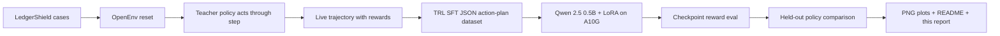

# LedgerShield Training Evidence Report

This is the judge-facing training report for LedgerShield ControlBench. It is written around the OpenEnv Hackathon rubric: show that the environment is original, explain the story clearly, prove the agent improved after real training, and make the reward/training pipeline auditable.

## Executive Summary

LedgerShield trains an LLM agent to operate enterprise accounts-payable controls, not just classify invoices. The agent must investigate hidden evidence, call tools, satisfy policy gates, avoid unsafe payment release, and submit an auditable decision certificate under budget pressure.

The final training evidence is a real Hugging Face A10G TRL run over live LedgerShield environment rollouts. The training script collected trajectories through `reset()` and `step()`, fine-tuned `Qwen/Qwen2.5-0.5B-Instruct` with LoRA, evaluated reward checkpoints during training, and compared the trained model against random, naive, base Qwen, and teacher policies in the same environment.

| Item | Evidence |
|---|---|
| Hugging Face Space | https://huggingface.co/spaces/shreayas/ledgershield-controlbench |
| Training job | https://huggingface.co/jobs/shreayas/69ecd421d70108f37acde80d |
| Model | `Qwen/Qwen2.5-0.5B-Instruct` |
| Hardware | Hugging Face Jobs `a10g-large`, observed `NVIDIA A10G`, `22.3 GB` GPU memory |
| Training method | Hugging Face TRL SFT with LoRA adapters |
| Live rollouts | `45` trajectories collected from LedgerShield through environment calls |
| Split | `36` train cases, `9` held-out evaluation cases |
| Optimizer steps | `900` |
| Loss log rows | `900` optimizer-step rows |
| Final training loss | `0.0885` |
| Primary artifact folder | [`../artifacts/trl-openenv-hf-a10g-qwen-rich/`](../artifacts/trl-openenv-hf-a10g-qwen-rich/) |

## Rubric Alignment

| Judging criterion | Weight | What this submission shows |
|---|---:|---|
| Environment Innovation | 40% | Enterprise AP control is a high-stakes, underexplored professional-task domain. LedgerShield combines blind partial observability, fraud mechanisms, institutional memory, proof-carrying certificates, deterministic falsification, calibration-gated authority, and long-horizon ControlBench tracks. |
| Storytelling & Presentation | 30% | The root README explains the problem, agent loop, reward logic, and results in a judge-readable path. This report gives the complete training story with plots and exact artifacts. |
| Showing Improvement in Rewards | 20% | The trained Qwen LoRA improves held-out mean score from `0.1283` base Qwen and `0.1088` random baseline to `0.4394`, with reward checkpoints during training peaking at `0.5090`. |
| Reward & Training Pipeline | 10% | The reward combines terminal rubric quality, tool/intervention costs, safety gates, institutional utility, certificate quality, and falsifier outcomes. The training loop runs against the environment, not a static-only file. |

## What The Agent Learns

The capability gap is operational control intelligence. A weak agent can guess `PAY`, `HOLD`, or `ESCALATE_FRAUD`, but LedgerShield rewards the harder behavior: collect the right evidence, call the right tools, satisfy policy controls, avoid unsafe release, and produce a decision that survives audit.

Before training, base Qwen often emitted generic or malformed action plans, repeated tools, or produced decisions without enough grounded evidence. After training on real trajectories, the LoRA model learned longer executable action sequences with LedgerShield-specific tools, richer final-decision payloads, policy checks, evidence maps, and calibrated fraud probabilities.

The trained model is not presented as perfect. The teacher policy remains higher, which is the honest learning frontier. The important result is measurable improvement over both untrained and random baselines under the same held-out environment evaluation.

## End-To-End Pipeline



The key property is that `training/ledgershield_trl_training.py` connects to the local LedgerShield environment and collects fresh examples by running `reset()` and `step()`. The JSONL file is an output of the live environment loop, not the starting point of the experiment.

## Reproduction Command

```bash
export HF_TOKEN="your_token"
python training/launch_hf_a10g_qwen_job.py \
  --repo-id shreayas/ledgershield-controlbench \
  --hardware A10G_LARGE \
  --output-dir artifacts/trl-openenv-hf-a10g-qwen-rich \
  --max-steps 900 \
  --case-limit 45 \
  --model-eval-case-limit 9 \
  --reward-eval-interval 300
```

For a quick local smoke test without GPU training:

```bash
python training/ledgershield_trl_training.py \
  --output-dir artifacts/trl-openenv-smoke \
  --case-limit 5
```

## Training Data Source

| Data asset | Source |
|---|---|
| [`openenv_trajectories.json`](../artifacts/trl-openenv-hf-a10g-qwen-rich/openenv_trajectories.json) | Live environment rollouts with recorded actions, rewards, observations, and final results |
| [`openenv_sft_examples.jsonl`](../artifacts/trl-openenv-hf-a10g-qwen-rich/openenv_sft_examples.jsonl) | Prompt/completion pairs derived from those live rollouts |
| [`training_metrics.json`](../artifacts/trl-openenv-hf-a10g-qwen-rich/training_metrics.json) | Full run metadata, generations, reward evaluations, summaries, and plot paths |
| [`loss_history.csv`](../artifacts/trl-openenv-hf-a10g-qwen-rich/loss_history.csv) | One row per optimizer step |
| [`reward_eval_history.csv`](../artifacts/trl-openenv-hf-a10g-qwen-rich/reward_eval_history.csv) | Reward checkpoint evaluations during training |

## Reward Logic

LedgerShield does not give a single opaque pass/fail reward. The environment rewards a control process:

| Reward signal | Why it matters |
|---|---|
| Terminal final score | Measures whether the final decision is correct, policy-complete, grounded, and safe |
| Tool and intervention costs | Penalize wasteful investigation and force prioritization under budget |
| Value-of-information shaping | Rewards evidence-gathering actions that reduce uncertainty and improve decision quality |
| Milestone progress | Gives intermediate signal for risk discovery, required-action coverage, callback usage, and artifact reveal |
| Certificate score | Rewards auditable proof structure, grounded evidence references, and policy support |
| Institutional utility | Measures enterprise-level value after fraud loss, supplier friction, review burn, and authority effects |
| Falsifier and unsafe-release gates | Prevent reward gaming by blocking unsupported or unsafe terminal decisions |

This design is coherent for the domain because the best agent is not the fastest classifier. The best agent is the one that investigates enough, follows controls, avoids unsafe payment release, and explains itself.

## Quantitative Results

Held-out evaluation uses 9 cases that were not in the SFT training split.

| Policy | Eval cases | Mean score | Mean total reward | Control satisfied | Certificate mean | Parse success | Unsafe release |
|---|---:|---:|---:|---:|---:|---:|---:|
| Random baseline | 9 | 0.1088 | 0.0888 | 0.0000 | 0.4461 | 1.0000 | 0.0000 |
| Naive PAY baseline | 9 | 0.0693 | 0.0493 | 0.2222 | 0.4794 | 1.0000 | 0.0000 |
| Base Qwen model | 9 | 0.1283 | -1.4473 | 0.0000 | 0.4044 | 1.0000 | 0.0000 |
| Trained Qwen LoRA | 9 | 0.4394 | -3.1019 | 0.2222 | 0.8478 | 1.0000 | 0.0000 |
| Teacher policy | 9 | 0.6627 | -2.7090 | 0.5556 | 0.9472 | 1.0000 | 0.0000 |

The trained model improves held-out mean score by `+0.3111` over base Qwen and `+0.3306` over the random baseline. Certificate quality more than doubles relative to base Qwen, from `0.4044` to `0.8478`. Unsafe release remains `0.0000`.

Mean total reward is lower for the trained model because it executes longer investigations and pays tool/intervention costs. That is expected in this environment: a one-step random or naive decision can avoid costs but fails the final control objective. The headline learning signal is final score, certificate quality, control satisfaction, parse success, and unsafe-release safety.

## Reward Progress During Training

Reward checkpoint evaluations were run during training on a fixed held-out subset.

| Training step | Mean score | Mean total reward | Parse success | Unsafe release |
|---:|---:|---:|---:|---:|
| 300 | 0.3599 | -2.8615 | 1.0000 | 0.0000 |
| 600 | 0.5090 | -3.0566 | 1.0000 | 0.0000 |
| 900 | 0.4743 | -3.0913 | 1.0000 | 0.0000 |

The reward curve shows real learning rather than a static demonstration file. The checkpoint score rises from `0.3599` to `0.5090`, then dips slightly to `0.4743`, which is consistent with small-split variance or mild late overfitting. The final 9-case held-out evaluation remains far above base and random policies.

## Key Plots


Caption: TRL SFT loss over 900 optimizer steps. The model fits executable LedgerShield action plans generated from live environment rollouts.


Caption: Smoothed loss makes the downward trend readable for reviewers scanning quickly.


Caption: Held-out reward checkpoints at steps 300, 600, and 900 show observable training progress.


Caption: Random, naive, base Qwen, trained Qwen, and teacher policy are shown on the same score axis.


Caption: Final held-out mean score comparison after training.


Caption: Case-level scores show where the trained model improved and where teacher-level behavior is still missing.


Caption: Parse success and unsafe-release rate confirm the trained policy remains executable and does not release unsafe payments on the held-out split.


Caption: Certificate quality improves materially after training, reflecting better evidence-grounded final decisions.


Caption: Result classes show qualitative behavior changes, including more valid successes and fewer purely boundary-failed outcomes.


Caption: The trained model moves toward higher score while maintaining zero unsafe release.

Full plot pack: [`../artifacts/trl-openenv-hf-a10g-qwen-rich/plots/`](../artifacts/trl-openenv-hf-a10g-qwen-rich/plots/)

## Before And After Behavior

| Behavior dimension | Before training | After training |
|---|---|---|
| Output format | Base model often produced generic chat text, repeated tool calls, or incomplete structures | Trained model emits executable JSON action plans with `1.0000` parse success |
| Investigation depth | Base model under-investigates or loops on shallow tools | Trained model executes multi-step tool and intervention sequences |
| Final decision payload | Base outputs often lack grounded policy evidence | Trained outputs include `policy_checks`, `evidence_map`, `predicted_probabilities`, `counterfactual`, and task-specific fields |
| Audit quality | Base certificate mean `0.4044` | Trained certificate mean `0.8478` |
| Safety | Unsafe release `0.0000`, but low score | Unsafe release remains `0.0000` while score rises substantially |

## Qualitative Held-Out Outcomes

| Result class | Trained count | Interpretation |
|---|---:|---|
| `valid_success` | 2 | Full success on held-out cases |
| `correct_but_policy_incomplete` | 2 | Correct direction but missing some required control evidence |
| `falsifier_blocked` | 2 | The adversarial audit layer still found unsupported or incomplete claims |
| `incorrect_resolution` | 2 | The model still misresolved some cases |
| `false_positive_overcontrol` | 1 | The model sometimes escalated too aggressively |

This distribution is honest and useful. The trained agent learned meaningful environment behavior, but the report does not claim solved performance. The remaining gap to teacher policy shows where future RL or rejection-sampling work should focus.

## Artifact Inventory

| Artifact | Path |
|---|---|
| Full metrics | [`../artifacts/trl-openenv-hf-a10g-qwen-rich/training_metrics.json`](../artifacts/trl-openenv-hf-a10g-qwen-rich/training_metrics.json) |
| Loss CSV | [`../artifacts/trl-openenv-hf-a10g-qwen-rich/loss_history.csv`](../artifacts/trl-openenv-hf-a10g-qwen-rich/loss_history.csv) |
| Reward checkpoint CSV | [`../artifacts/trl-openenv-hf-a10g-qwen-rich/reward_eval_history.csv`](../artifacts/trl-openenv-hf-a10g-qwen-rich/reward_eval_history.csv) |
| HF job API log | [`../artifacts/trl-openenv-hf-a10g-qwen-rich/hf_job_api.log`](../artifacts/trl-openenv-hf-a10g-qwen-rich/hf_job_api.log) |
| Analysis summary | [`../artifacts/trl-openenv-hf-a10g-qwen-rich/analysis_summary.md`](../artifacts/trl-openenv-hf-a10g-qwen-rich/analysis_summary.md) |
| Dashboard | [`../artifacts/trl-openenv-hf-a10g-qwen-rich/showcase_dashboard.html`](../artifacts/trl-openenv-hf-a10g-qwen-rich/showcase_dashboard.html) |
| LoRA adapter | [`../artifacts/trl-openenv-hf-a10g-qwen-rich/final_model/`](../artifacts/trl-openenv-hf-a10g-qwen-rich/final_model/) |
| Colab notebook | [`../training/LedgerShield_OpenEnv_TRL_Training_Colab.ipynb`](../training/LedgerShield_OpenEnv_TRL_Training_Colab.ipynb) |
| HF launcher | [`../training/launch_hf_a10g_qwen_job.py`](../training/launch_hf_a10g_qwen_job.py) |

## Minimum Submission Checklist

| Requirement | Status |
|---|---|
| Use OpenEnv latest and valid manifest | Satisfied by `openenv.yaml`, `/reset`, `/step`, `/state`, `/health`, and `openenv validate` |
| Working training script using Hugging Face TRL | Satisfied by `training/ledgershield_trl_training.py` and `training/launch_hf_a10g_qwen_job.py` |
| Colab notebook for rerun | Satisfied by `training/LedgerShield_OpenEnv_TRL_Training_Colab.ipynb` |
| Evidence of real training | Satisfied by A10G job log, 900 loss rows, reward checkpoints, metrics JSON, and plots |
| Compare trained vs baseline | Satisfied by random, naive, base Qwen, trained Qwen, and teacher policy evaluations |
| Plots saved as PNG and committed | Satisfied by 23 PNG plots under the rich artifact folder |
| README has HF Space and materials | Satisfied by root `README.md` links to Space, this report, docs, plots, and job |
| HF Space runnable | Satisfied by remote `/health` and `/reset` validation |

## Validation

Final validation commands:

```bash
python -m pytest tests/ -q
openenv validate
bash validate-submission.sh "https://shreayas-ledgershield-controlbench.hf.space" .
```

Final validation results:

| Check | Result |
|---|---|
| Unit/integration tests | `329 passed` |
| OpenEnv validation | passed |
| Remote Space `/health` | passed |
| Remote Space `/reset` | passed |
| Docker build and local health/reset | passed |
| `inference.py` stdout contract | passed |
| Submission validator | `All 4/4 checks passed` |

## Bottom Line

LedgerShield is not a toy game. It is a high-stakes professional-control environment where the reward signal teaches evidence gathering, safe decision-making, auditability, and institutional robustness. The final A10G run shows the agent learned: the trained Qwen LoRA beats both random and untrained baselines on held-out environment score while preserving parse success and zero unsafe release.
